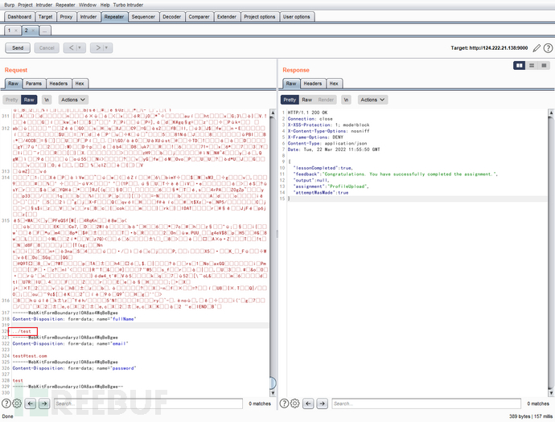
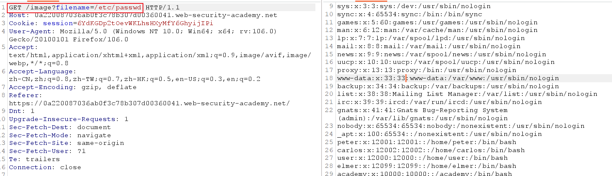

# 目录遍历

## 介绍

目录遍历是一种允许攻击者读取运行应用程序的服务器上的任意文件的漏洞，攻击者可以利用这一步方法区读取网站的数据库配置文件或者应用程序的配置文件、源码，来为进一步的攻击做铺垫

## 攻击方法

> 目录遍历攻击是基于`操作系统`的一种攻击方式
>
> **../ 命令将会贯穿整个目录遍历攻击路径，也是核心所在**

### 1. 文件上传中利用目录遍历

> 在上传文件时，我们要上传的目录可能是 /PathTraversal/user/tests 下，但是我们可以通过目录遍历的方式，将要上传的图片上传至其他目录

<figure><figcaption></figcaption></figure>

> 最后我们可以发现我们上传到 /PathTraversal/user 下

### 2. 对网站存在的资源进行目录遍历攻击

> 在网站请求图片时，在请求图片的同时尝试目录遍历

正常的请求时这样的：这会去 127.0.0.1/home/image 下寻找 1.jpeg 文件

```shell
127.0.0.1/home/image?filename=1.jpg
```

但是我们可以修改这里的文件名称进而形成目录遍历：这时我们就会找到 127.0.0.1/home 下的 passwords.txt 文件

```shell
127.0.0.1/home/image?filename=../password.txt
```

### 3. 对于 ZIP 文件，在文件上传时，可以替代头像上传，并利用目录遍历

* 场景应用于文件上传界面，但同样也是一个非常特殊的点。早在之前人们并不重视这个情况的时候，Zip 文件可以作为文件上传。
* 攻击者可以利用`../`来改变 Zip 包中某个文件的存放位置。

Zip 文件在解压之后，在攻击者的精心设计之下，很有概率会覆盖服务器上原有的文件。举个例子，php 当中的 .htacess 文件就是最著名的文件上传的覆盖，若是覆盖了 .htacess 文件，那么就可以进一步的利用

### 4. 利用空字节绕过文件扩展名

如果应用程序要求用户提供的文件名必须以预期的文件扩展名结尾，例如`.png`，则可以使用空字节有效地终止所需扩展名之前的文件路径。例如

```shell
filename=../../../etc/passwd%00.png
```

### 5. 绝对路径

在访问时使用文件系统根目录的绝对路径

<figure><figcaption></figcaption></figure>

### 6. 双写

* 后端代码可能会过滤 ../ 所以我们可以利用 ....// 来进行绕过
* 对 ../ 进行 URL 编码

## 普通防御手段

### 1. 简单的 ../ 目录遍历防御

我们可以在后端对请求进行过滤：

```php
return super.execute(file, fullName != null ? fullName.replace("../", "") : "");
```

这会将输入的 ../ 过滤替换为空格，但是我们可以使用双写绕过 `....//`

> 这里在实际生活中通常会对这里进行循环替换

### 2. GET请求参数中不允许存在 .. 与 /

> 后端代码对参数值进行设置，禁止存在 .. 与 /

绕过思路：

* 原理： 服务器后台在获取到参数值后，会进行一次 URLDECODE , 如果只是单纯的对参数进行 URL 解码，则可以通过 URL 编码绕过
*   payload

    ```shell
    ?filename=%2e%2e%2f/etc/passwd
    # %2e%2e ------> ..
    # %2f ------> /
    ```

### 3. 当服务器只允许获取当前格式的资源

> 情景：若此时资源为图像，那么服务器只允许的请求是`?filename=图片格式的后缀`。只有`?filename=1.jpg`才可以被请求。

绕过思路：空字节绕过

空字节绕过，也就是增添空格，因为空格后的内容都会被自动过滤。而空格对应的 hex 编码为 %00，所以我们构造新的 payload。

```shell
?filename=../etc/passwd%001.jpg

# 转换一下，也就是
?filename=../etc/passwd 1.jpg

# 在空字节存在的情况下，空格后面的内容会直接被注释掉，就变成了这样。
?filename=../etc/passwd
```

## 终极防御手段

1. 限制用户输入路径在某一个范围内
2. 标准化所有字符
3.  验证用户的输入是否在白名单内

    > 限制用户请求资源，写正则表达式批量规范请求资源的白名单

## 参考文章

* [从 0 到 1 完全掌握目录遍历漏洞](https://www.freebuf.com/articles/web/326213.html)
