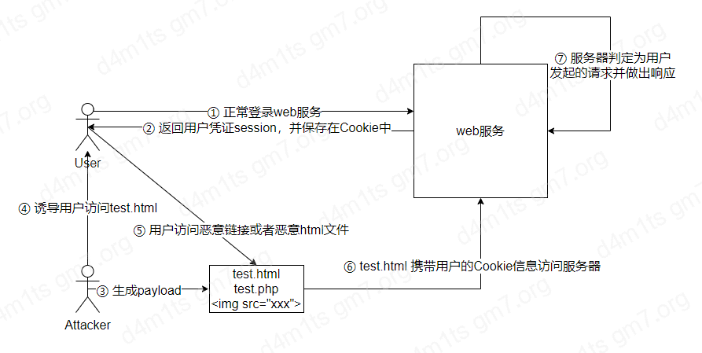

# CSRF

> [XSS VS CSRF](https://portswigger.net/web-security/csrf/xss-vs-csrf)

## 介绍

跨站请求伪造，是一种挟制用户在当前已经登陆的 WEB 应用程序上执行非本意的操作的攻击方式，利用的网站对用户网页浏览器的信任。

跨站请求伪造攻击，是攻击者通过一些技术手段欺骗用户的浏览器去访问一个用户自己曾经认证过的网站并执行一些操作，由于浏览器曾经认证过，所以被访问的网站会被认为是真正的用户操作而去执行，这利用了 WEB 中用户身份验证的一个漏洞： **简单的身份验证只能保证请求时来自某个用户的浏览器而不能保证请求本身是用户自愿发出的**。

## 原理

<figure><figcaption></figcaption></figure>

> 具体的攻击流程如下：
>
> 1. 用户正常登录web服务，并一直保持在线
> 2. 服务器返回用户凭证Session ，并将其保存在Cookie中
> 3. 攻击者生成payload，并放置在用户可访问的地方
> 4. 攻击者诱导用户点击在第3步放置的链接，此时用户一直在线，且是用同一浏览器打开（保证Cookie未失效）
> 5. 用户点击恶意链接
> 6. 恶意链接向服务器请求，由于用户Cookie未失效，就携带用户Cookie访问服务器
> 7. 服务器收到请求，此时用户Cookie 未失效，并判定为“**用户**”发起的正常请求，并做出响应

## 影响

攻击者可以盗用其他用户的信息(比如管理员)，去执行一些特定的操作，进而形成更大的危害

## 条件

* 一个相关的操作
* 基于 COOKIE 的会话处理： 之慈宁宫该操作涉及发出一个或多个 HTTP 请求，应用程序仅仅依赖会话 COOKIE 来识别发出请求的用户，没有其他机制来跟踪会话或验证用户请求
* 没有不可预测的请求参数

## 分类

### 1. GET 型

这种是最容易利用的，相比于POST型来说，攻击面也大很多，比如上述CSRF转账例子中就是GET型的

在web应用中，很多接口通过GET进行数据的请求和存储，如果未对来源进行校验，并且没有token保护，攻击者可以直接通过发送含有payload的链接进行诱导点击；亦可以通过评论区或类似功能处发布图片，通过修改img地址的方式保存至页面，用户访问便会进行自动加载造成攻击

```shell
<!-- 不论什么手段，只要能让受害者访问一个链接即可 -->

```

### 2. POST 型

相比于GET型，这种就要多很多，因为很多开发在提交数据的功能点时都会采用POST，如创建用户、创建文章、发消息等，利用起来也相对麻烦点

利用起来无非也是构造一个自动提交的表单，然后嵌入到页面中，诱导受害者访问，受害者访问后会自动提交表单发起请求

## 构建

手动创建 CSRF 漏洞利用的 HTML 可能会很麻烦，所以我们可以使用 Burp Suite Pro 中内置的 CSRF POC 生成器

## 攻击

### 1. 绕过 CSRF 令牌验证

#### 1. CSRF 令牌的验证取决于请求方法

某些应用程序在请求使用 `POST` 方法时验证令牌，但是在使用 GET 方法时跳过验证，这时候我们可以将请求方法切换到 GET 方法绕过验证

#### 2. CSRF 令牌验证取决于令牌是否存在

某些应用程序会在令牌存在是验证令牌，但是如果令牌被省略则跳过验证。

所以我们可以删除令牌，来绕过验证

#### 3. CSRF 令牌未绑定用户会话

某些应用程序不会验证令牌是否和发出请求的用户属于同一会话，相反应用程序维护它已发布的全局令牌池，并接受出现在该池中的任何令牌。

在这种情况下，攻击者可以使用自己的账号登陆应用程序获取有效令牌，然后将令牌提供给受害者用户进行 CSRF 攻击

#### 4. CSRF 令牌绑定到非会话 COOKIE

某些应用程序将 CSRF 绑定到一个 COOKIE 但是这个 COOKIE 不是用于跟踪会话的 COOKIE，当应用程序使用两种不同的框架时，就容易发生这种情况，一个 COOKIE 用于会话处理，另一个用于 CSRF 保护

```http
POST /email/change HTTP/1.1
Host: vulnerable-website.com
Content-Type: application/x-www-form-urlencoded
Content-Length: 68
Cookie: session=pSJYSScWKpmC60LpFOAHKixuFuM4uXWF; csrfKey=rZHCnSzEp8dbI6atzagGoSYyqJqTz5dv

csrf=RhV7yQDO0xcq9gLEah2WVbmuFqyOq7tY&email=wiener@normal-user.com
```

攻击者可以提取出 csrfKey 和 csrf 提供给受害者，然后利用 SET-COOKIE

```html

```

#### 5. CSRF 令牌只是在 COOKIE 中复制

应用程序值验证请求参数中提交的令牌是否和 COOKIE 中提交值匹配

```http
POST /email/change HTTP/1.1
Host: vulnerable-website.com
Content-Type: application/x-www-form-urlencoded
Content-Length: 68
Cookie: session=1DQGdzYbOJQzLP7460tfyiv3do7MjyPw; csrf=R8ov2YBfTYmzFyjit8o2hKBuoIjXXVpa

csrf=R8ov2YBfTYmzFyjit8o2hKBuoIjXXVpa&email=wiener@normal-user.com
```

攻击者可以自己创建一个令牌进行利用

### 2. 绕过 SameSite cookie 限制

> 参考原文 --> [链接](https://portswigger.net/web-security/csrf/bypassing-samesite-restrictions)
>
> 一个参考小文章 --> [当SameSite属性为默认值Lax时，绕过它并获得一个CSRF](https://zhuanlan.zhihu.com/p/354215929)

#### 1. 使用 GET 请求绕过 SameSite Lax 限制

### 3. 绕过基于 Referer 的 CARF 防御

> 一些服务器使用 HTTP 的 Referer 标头来尝试防御 CSRF 攻击，通常是通过验证请求是否来自应用程序自己的域，这种方法效率比较低

#### 1. Referer 的验证取决于 HTTP 头是否存在

某些应用程序`Referer`会在请求中出现标头时验证标头，但如果省略标头则跳过验证。

在这种情况下，攻击者可以通过导致受害用户的浏览器在生成的请求中删除标头的方式来设计他们的CSRF 漏洞。`Referer`有多种方法可以实现这一点，但最简单的方法是在承载CSRF 攻击的 HTML 页面中使用 META 标记：

```html
<meta name="referrer" content="never">
```

#### 2. 绕过 Referer 验证

一些应用程序`Referer`以一种可以绕过的天真方式验证标头。例如，如果应用程序验证域以`Referer`预期值开头，则攻击者可以将其作为自己域的子域：

```html
http://vulnerable-website.com.attacker-website.com/csrf-attack
```

同样，如果应用程序只是验证`Referer`包含自己的域名，那么攻击者可以将所需的值放在 URL 的其他位置：

```html
http://attacker-website.com/csrf-attack?vulnerable-website.com
```

> 尽管您可以使用 Burp 识别此行为，但当您在浏览器中测试您的概念验证时，您通常会发现此方法不再有效。为了降低敏感数据以这种方式泄露的风险，许多浏览器现在`Referer`默认从标头中删除查询字符串。
>
> 您可以通过确保包含您的漏洞利用的响应`Referrer-Policy: unsafe-url`设置了标头来覆盖此行为（注意`Referrer`在这种情况下拼写正确，只是为了确保您注意！）。这确保将发送完整的 URL，包括查询字符串

## 防御

* CSRF Token : CSRF Token 是由服务器端应用程序生成并与客户端共享的唯一、秘密且不可预测的值。当尝试执行敏感操作（例如提交表单）时，客户端必须在请求中包含正确的 CSRF 令牌。这使得攻击者很难代表受害者构造有效请求。
* **SameSite cookie** : SameSite 是一种浏览器安全机制，用于确定网站的 cookie 何时包含在来自其他网站的请求中。由于执行敏感操作的请求通常需要经过身份验证的会话 cookie，因此适当的 SameSite 限制可能会阻止攻击者跨站点触发这些操作。自 2021 年起，Chrome 默认强制执行 SameSite Lax 限制
* 基于 Referer 的验证 ： 一些应用程序使用 HTTP Referer 标头来尝试抵御 CSRF 攻击，通常是通过验证请求是否来自应用程序自己的域。这通常不如 CSRF 令牌验证有效。
