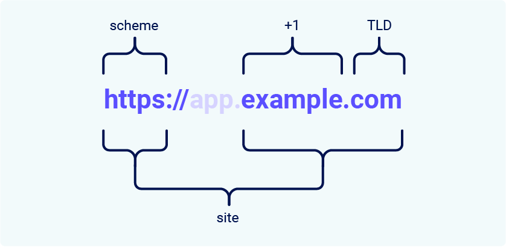

# 同源策略

> Chrome 80 开始没有 SameSite 属性的 cookie 将被视为 **Lax**，这意味着 cookie 仅在顶部窗口导航和 GET 请求中发送。这可能是解决许多 POST CSRF 攻击的好方法。

## SameSite cookie 上下文中的 site 是什么？

在 SameSite cookie 限制的上下文中，站点被定义为顶级域 (TLD)，通常类似于`.com`或`.net`，再加上一层额外的域名。这通常称为 TLD+1

在确定请求是否为同一站点时，还会考虑 URL 方案。这意味着从`http://app.example.com`到的链接`https://app.example.com`被大多数浏览器视为跨站点

<figure><figcaption></figcaption></figure>

> 您可能会遇到术语“有效顶级域”(eTLD)。这只是一种考虑在实践中被视为顶级域的保留多部分后缀的方法，例如`.co.uk`

## site 和 origin 之间有什么区别？

站点和来源之间的区别在于它们的范围；一个站点包含多个域名，而一个来源仅包含一个.

如果两个 URL 共享完全相同的 scheme、域名和端口，则它们被认为具有相同的来源。尽管请注意，端口通常是从 scheme 中推断出来的

<figure><figcaption></figcaption></figure>

从此示例中可以看出，术语“ site ”的具体性要低得多，因为它仅说明 scheme 和域名的最后一部分。至关重要的是，这意味着跨源请求仍然可以是同一站点的，但反之则不行

| 请求来自                    | 请求                           | 同一站点？       | 同源？      |
| ----------------------- | ---------------------------- | ----------- | -------- |
| https://example.com     | https://example.com          | 是的          | 是的       |
| https://app.example.com | https://intranet.example.com | 是的          | 否：不匹配的域名 |
| https://example.com     | https://example.com:8080     | 是的          | 否：不匹配的端口 |
| https://example.com     | https://example.co.uk        | 否：不匹配的 eTLD | 否：不匹配的域名 |
| https://example.com     | http://example.com           | 否：不匹配的方案    | 否：不匹配的方案 |

## SameSite 如何运作？

SameSite 的工作原理是让浏览器和网站所有者能够限制哪些跨站点请求（如果有）应包含特定的 cookie。在引入 SameSite 机制之前，浏览器会在每个请求中将 cookie 发送到发出它们的域，即使该请求是由不相关的第三方网站触发的。

如今，Chrome 默认会自动应用 SameSite `Lax` 限制，以便仅在满足特定条件的跨站点请求中发送 cookie。这有助于减少用户遭受 CSRF 攻击的风险，CSRF 攻击会诱使受害者的浏览器发出请求，从而在易受攻击的网站上触发有害操作。由于这些请求通常需要与受害者的经过身份验证的会话相关联的 cookie，因此如果浏览器不包含此信息，则攻击将失败。

目前所有主流浏览器支持的 SameSite 限制级别：

* [`Strict`](https://portswigger.net/web-security/csrf/bypassing-samesite-restrictions#strict)
* [`Lax`](https://portswigger.net/web-security/csrf/bypassing-samesite-restrictions#lax)
* [`None`](https://portswigger.net/web-security/csrf/bypassing-samesite-restrictions#none)

开发人员可以为他们设置的每个 cookie 手动配置限制级别，使他们能够更好地控制何时使用这些 cookie。为此，他们只需`SameSite`在响应标头中包含该属性`Set-Cookie`及其首选值

```html
Set-Cookie: session=0F8tgdOhi9ynR1M9wa3ODa; SameSite=Strict
```

### Strict

如果使用该`SameSite=Strict`属性设置 cookie，浏览器将不会在任何跨站点请求中发送它。简单来说，这意味着如果请求的目标站点与浏览器地址栏中当前显示的站点不匹配，则不会包含 cookie。

在设置使持有者能够修改数据或执行其他敏感操作的 cookie 时，建议这样做，例如访问仅对经过身份验证的用户可用的特定页面。

虽然这是最安全的选项，但在需要跨站点功能的情况下，它可能会对用户体验产生负面影响。

### Lax

SameSite `Lax` 限制意味着浏览器将在跨站点请求中发送 cookie，但前提是同时满足以下两个条件：

* 请求使用`GET`方法。
* 请求是由用户的顶级导航产生的，例如单击链接。

例如，这意味着 cookie 不包含在跨站点`POST`请求中。由于`POST`请求通常用于执行修改数据或状态的操作（至少根据最佳实践），因此它们更有可能成为 CSRF 攻击的目标。

同样，cookie 不包含在后台请求中，例如由脚本、iframe 或对图像和其他资源的引用发起的请求。

这是 Chrome 在`SameSite`设置 cookie 时未明确提供属性的情况下应用的默认限制。由于这是一项拟议的新标准，

> 为避免破坏单点登录 (SSO) 机制，Chrome 在设置 cookie 后的前两分钟内不会强制执行`Lax`限制。这留下了一个很短的窗口，用户可能会在其中暴露于跨站点攻击。

### None

如果使用该`SameSite=None`属性设置 cookie，这将有效地完全禁用 SameSite 限制，而不管浏览器是什么。因此，浏览器将在所有发送到发出它的站点的请求中发送此 cookie，即使是那些由完全不相关的第三方站点触发的请求。

除了 Chrome 之外，如果`SameSite`在设置 cookie 时没有提供属性，这是主要浏览器使用的默认行为。

禁用 SameSite 有正当理由，例如当 cookie 旨在从第三方上下文中使用并且不授予持有者访问任何敏感数据或功能的权限时。跟踪 cookie 是一个典型的例子。

如果您遇到带有`SameSite=None`或没有明确限制的 cookie 集，则值得调查它是否有用。当 Chrome 首次采用“Lax-by-default”行为时，这具有破坏许多现有网络功能的副作用。作为一种快速解决方法，一些网站选择简单地禁用对所有 cookie 的 SameSite 限制，包括可能敏感的 cookie。

使用 设置 cookie 时`SameSite=None`，网站还必须包含该`Secure`属性，以确保 cookie 仅在通过 HTTPS 的加密消息中发送。否则，浏览器将拒绝该 cookie，并且它不会被设置。

```html
Set-Cookie: trackingId=0F8tgdOhi9ynR1M9wa3ODa; SameSite=None; Secure
```
