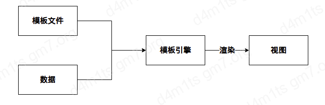
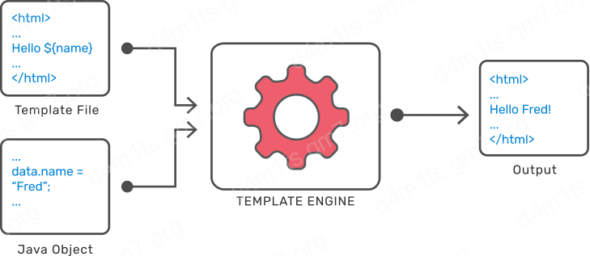
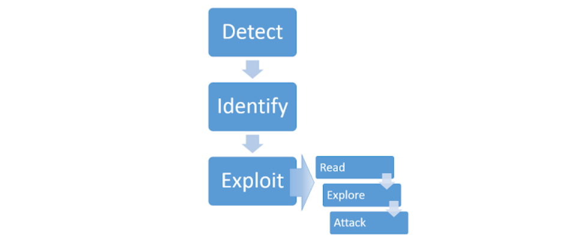

# SSTI

## 介绍

SSTI 全称 服务端模板注入，漏洞的成因是服务端接收了攻击者的恶意输入后，没有经过任何处理或者处理不足就将其作为 WEB 应用模板内容的一部分，模板引擎在对目标进行编译渲染时执行了攻击者插入的恶意语句(`也就是说将攻击者传入的恶意数据当成了模板进行渲染，而不是当做数据，这种行为类似于 XSS`)，进而造成了敏感信息泄露、代码执行、GetShell 等问题，其影响的范围主要取决于模板引擎的复杂性

## 影响

* 信息泄露
* 代码执行

## 什么是模板/模板引擎

SSTI 漏洞产生的原因是因为 `模板引擎`将恶意的语句视为模板进行处理，那模板和模板引擎是什么？

目前主流的 WEB 开发技术：

* **前后端不分离**：即后端完成路由，用户在浏览器输入一个url，访问的是后端路由（服务端响应），后端接收请求后，再将数据通过模板引擎解析再渲染成视图返回给前端。后端路由，由后端渲染数据，再返回视图给前端，前端只负责展示视图，所有的交互都在后台；可以简单理解为访问一个URL后直接得到html页面。
* **前后端分离**：前端使用JavaScript框架，如(jquery，vue，react，angular)，前端项目化；后端去掉所有的视图，只提供api接口，用户在浏览器访问的路由为前端路由（也称为Hash路由，由前端响应），只加载前端视图，数据只通过ajax获取，前端获取数据之后再渲染到视图，前端负责控制路由，展示视图，后端只负责提供api，用户和视图交互，视图上的按钮以及页面数据和后端api交互；`可以简单理解为访问一个URL后返回的是JSON等数据，而不是一个完全渲染好的html页面`

> SSTI 主要存在于 `前后端不分离的项目中`

* **模板**： 可以理解为一段固定好格式，等着你来填充信息的文件。通过这种方法，可以做到逻辑与视图分离，更容易、清楚且相对安全地编写前后端不同的逻辑。
* **模板引擎**（这里特指用于Web开发的模板引擎）： 是为了使用户界面与业务数据（内容）分离而产生的，它可以生成特定格式的文档，用于网站的模板引擎就会生成一个标准的文档，简单来说 就是将模板文件和数据通过模板引擎的渲染生成最终的HTML代码。

流程如下：

<figure><figcaption></figcaption></figure>

<figure><figcaption></figcaption></figure>

> 模板引擎也会提供沙箱机制进行漏洞防范，但是可以使用沙箱逃逸技术来进行绕过

## 原因

当用户输入连接到模板而不是作为数据传入时，会出现服务器端模板注入漏洞。

静态模板仅提供用于呈现动态内容的占位符，通常不易受到服务器端模板注入的攻击。典型的例子是一封电子邮件，用他们的名字问候每个用户，例如下面从 Twig 模板中提取的内容：

```javascript
$output = $twig->render("Dear {first_name},", array("first_name" => $user.first_name) );
```

这不容易受到服务器端模板注入的攻击，因为用户的名字只是作为数据传递到模板中。

然而，由于模板只是字符串，Web 开发人员有时会在呈现之前直接将用户输入连接到模板中。让我们举一个与上面类似的例子，但这一次，用户可以在发送电子邮件之前自定义部分电子邮件。例如，他们可能能够选择使用的名称：

```javascript
$output = $twig->render("Dear " . $_GET['name']);
```

`GET`在此示例中，不是将静态值传递到模板中，而是使用参数 动态生成模板本身的一部分`name`。由于模板语法是在服务器端评估的，这可能允许攻击者在参数中放置服务器端模板注入有效负载`name`，如下所示：

```javascript
http://vulnerable-website.com/?name={{bad-stuff-here}}
```

## 构建服务器端模板注入攻击

<figure><figcaption></figcaption></figure>

### 探测

服务器端模板注入漏洞经常被忽视，不是因为它们很复杂，而是因为它们只对明确寻找它们的审计员来说才真正明显。如果您能够检测到存在漏洞，那么利用它会非常容易

与任何漏洞一样，利用的第一步是能够找到它。也许最简单的初始方法是通过注入模板表达式中常用的一系列特殊字符来尝试对模板进行模糊测试，例如`${{<%[%'"}}%\`. 如果引发异常，这表明注入的模板语法可能以某种方式被服务器解释。这是可能存在服务器端模板注入漏洞的一个迹象。

服务器端模板注入漏洞出现在两个不同的上下文中，每个上下文都需要自己的检测方法。无论您的模糊测试结果如何，尝试以下特定于上下文的方法也很重要。如果模糊测试没有定论，那么使用其中一种方法仍可能会暴露出漏洞。即使模糊测试确实提示存在模板注入漏洞，您仍然需要识别其上下文才能利用它。

### 明文上下文

大多数模板语言都允许您通过直接使用 HTML 标记或使用模板的本机语法自由输入内容，这些内容将在发送 HTTP 响应之前在后端呈现为 HTML。例如，在 Freemarker 中，该行将 `render('Hello ' + username)`呈现为类似`Hello Carlos`.

这有时会被用于[XSS](https://portswigger.net/web-security/cross-site-scripting)，实际上经常被误认为是一个简单的 XSS 漏洞。但是，通过将数学运算设置为参数的值，我们可以测试这是否也是服务器端模板注入攻击的潜在入口点。

例如，考虑一个包含以下易受攻击代码的模板：

```javascript
render('Hello ' + username)
```

在审核期间，我们可能会通过请求 URL 来测试服务器端模板注入，例如：

```javascript
http://vulnerable-website.com/?username=${7*7}
```

果生成的输出包含`Hello 49`，则表明正在服务器端计算数学运算。这是服务器端模板注入漏洞的一个很好的概念证明。

### 代码上下文

在其他情况下，漏洞是通过将用户输入放置在模板表达式中来暴露的，正如我们之前在电子邮件示例中看到的那样。这可能采取将用户可控制的变量名置于参数内的形式，例如：

```javascript
greeting = getQueryParameter('greeting')
engine.render("Hello {{"+greeting+"}}", data)
```

在网站上，生成的 URL 类似于：

```javascript
http://vulnerable-website.com/?greeting=data.username
```

例如，这将在输出中呈现`Hello Carlos`。

这个上下文在评估过程中很容易被遗漏，因为它不会导致明显的 XSS，并且几乎无法与简单的 hashmap 查找区分开来。在这种情况下测试服务器端模板注入的一种方法是首先通过向值中注入任意 HTML 来确定参数不包含直接的 XSS 漏洞：

```javascript
http://vulnerable-website.com/?greeting=data.username<tag>
```

在没有 XSS 的情况下，这通常会导致输出中出现空白条目（只是`Hello`没有用户名）、编码标签或错误消息。下一步是尝试使用通用模板语法打破语句，并尝试在它之后注入任意 HTML：

```javascript
http://vulnerable-website.com/?greeting=data.username}}<tag>
```

如果这再次导致错误或空白输出，则说明您使用了错误模板语言的语法，或者如果没有有效的模板样式语法，则无法进行服务器端模板注入。或者，如果输出与任意 HTML 一起正确呈现，则这是存在服务器端模板注入漏洞的关键迹象：

```javascript
Hello Carlos<tag>
```

### 确认

一旦检测到模板注入潜力，下一步就是识别模板引擎。

尽管有大量的模板语言，但其中许多使用非常相似的语法，这些语法是专门选择的，以免与 HTML 字符冲突。因此，创建探测负载以测试正在使用的模板引擎可能相对简单。

简单地提交无效语法通常就足够了，因为生成的错误消息会准确告诉您模板引擎是什么，有时甚至是哪个版本。例如，无效表达式`<%=foobar%>`会触发基于 Ruby 的 ERB 引擎的以下响应：

```javascript
(erb):1:in `<main>': undefined local variable or method `foobar' for main:Object (NameError)
from /usr/lib/ruby/2.5.0/erb.rb:876:in `eval'
from /usr/lib/ruby/2.5.0/erb.rb:876:in `result'
from -e:4:in `<main>'
```

否则，您将需要手动测试不同语言特定的有效负载并研究模板引擎如何解释它们。使用基于语法有效或无效的排除过程，您可以比您想象的更快地缩小选项范围。这样做的一种常见方法是使用来自不同模板引擎的语法注入任意数学运算。然后您可以观察它们是否被成功评估。为帮助完成此过程，您可以使用类似于以下内容的决策树：

<figure><figcaption></figcaption></figure>

## Exploit

### 1. 读

当我们发现模板注入并识别模板引擎后，应该去阅读官方的文档，重点阅读：

* 基本语法
* 安全注意事项
* 内置方法、函数、过滤器和变量列表
* 扩展/插件列表-有些可能是默认开启

### 2. 探索

假设没有出现任何漏洞，下一步就是探索环境以便于准确找出我们可以访问的内容，我们可以期望找到模板引擎提供的默认对象，以及开发人员传递给模板的特定与应用程序的对象，许多模板系统会公开一个包含范围内所有内容的 ’self' 或名称空间对象以及一种列出对象属性和方法的方式

* 如果没有找到内置的 self 对象我们可以使用 [SecLists](https://github.com/danielmiessler/SecLists/blob/25d4ac447efb9e50b640649f1a09023e280e5c9c/Discovery/Web-Content/burp-parameter-names.txt) 和 Burp Intruder 暴力破解变量名
* 开发人员提供的对象可能包含敏感信息，并且在应用程序的不同模板之间会有不同，因此理想情况下，应该将此过程分别应用于不同的模板

### 3. 攻击

> 此时我们应该对可以攻击面有一个基础的认识，我们需要继续使用安全审计技术，检查每个功能是否存在可以利用的漏洞，在更广泛的应用程序的上下文中处理这一点很重要 - 一些函数可用于利用特定于应用程序的功能

## Exploits

我们可以查找这个[词表](https://github.com/danielmiessler/SecLists/blob/master/Fuzzing/template-engines-special-vars.txt)，以此来找到引擎的环境中定义的变量

## 攻击

### 1. 读取文档了解部分信息后攻击

### 2. 利用已知的漏洞

### 3. 开发人员提供的对象

网站将包含模板提供的内置对象和 Web 开发人员提供的自定义、特定于站点的对象。您应该特别注意这些非标准对象，因为它们特别有可能包含敏感信息或可利用的方法。由于这些对象在同一网站内的不同模板之间可能会有所不同，因此请注意，在找到利用对象的方法之前，您可能需要研究对象在每个不同模板的上下文中的行为。

虽然服务器端模板注入可能会导致远程代码执行和服务器的完全接管，但实际上这并不总是能够实现。但是，仅仅因为您已经排除了远程代码执行的可能性，并不一定意味着不存在其他类型的漏洞利用的可能性。您仍然可以利用服务器端模板注入漏洞进行其他高严重性攻击，例如[目录遍历](https://portswigger.net/web-security/file-path-traversal)，以获取对敏感数据的访问权限。

### 4. 使用对象链构建自定义漏洞

第一步是确定您有权访问的对象和方法。某些对象可能会立即跳出有趣的内容。通过结合您自己的知识和文档中提供的信息，您应该能够将您想要更彻底调查的对象放在一起。

在研究对象的文档时，请特别注意这些对象授予访问哪些方法以及它们返回哪些对象。通过深入查看文档，您可以发现可以链接在一起的对象和方法的组合。将正确的对象和方法链接在一起有时可以让您访问最初看似遥不可及的危险功能和敏感数据。

例如，在基于 Java 的模板引擎 Velocity 中，您可以访问一个`ClassTool`名为`$class`. 研究文档表明您可以链接`$class.inspect()`方法和`$class.type`属性以获得对任意对象的引用。过去，这已被利用在目标系统上执行 shell 命令，如下所示：

```java
$class.inspect("java.lang.Runtime").type.getRuntime().exec("bad-stuff-here")
```

### 5. 使用开发人员提供的对象构建自定义漏洞

些模板引擎默认在安全、锁定的环境中运行，以尽可能降低相关风险。尽管这使得利用此类模板进行远程代码执行变得困难，但暴露给模板的开发人员创建的对象可以提供更深远的、不易受攻击的攻击面。

然而，虽然通常为模板内置函数提供大量文档，但几乎可以肯定的是，站点特定对象根本没有文档。因此，弄清楚如何利用它们将需要您手动调查网站的行为以识别攻击面并相应地构建您自己的自定义利用。

## 防御

* 防止服务器端模板注入的最好方法是不允许任何用户修改或提交新模板
* 只在沙盒环境中执行用户的代码
* 使用一些特殊的模板引擎 例如： Mustache

## 参考文章

* [模板注入](https://wizardforcel.gitbooks.io/web-hacking-101/content/16.html)
* [SSTI 注入](https://blog.gm7.org/%E4%B8%AA%E4%BA%BA%E7%9F%A5%E8%AF%86%E5%BA%93/01.%E6%B8%97%E9%80%8F%E6%B5%8B%E8%AF%95/02.WEB%E6%BC%8F%E6%B4%9E/05.SSTI%E6%B3%A8%E5%85%A5/#%E8%87%AA%E5%8A%A8%E5%8C%96%E5%B7%A5%E5%85%B7)
* [portswigger 学院](https://portswigger.net/web-security/server-side-template-injection)
