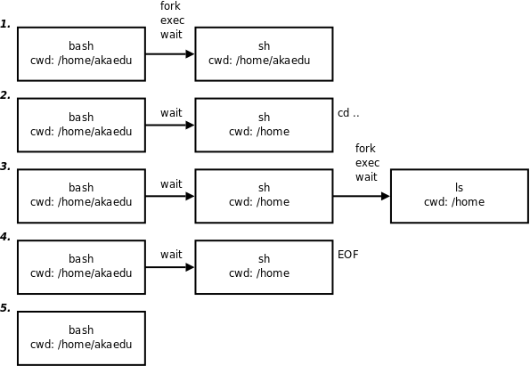

# 子 SHELL

> 一个 SHELL 脚本可以启动多个子进程，这些子进程使得脚本进行并行处理

```shell
#!/bin/bash

command 
sh sub_shell.sh  # 运行子 SHELL 脚本文件
command
```

## SHELL 脚本如何执行命令

<figure><figcaption></figcaption></figure>

```shell
#! /bin/sh
# script.sh
cd ..
ls
```


> 1. 交互Shell（`bash`）`fork`/`exec`一个子Shell（`sh`）用于执行脚本，父进程`bash`等待子进程`sh`终止。
> 2. `sh`读取脚本中的`cd ..`命令，调用相应的函数执行内建命令，改变当前工作目录为上一级目录。
> 3. `sh`读取脚本中的`ls`命令，`fork`/`exec`这个程序，列出当前工作目录下的文件，`sh`等待`ls`终止。
> 4. `ls`终止后，`sh`继续执行，读到脚本文件末尾，`sh`终止。
> 5. `sh`终止后，`bash`继续执行，打印提示符等待用户输入。
