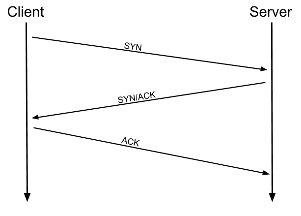
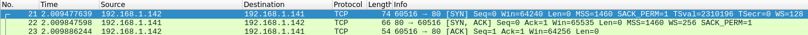
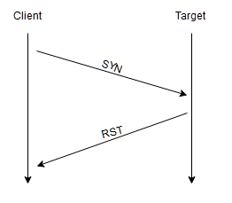
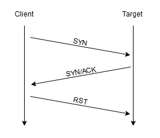
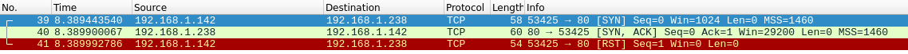

# 研究

## TCP 连接扫描

```bash
-sT
```

我们首先需要知道的是 TCP 连接涉及三次握手：

* 主机向目标服务器发送一个 SYN 标志的 TCP 请求
* 服务器使用包含 SYN 和 ACK 标志的 TCP 响应
* 主机收到后发送 ACK 标志的 TCP 请求完成握手



<figure><figcaption></figcaption></figure>



<figure><figcaption></figcaption></figure>



NMAP 通过依次与每个目标端口进行三次握手来查看 TCP 端口是否打开

> 1. 那么如何检测端口关闭？
>
> 在 RFC 793 中指出，如果连接不存在，则发送一个 RST 标志的TCP 数据包，通过这个响应 NMAP 就可以确定端口关闭

<figure><figcaption></figcaption></figure>

> 2. 如果端口隐藏在防火墙后？
>
> 许多防火墙的配置为简单<mark style="color:red;">丢弃传入的数据包</mark>，所以当发送 SYN 请求并且没有收到回复时，可以说明该端口受到防火墙保护，因此认为该端口被过滤

## SYN 扫描

```bash
-sS
```

SYN 扫描有时称为 Half-open 扫描或者 隐形扫描，相较于 TCP 扫描 SYN 扫描是将第三次发送的数据包<mark style="color:red;">由 SYN 变为了 RST 数据包</mark>&#x20;



<figure><figcaption></figcaption></figure>



<figure><figcaption></figcaption></figure>



