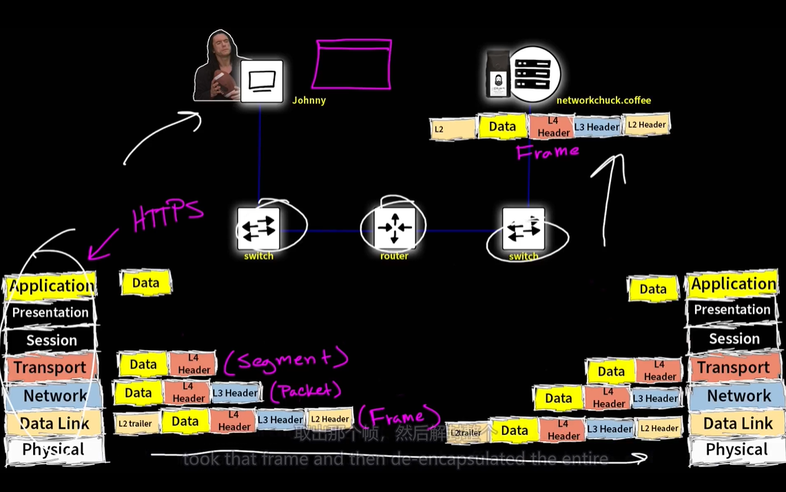

# 什么是TCP/IP模型？什么是OSI模型？

> [视频1](https://www.iculture.cc/cybersecurity/pig=13798)
>
> * [视频2](https://www.iculture.cc/cybersecurity/pig=13789)
> * [视频3](https://www.iculture.cc/cybersecurity/pig=15870)

## TCP/IP 模型

* 应用层 （Application）
* 传输层 （Transport）: TCP UDP
* 网络层 （Network） : MAC 地址 （路由器）
* 数据链路层 （Data Link）： IP 地址 （交换机）
* 物理层 （Physical）： 传输设备 （电缆、光纤、双绞线、集线器、中继器）

## OSI 模型

* 应用层 （Application）
  * 是你计算机上需要网络的应用程序接口
* `表示层 （Presentation）`
  * 处理数据格式和加密
* `会话层 （Session）`
  * l2tp (第二层隧道协议) ： RTCP、h.245、Socks
* 传输层 （Transport）
  * 依据：端口
  * 协议：TCP、UDP
  * 处理数据名称： segmemt
* 网络层 （Network）
  * 依据： IP 地址
  * 设备： 路由器
  * 协议： OSPF、RIP、ARP
  * 处理数据名称：package
* 数据链路层 （Data Link）
  * 依据： MAC 地址
  * 设备： 交换机
  * 处理数据名称： 帧
* 物理层 （Physical）
  * 传输设备： 电缆、光纤、双绞线、集线器、中继器

> 速记： ALL PEOPLE SEEM TO NEED DATA ProCESSING (所有人似乎都需要处理数据)

<figure><figcaption></figcaption></figure>

> * TCP : FTP HTTP SMTP
> * UDP : DHCP SNMP TFTP
> * TCP\&UDP : DNS
