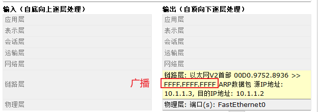

# 什么是交换机

> 交换机是集线器的进阶版本，集线器会对收到的数据发往除源主机以外的其余全部主机，而交换机会配合 ARP 协议获取 MAC 地址，然后发往指定主机。
>
> 视频地址 --> [链接](https://www.iculture.cc/cybersecurity/pig=12316)

在交换机中存在一个 CAM 表，这个表存放的内容为`交换机的端口`以及`对应连接的电脑 MAC 地址`。

```shell
# 查看一个交换机的 CAM 表
Switch>enable
Switch#show mac-address-table
          Mac Address Table
-------------------------------------------

Vlan    Mac Address       Type        Ports
----    -----------       --------    -----

   1    0001.4298.a262    DYNAMIC     Fa0/4
   1    00d0.9752.8936    DYNAMIC     Fa0/2
   1    00e0.b059.0a97    DYNAMIC     Fa0/1
```

> * 交换机中转发的数据为`帧` (也就是第二层)
> * 电脑（路由器）接受到的数据为 `数据包` (也就是第三层)

## 无线

> 无线基本就和交换机做同样的工作，但是更像是集线器

无线会将数据包发送给所有的终端

## 总结

### 交换机和集线器的区别：

* 对于集线器而言，信号将沿其**端口进行传输，并广播到其他端口，正因如此容易产生广播风暴，当网络规模较大时其性能会受到影响**。
* 而交换机只有发出**请求的端口**和**目的端口**之间**才会相互响应**，并**不会影响到其他端口**，因此交换机能够在一定程度上有效抑制广播风暴的产生。
*

### 交换机可以识别到第几层

交换机和集线器只能识别到第二层，他们只能看到 MAC 地址

## 问题

### 在一个集线器连接局域网中的电脑是如何知道目标的 MAC 地址的？

<figure><figcaption></figcaption></figure>


