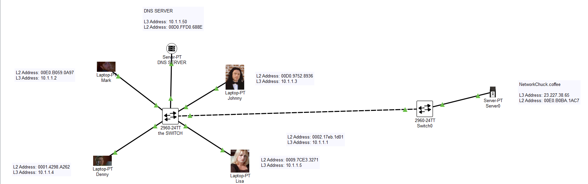
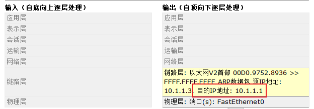
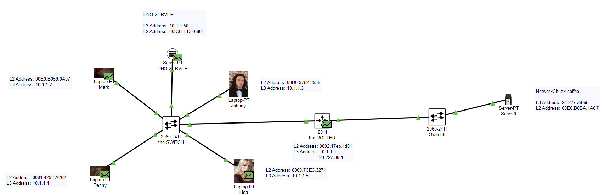
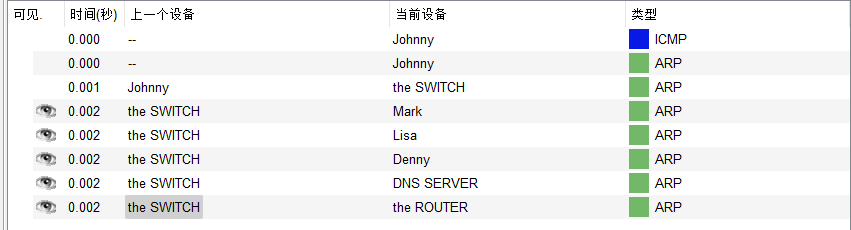
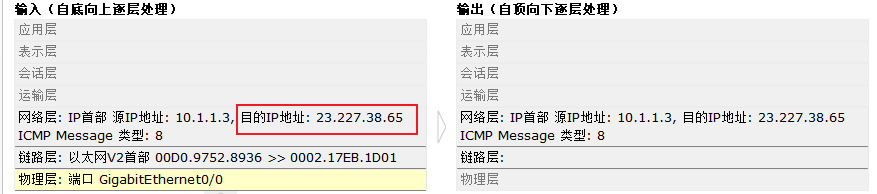
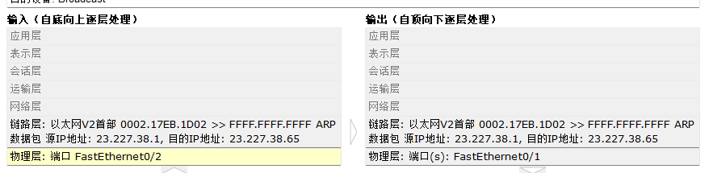
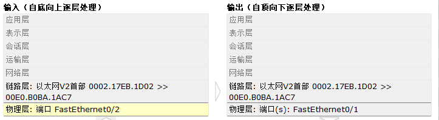

# 什么是路由器

> [视频](https://www.iculture.cc/cybersecurity/pig=12876)

## 为什么需要路由器？

> 现在我们在一个由两个交换机分别组成的局域网中

<figure><figcaption></figcaption></figure>

> 现在我们假设是第一次开机，电脑不知道任何 MAC 地址

我们在 10.1.1.3 执行 ping 10.1.1.4 时，会发送 ATP 请求包：

> 我们可以注意到目的地址是 10.1.1.4

现在我们去 ping 23.227.38.65 查看 ARP 请求包：

<figure><figcaption></figcaption></figure>

> 我们可以发现目的地址是 10.1.1.1 并不是 23.227.38.65
>
> > 为什么会出现这种情况？
> >
> > * 因为 10.1.1.3 主机知道 23.227.38.65 不在局域网中 (子网掩码)
> > * 10.1.1.1 是 10.1.1.3 的默认网关 (路由器)

## 路由器如何解决的？

> 现在我们解决上面的问题，我们加入路由器

<figure><figcaption></figcaption></figure>

1.  获取 MAC 地址

    > 当我执行 ping 之后，对包进行分析

    > 我们知道 ARP 请求包的 目的 IP 地址为 10.1.1.1，这是默认网关，而路由器与该局域网连接的端口的 IP 地址为 10.1.1.1

    <figure><figcaption></figcaption></figure>

    <figure><figcaption></figcaption></figure>
2.  路由器返回自己的 MAC 地址

    > 路由器告诉源主机自己的 MAC 地址，这时候发的数据报:

    <figure><figcaption></figcaption></figure>
3.  路由器发送 ARP 请求包，到目标网络寻找 MAC 地址

    > `注意端口的变化`

    <figure><figcaption></figcaption></figure>
4.  找到 MAC 地址后，路由器将数据报进行修改再次发送

    <figure><figcaption></figcaption></figure>

## 总结

* 路由器可以阻止广播风暴
* 路由器每一个端口都一个 IP 地址

### 路由器可以识别到第几层

路由器是一个三层设备，是根据 IP 地址
