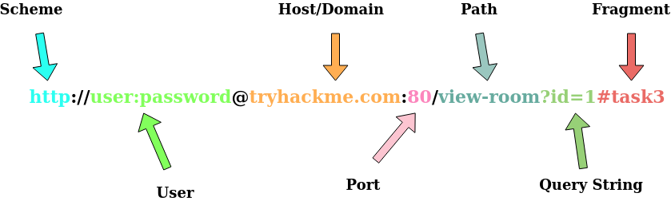

# HTTP

## 请求和响应

### URL

<figure><figcaption></figcaption></figure>

> * Scheme : 使用什么协议访问资源
> * User：有些服务需要身份验证才能登陆，可以在 URL 中输入用户名和密码登陆
> * Host：访问的服务器
> * Port：连接的端口
> * Path：访问资源的文件名
> * Query String：查询字符串
> * Fragment：对请求资源的某个位置的引用
