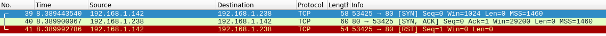

# linux下使用clash(GUI)

1.  安装 [Clash.for.Windows-0.20.12-x64-linux.tar.gz](https://github.com/Fndroid/clash\_for\_windows\_pkg/releases/download/0.20.12/Clash.for.Windows-0.20.12-x64-linux.tar.gz)

    <figure><figcaption><p>下载指定文件</p></figcaption></figure>


## 执行以下命令

<pre class="language-bash"><code class="lang-bash"># 解压文件到 /opt
<strong>$ sudo tar -zx Clash.for.Windows-0.17.1-x64-linux.tar.gz -C /opt 
</strong><strong># 打开 opt 
</strong><strong>$ cd /opt
</strong># 重命名文件
$ sudo mv 'Clash for Windows-0.17.1-x64-linux' clash
# 打开程序文件夹
$ cd clash 
# 运行 clash
$ ./cfw 
</code></pre>

<figure><figcaption></figcaption></figure>

## 修改配置文件

<pre class="language-bash"><code class="lang-bash"># 将文件改为可读可写状态
$ sudo chmod 666 /etc/environment
# 编辑文件
$ vi /etc/environment
    http_proxy=http://127.0.0.1:7890/
    https_proxy=http://127.0.0.1:7890/
    ftp_proxy=http://127.0.0.1:7890/
    HTTP_PROXY=http://127.0.0.1:7890/
    HTTPS_PROXY=http://127.0.0.1:7890/
<strong>    FTP_PROXY=http://127.0.0.1:7890/
</strong><strong># 改为原来的只读状态
</strong>sudo chmod 444 /etc/environment
# 重启电脑
</code></pre>

## 设置 apt 走代理

```bash
sudo vi /etc/apt/apt.conf.d/10proxy   #这个文件正常不存在，会新建一个
#编辑内容为：
Acquire::http::Proxy "http://192.168.1.1:8080";
```
