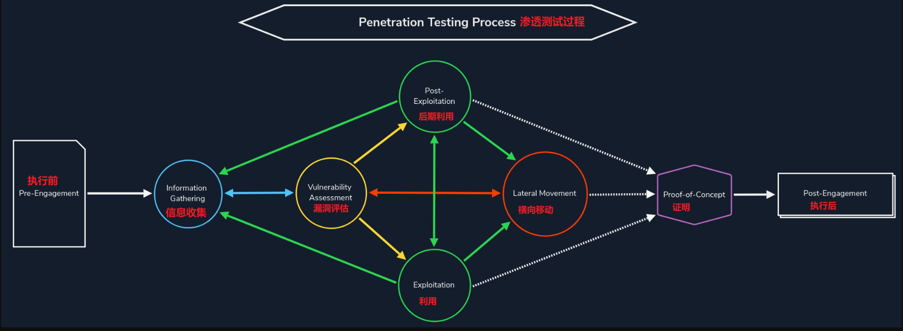

# 侦查

<figure><figcaption></figcaption></figure>

## Whois

> WHOIS 服务器在TCP端口 43 上侦听传入请求。域名注册商负责维护其租用域名的 WHOIS 记录。WHOIS 服务器回复与所请求域相关的各种信息，通过这些信息我们可以知道：
>
> * 注册商：域名是通过哪个注册商注册的？
> * 注册人联系方式：姓名、单位、地址、电话等。（除非通过隐私服务隐藏）
> * 创建、更新和到期日期：域名首次注册的时间是什么时候？最后一次更新是什么时候？什么时候需要更新？
> * 名称服务器：请求哪个服务器来解析域名？

```shell
$ whois google.com
```

* [在线 WHOIS 查询](https://www.whois.com/whois/)

## ping

> 我们可以使用 ping 去 ping 主机来判断目标的存活状态

没有收到 ping 回复的原因？

* 目标计算机没有响应
* 网络上下线或者存在故障设备
* 防火墙配置为阻止此类数据包，默认情况下 WIndows 防火墙会阻止 ping

## traceroute

> 使用该工具对路由进行查看

## 域信息

> 请查看[子域枚举模块](../zi-yu-mei-ju/)

## 黑暗搜索引擎

### 1. Shodan.io

> 国外的黑暗搜索引擎
>
> * [Shodan.io](https://www.shodan.io/)
