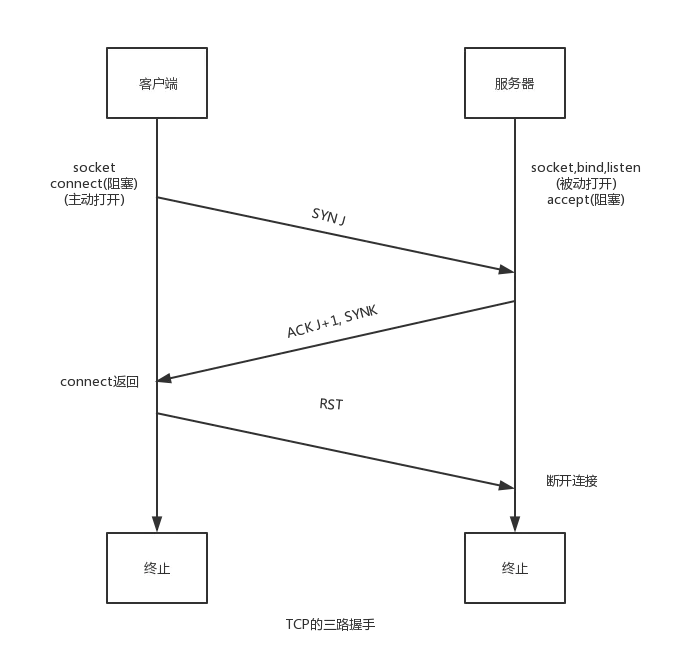

# masscan

> 该工具只适合扫描端口

## 安装

```bash
sudo apt install masscan
```

## 原理

> MASSCAN不建立完整的TCP连接，收到SYN/ACK之后，发送RST结束连接。选项--banners除外。

<figure><figcaption></figcaption></figure>

## 使用

```bash
# 扫描 B 类子网的 443 端口
masscan 192.168.0.0/16 -p 443
# 扫描指定范围内端口
masscan 192.168.0.0/16 -p22-25
```

## 参数介绍

```bash
```
