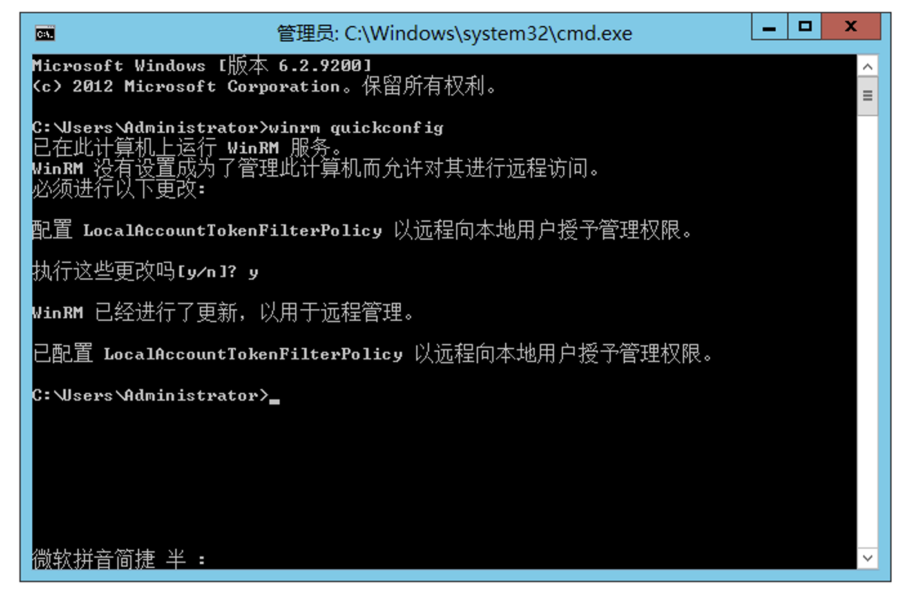
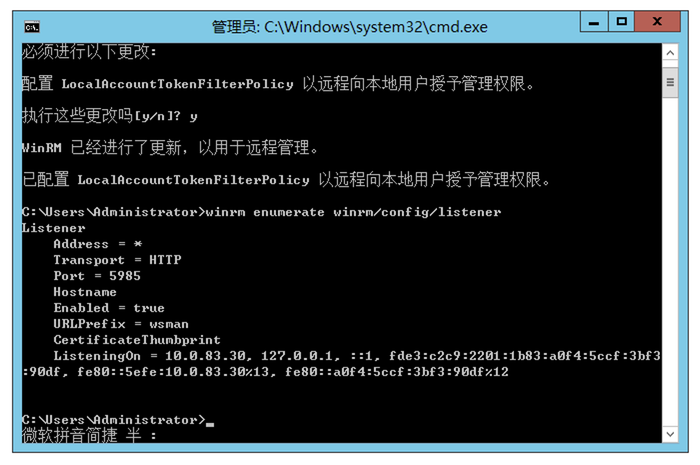
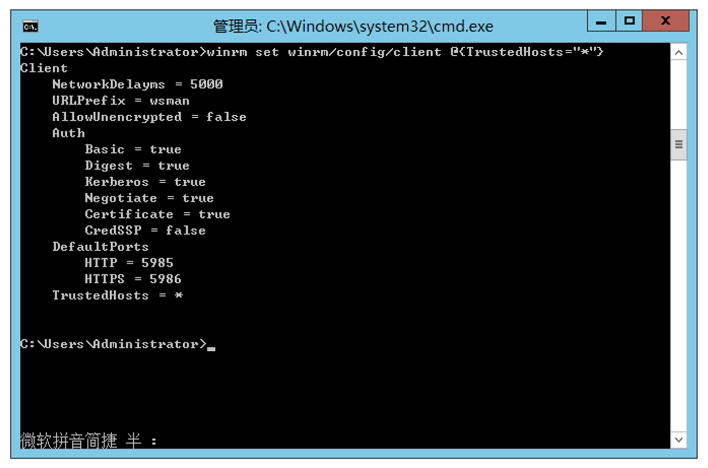
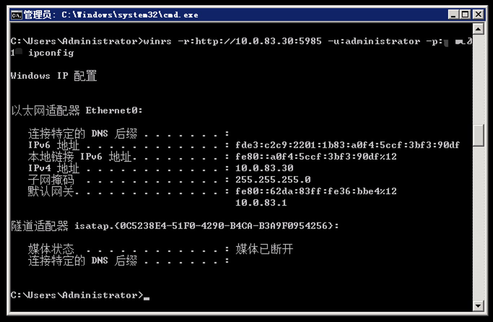

# WINRM 介绍

> 是一个简单的基于命令行的 WIndows 集成远程管理协议， WinRM 使用简单对象访问协议 SOAP 来建立与远程主机及其应用程序的连接。
>
> * 使用 TCP 端口： 5985(HTTP)、5986（HTTPS）

```shell
# nmap 扫描
nmap -sV -sC 10.129.201.248 -p5985,5986 --disable-arp-ping -n
```

如果我们想知道是否可以通过 WinRM 访问一个或多个远程服务器，我们可以在 Powershell 的帮助下达到，使用 [Test-WsMan](https://learn.microsoft.com/en-us/powershell/module/microsoft.wsman.management/test-wsman?view=powershell-7.2), 负责此操作，并将相关主机名称传递给他，在 Liux 环境中，我们可以使用名为[evil-winrm](https://github.com/Hackplayers/evil-winrm)的工具，这是另一个旨在与 WinRM 交互的渗透测试工具。

## WS-Management 协议\&WinRM

Web服务管理协议（WS-Management，Web Services-Management）是一种基于SOAP协议的DMTF开放标准，用于对服务器等网络设备以及各种Web应用程序进行管理。WinRM（[Windows Remote Management](https://docs.microsoft.com/en-us/windows/win32/winrm/portal)）是Windows对WS-Management的实现，允许远程用户使用工具和脚本对Windows服务器进行管理并获取数据。WinRM服务自Windows Vista开始成为Windows的默认组件，在运行与启动上有以下几个特点：

1. 在Windows Vista上必须手动启动WinRM服务，但从Windows Server 2008开始，WinRM服务自动启动
2. 默认情况下，WinRM服务后台已经运行，但并不开启监听模式，因此无法接受和发送数据
3. 使用WinRM提供的quickconfig对WinRM进行配置后，Windows将开启监听并打开HTTP及HTTPS监听端口，同时Windows防火墙生成这两个端口的例外

WinRM的组件主要由以下几部分构成:

1. WinRM Scritping API：提供给外部的用于执行管理操作的接口
2. winrm.cmd和winrm.vbs：系统内置的用于配置WinRM的命令行工具，基于VBS脚本并使用了WinRM Scritping API
3. winrs.exe：基于命令行的工具，此工具作为客户端使用，用于远程连接运行WinRM的服务器并执行大多数的cmd命令

可以参照Windows给出的[WinRM安装和配置文档](https://docs.microsoft.com/en-us/windows/win32/winrm/installation-and-configuration-for-windows-remote-management)快速配置WinRM环境。

在命令行中执行`winrm quickconfig`对WinRM进行首次（默认）配置：

<figure><figcaption></figcaption></figure>

此时，WinRM服务已经开始监听5985/TCP（从WinRM2.0开始，服务的HTTP默认监听端口由原来的80/TCP变更为5985/TCP）端口并等待远程主机进行访问，通过`winrm enumerate winrm/config/listener`查看WinRM服务当前的配置情况：

<figure><figcaption></figcaption></figure>

以此配置为例，此时远程主机已经可以通过WS-Management协议访问http://10.0.83.30/wsman连接当前服务器的WinRM服务。不过，WinRM`只允许当前域用户或者处于本机TrustedHosts列表中的远程主机`进行访问。因此在连接之前，还需要`确保发起连接的主机与当前服务器处于同一域或者两台主机的WinRM服务TrustedHosts中必须存在对方主机的IP或主机名`，这里类似于一个白名单机制。可以执行`winrm set winrm/config/client @{TrustedHosts="*"}`手动配置当前服务器允许被任意主机连接：

<figure><figcaption></figcaption></figure>

在本地Windows主机上也进行相同的设置，允许连接任意Windows主机。接着，使用winrs客户端连接这台Windows服务器即可直接执行系统命令，例如运行：

```shell
winrs -r:http://10.0.83.30:5985 -u:administrator -p:123456 
```

ipconfig得到网络配置信息：

<figure><figcaption></figcaption></figure>

上述操作为WinRM服务的一次简单的配置和使用过程。

在Windows中，除了WinRM本身，其他一些工具和一些第三方工具也都借助了WinRM所提供的功能。例如：

1. PowerShell：自2.0开始引入了Remoting技术，即远程执行PowerShell命令，此技术基于WinRM服务实现。
2. Ansible：基于Python的开源IT自动化平台，使用pywinrm库远程管理Windows服务器，基于WinRM服务。

## 参考文章

* [内网横移之 WINRM](https://0x0c.cc/2019/09/25/%E5%86%85%E7%BD%91%E6%A8%AA%E7%A7%BB%E4%B9%8BWinRM/#%E5%86%85%E7%BD%91%E6%A8%AA%E7%A7%BB%E4%B8%AD%E7%9A%84WinRM)
