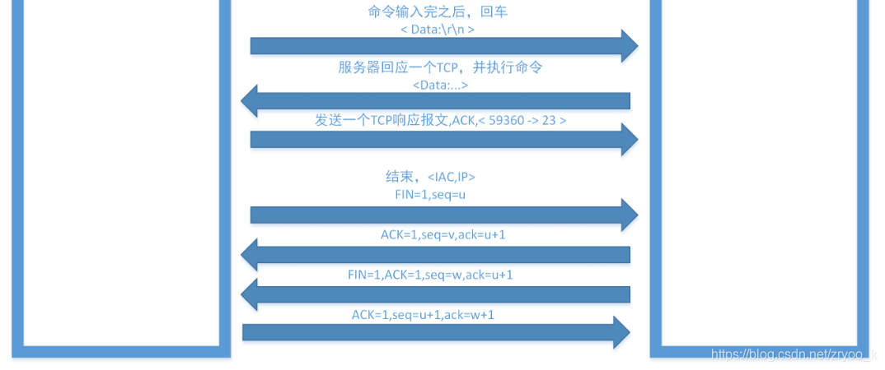

# Telnet 协议

## Telnet 协议

Telnet 协议是一种最早的 Internet 应用， Telnet 协议提供了一种通过`终端远程登陆`到服务器的方式，呈现一个交互式操作界面，用户可以先登陆到一个主机，再通过 telnet 的方式远程登陆到网络上的其他主机，而不需要为每个主机都连接一个硬件终端，然后对设备进行配置和管理

## Telnet 基本概念

### 1. NVT 网络虚拟终端

一种`双向的虚拟设备`，连接的双方都必须将各自的物理终端 NVT 之间进行转换，Telnet协议可以工作再任何主机（例如任何擦操作系统）或者任何终端之间就是由于使用了统一的NVT。

NVT是虚拟设备，对于连接的双方，即客户机和服务器，都必须把它们的物理终端和NVT进行相互转换。也就是说，不管客户进程终端是什么类型，操作系统都必须把它转换为NVT格式，同时，不管服务器进程的终端是什么类型，操作系统必须能够把NVT格式转换为终端所能够支持的格式。

\*\*如下图：\*\*物理终端与NVT的转换模型

<figure><figcaption></figcaption></figure>

### 2. Telnet 连接

一个telnet连接就是用来传输带有Telnet控制信息数据的TCP连接。

### 3. telnet的C/S模式

telnet采用客户端/服务器模式。下图为telnet客户端和服务器连接图：

<figure><figcaption></figcaption></figure>

如图为：

* telnet使用的传输协议为TCP。
* telnet连接的任何回显信息，最终都会输出到终端上。
* 服务器进程直接与“伪终端设备”交互。
* 客户端和服务器通过一条TCP连接来传输命令和数据。
* 客户端登录到服务器上。

## Telnet 工作原理

telnet协议可以在任何主机或者任何终端之间。无论客户终端是什么类型，操作系统也会将NVT格式转换成服务器终端所支持的类型。那么，可以屏蔽具体的客户端和终端类型，简单地认为telnet双方都连接在NVT上。

telnet连接的两端，通过"WILL、WONT、DO、DONT"请求来进行选项协商，从而确定telnet服务费具体内容。这些选项包括回显、改变命令字符集、行方式等。

### telnet中的请求

telnet连接的任何一方都可以主动发起请求。请求含义和用法如下所示：

<figure><figcaption></figcaption></figure>

发起方发送“选项失效”请求（WONT和DONT）时，接收方必须同意；

发起发发送一些“选项有效”的请求，接收方可以接受或者拒绝这些请求；

* 如果接受请求，则选项立即生效
* 如果拒绝请求，则选项不生效，而发送方仍然能保留NVT的特性。

## 图解交互过程

<figure><figcaption></figcaption></figure>

<figure><figcaption></figcaption></figure>

<figure><figcaption></figcaption></figure>

<figure><figcaption></figcaption></figure>

## 参考文章

* [Telnet协议详解](https://blog.csdn.net/m0\_52165864/article/details/126894004?ops\_request\_misc=%257B%2522request%255Fid%2522%253A%2522167282888016800213010770%2522%252C%2522scm%2522%253A%252220140713.130102334..%2522%257D\&request\_id=167282888016800213010770\&biz\_id=0\&utm\_medium=distribute.pc\_search\_result.none-task-blog-2\~all\~sobaiduend\~default-1-126894004-null-null.142^v68^pc\_rank\_34\_queryrelevant25,201^v4^add\_ask,213^v2^t3\_control1\&utm\_term=TELNET%20%E5%8D%8F%E8%AE%AE\&spm=1018.2226.3001.4187)
* [图解 Telnet 协议](https://blog.csdn.net/zryoo\_k/article/details/93036016?spm=1001.2101.3001.6650.1\&utm\_medium=distribute.pc\_relevant.none-task-blog-2%7Edefault%7ECTRLIST%7ERate-1-93036016-blog-126894004.pc\_relevant\_default\&depth\_1-utm\_source=distribute.pc\_relevant.none-task-blog-2%7Edefault%7ECTRLIST%7ERate-1-93036016-blog-126894004.pc\_relevant\_default\&utm\_relevant\_index=2)

## 参考实例

* [TELNET - authentication](https://www.yuque.com/gulujili/utxn4o/yyyqu9v5ia2mg26i)
