# Linux

## Linux目录结构

1. 基本介绍：
   1.  Linux的文件系统是采用**级层式**的**树状目录结构**，在此结构上最上层的根目录是\*\*/\*\*，然后在此目录下创建其他目录

       > 1. Windows系统一直是以存储介质为主的
       > 2. UNIX/Linux是以目录结果为主， 从本质上来说无论是目录结构还是操作系统内核都是存储在磁盘上的，但是从逻辑上来说Linux的磁盘是**挂载**在目录上的
   2.  示意图： &#x20;

       <figure>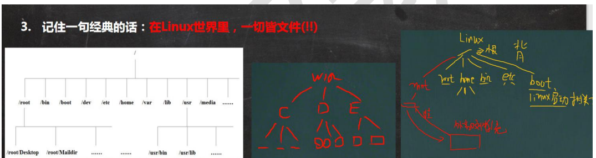<figcaption></figcaption></figure>
2.  目录结构

    |      命令     |                                     | 作用                      |
    | :---------: | ----------------------------------- | ----------------------- |
    |  /bin \[常用] | <p>/user/bin<br>/user/local/bin</p> | 存放最常使用的**命令**           |
    |    /sbin    | (/usr/sbin /usr/local/sbin)         | 存放系统管理员使用的**系统管理程序**    |
    |    /home    |                                     | 存放用户的主目录                |
    |    /root    |                                     | 该目录为系统管理员               |
    |     /lib    |                                     | 系统开机所需要的最基本的动态连接共享库     |
    | /lost+found |                                     | 当系统非法关机时，这里就存放一些文件      |
    |     /etc    |                                     | 所有系统管理所需要的配置文件和子目录      |
    |     /usr    |                                     | 存放用户的应用程序和文件            |
    |    /boot    |                                     | 存放**启动**Linux时使用的一些核心文件 |
    |    /proc    |                                     | 系统内存的映射                 |
    |     /srv    |                                     | 存放**服务启动**后需要提取的数据      |
    |     /sys    |                                     | 安装了2.6内核中新出现的文件系统       |
    |     /tmp    |                                     | 存放临时文件                  |
    |     /dev    |                                     | 把所有的硬件用文件的形式进行存储        |
    |    /media   |                                     | Linux会把识别的设备挂载到这个目录下    |
    |     /mnt    |                                     | 为了让用户临时挂载别的文件系统         |
    |     /opt    |                                     | 额外安装软件所存放的目录            |
    |  /usr/local |                                     | 另一个给主机额外安装软件所安装的目录      |
    |     /var    |                                     | 存放不断扩充的东西               |
    |   /selinux  |                                     | 是一种安全子系统                |
    |     pwd     |                                     | 显示当前用户所在的目录             |

## Vim编辑器

<figure>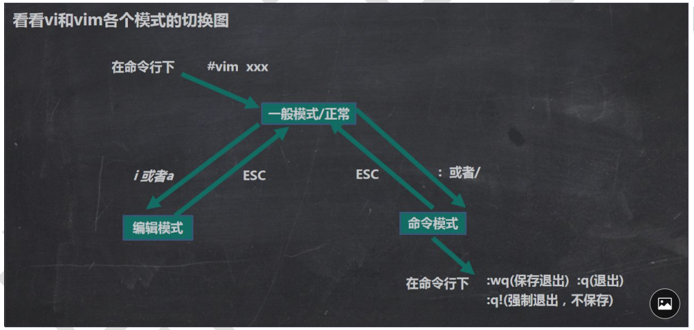<figcaption></figcaption></figure>

1. Vim是文本编辑器具有程序编辑的能力
2. 三种模式：
   1. 正常（一般）模式： 使用**vim**打开一个文件就进入了一般模式
   2. 插入模式：按下**i**进入编辑模式
   3. 命令行模式：按下**Esc**键，在输入指令，可以完成读取、存盘、替换、表示行号等动作&#x20;
3. 快捷键：
   * 拷贝当前行： **yy**，(如果是要拷贝当前行向下n行输入**nyy**),并粘贴：**p**
   * 删除当前行： **dd**，（如果是删除当前行向下n行输入**ndd**）
   * 在文件中查找某个单词，在命令行模式下输入/关键字，回车进行查找，输入n就是查找下一个
   * 设置文件行号：命令行模式下，输入 :set nu 取消文件行号：输入:set nonu
   * 锁定到文件末尾 一般模式下，输入G 锁定到文件开始 一般模式下，输入gg
   * 撤销一个动作：一般模式下，输入 u
   * 锁定到具体行：一般模式下，输入行数，在输入 shift+g

## Linux 开机 重启 用户登录

1. 关机 重启命令
   1. shutdown - h now 立刻进行关机
   2. shutdown - h n 在n分钟后进行关机默认是一分钟
   3. shutdown - r now 现在重新启动计算机
   4. halt 关机
   5. reboot 现在重新启动计算机
   6. sync 把内存的数据同步到磁盘中（建议在关机前使用该指令避免数据丢失）
2. 用户登录 注销
   1. 切换用户 **su - 用户名**
   2. 在提示符下输入logout注销用户，（在图形运行级别无效）

## 用户管理

1.  创建用户：useradd 用户名 当创建用户成功后，会自动的创建和用户同名的家目录（默认是 /home/用户名） 当然也可以通过 useradd -d 指定目录 新的用户名 ,给新创建的用户指定家目录

    > `adduser` 和 `useradd` 的区别是什么
    >
    > 答：`useradd` 只创建用户，**不会创建用户密码和工作目录**，创建完了需要使用 `passwd <username>` 去设置新用户的密码。`adduser` 在创建用户的同时，会创建工作目录和密码（提示你设置），做这一系列的操作。其实 `useradd`、`userdel` 这类操作更像是一种命令，执行完了就返回。而 `adduser` 更像是一种程序，需要你输入、确定等一系列操作
2. 指定/修改密码：passwd 用户名 （注意这是修改当前用户的密码）
3. 删除用户：usrdel 用户名 (这是删除用户，保留家目录) 删除用户以及用户家目录： userdel -r 用户名
4. 查询用户信息指令： id 用户名
5.  查看当前用户： who am i&#x20;

    <figure>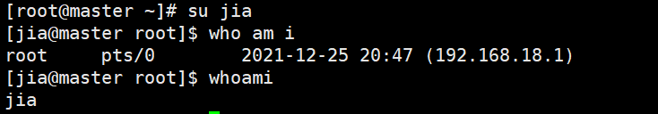<figcaption></figcaption></figure>

    > 1. 输出的第一列表示打开**当前伪终端的用户的用户名**（要查看当前登录用户的用户名，去掉空格直接使用 `whoami` 即可），
    > 2. 第二列的 `pts/0` 中 `pts` 表示伪终端，所谓伪是相对于 `/dev/tty` 设备而言的，还记得上一节讲终端时的那七个使用 `[Ctrl]`+`[Alt]`+`[F1]～[F7]` 进行切换的 `/dev/tty` 设备么，这是“真终端”，伪终端就是当你在图形用户界面使用 `/dev/tty7` 时每打开一个终端就会产生一个伪终端，`pts/0` 后面那个数字就表示打开的伪终端序号，你可以尝试再打开一个终端，然后在里面输入 `who am i`，看第二列是不是就变成 `pts/1` 了，
    > 3. 第三列则表示当前伪终端的启动时间。
6. 用户组：系统可以对有共性/权限的多个用户进行统一的管理 新增组： groupadd 组名 （当我们创建一个用户时就会创建一个与用户名相同的组） 删除组： groupdel 组名\
   创建一个用户并将其指定到一个组： useradd -g 用户组 用户名 将一个用户移至指定组： usermod -g 用户组 用户名
7. 用户和组相关的文件：
   * /etc/passwd 文件 用户的配置文件，记录用户的各种信息 每行的含义： 用户名:口令:用户标识号:组标识号:注释性描述:主目录:登录 Shell&#x20;
   * /etc/shadow文件 口令的配置文件 每行含义：登录名:加密口令:最后一次修改时间:最小时间间隔:最大时间间隔:警告时间:不活动时间:失效时间:标志
   * /etc/group文件 组的配置文件，记录Linux包含的组的信息 每行含义：组名:口令:组标识号:组内用户列表

## 实用指令

### 1. 运行级别

1.  说明： 0：关机 1：单用户（找回丢失密码） 2：多用户状态没有网络服务 3：多用户状态有网络服务 4：系统未使用保留给用户 5：图形界面 6：系统重启

    常用的运行级别为 3 5 可以使用**init 运行级别**来切换不同的运行级别

    > multi-user.target: analogous to runevel 3
    >
    > graphical.target: analogous to runlevel 5
    >
    > 获取当前默认运行级别：systemctl get-default
    >
    > 设置当前默认运行级别：systemctl set-default multi-user.target | graphical.target

### 2. 帮助指令

内建命令：shell 程序的一部分，通常在Linux系统加载运行时shell就被加载并驻留在系统内存中，而且解析内部命令shell不需要创建子进程 外部命令：是Linux系统中的实用程序部分，只有在需要时才需要跳入内存

1. man获取帮助信息（cman） 基本语法： man \[命令或配置文件] （功能描述：获得帮助信息） eg： man ls 在Linux下，隐藏文件是以\*\*.\*\*开头的
2. help指令 基本语法：help 命令 （功能描述：获得shell**内置命令**的帮助信息） 如果是外部命令实验 命令 --help

### 3. 文件目录类

1. pwd指令： 基本语法 pwd\
   功能描述： 显示当前工作目录的绝对路径
2. ls指令： 基本语法：ls \[选项] \[目录或是文件] 常用选项： -a : 显示当前目录所有的文件和目录，包括隐藏的 -l ：以**列表的方式**显示信息
3.  cd指令： 基本语法：cd \[参数]\
    功能描述：切换到指定目录&#x20;

    cd \~ 或者 cd ：回到自己的家目录\
    cd .. : 返回上一级目录
4. mkdir指令： 基本语法：mkdir \[选项] 要创建的目录 功能描述： 用于创建目录 常用选项： -p ： 创建多级目录
5. rmdir指令： 基本语法：rmdir \[选项] 要删除的**空目录** 功能描述： 删除空目录
6. touch指令： 基本语法：touch 文件名称 功能描述：touch指令创建空文件

> touch指令：主要作用是用来更改已有文件的时间戳的(比如：最近访问时间，最近修改时间)，但其在不加任何参数的情况下，只指定一个文件名，则可以创建一个指定文件名的空白文件(不会覆盖已有同名文件，会更改文件的时间戳)

1.  cp 指令： 基本语法：cp \[选项] source dest 功能描述：拷贝文件到指定目录 常用选项： -r ： 递归赋值整个文件夹 使用细节：强制覆盖不提示的方法：\cp \[选项] 源文件 目标文件

    案例：将/home/hello.txt拷贝到/home/bbb目录下： cp /home/bbb /opt
2. rm 指令： 基本语法：rm \[选项] 要删除的文件和目录 功能描述：rm指令移除文件或目录 常用选项： -r：递归删除整个文件夹 -f: 强制删除不提示
3. mv指令： 基本语法：mv oldNameFile newNameFile （功能描述 ：重命名） mv /temp/movefile /targetFolder (功能描述：移动文件)
4. cat指令： 基本语法：cat \[选项] 要查看的文件 功能描述：查看文件内容 常用选项： -n ：显示行号 使用细节： cat只能浏览文件，而不能修改文件，为了浏览方便，一般会带上 管道命令 |more cat -n /eyc/profile |more
5. more指令 基本语法： more 要查看的文件 功能描述：more指令是一个基于VI编辑器的文本过滤器，它以全屏幕的方式按页显示文本文件的内容
6. less指令： 基本语法：less 要查看的文件 功能描述：less指令用来分屏查看文件内容，它的功能与more指令类似，但是比more指令更加强大，支持各种显示终端，less指令在显示文件内容是，并不是一次将整个文件加载后才显示，而是根据显示需要加载内容，对于显示大型文件具有较高的效率&#x20;
7.

    <figure>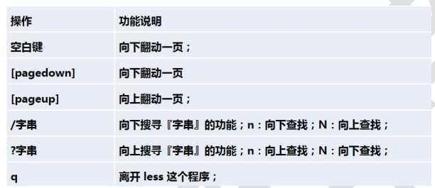<figcaption></figcaption></figure>
8. echo指令： 基本语法：echo \[选项] \[输出内容] 功能描述：输出内容到控制台
9. head指令： 基本语法： head 文件 （功能描述： 查看文件头10行内容） head -n 5 文件 （功能描述：查看文件头5行内容） 功能描述：用于显示文件的开头部分内容，默认情况下head指令显示文件的头10行内容
10. tail指令： 基本语法：tail 文件 （功能描述：查看文件尾10行内容） tail -n 5 文件 （功能描述：查看文件尾5行内容，5可以使任意行数） tail -f 文件 （功能描述：实时追踪该文档的所有更新） 功能描述： 输出文件中尾部的内容
11. **>** 指令和 **>>** 指令 基本语法：ls -l > 文件 （功能描述： 列表的内容写入文件中） ls -al >>文件 （功能描述：列表的内容追加到文件的末尾） cat 文件1 > 文件2 （功能描述：将文件1的内容覆盖写到文件2中） echo "内容" >> 文件 （功能描述 ： 将内容追加到文件中） 功能描述： **>** 输出重定向 **>>** 追加 案例： 将/home目录下的文件列表写入到/home/info.txt中，覆盖写入 ls -l /home > /home/info.txt 案例：将当前日历信息，追加到/home/mycal文件中 cal >> /home/mycal
12. In指令 基本语法：In -s \[原文件或目录] \[软连接名] 功能描述：给原文件创建一个软链接 软链接：也称为符号链接，类似于Windows中的快捷方式，主要存放了链接其他文件的路径
13. history指令 基本语法：history 功能描述：查看以及执行过的历史命令，也可以执行历史命令 案例： 显示所有的历史命令：history 显示最近使用过的10个指令：history 10 执行历史编号为5的指令：!5

### 4. 时间日期类

|            基本语法           |                 功能描述                 |
| :-----------------------: | :----------------------------------: |
|            date           |                显示当前时间                |
|         date "+%Y"        |                显示当前年份                |
|         date "+%m"        |                显示当前月份                |
|         date "+%d"        |               显示当前是那一天               |
| date "+%Y-%m-%d %H:%M:%S" |               显示年月日时分秒               |
|       date -s 字符串日期       |                设置系统日期                |
|            cal            | <p>查看日历指令<br>显示2020年日历： cal 2020</p> |

### 5. 搜索查找类

1.  find指令 基本语法：find \[搜索范围] \[选项] 功能描述：find指令从指定目录向下递归遍历其各个子目录，将满足的文件或目录显示在终端 常用选项：

    |     选项     |                         功能描述                         |
    | :--------: | :--------------------------------------------------: |
    | -name 文件名称 |                   按照指定的文件名查找模式查找文件                   |
    | -user 用户名称 |                     查找属于指定用户名所有文件                    |
    | -size 文件大小 | <p>按照指定的文件大小查找文件<br>（+n表示大于该文件大小 -n 表示小于 n 表示等于）</p> |
2.  locate指令 基本语法：locate 搜索文件名称 在第一运行前需要使用**updatedb**指令创建locate数据库

    功能描述：locate指令可以快速定位文件路径。locate指令利用事先建立的系统中所有文件名称及路径的**locate数据库**事先快速定位给定的文件
3. which指令： 基本语法：which 指令 功能描述：查看某一个指令在那一个目录下
4.  grep指令和管道符号 | 基本语法： grep \[选项] 查找内容 源文件 功能描述：过滤查找，管道符 “|” 表示将前一个命令的处理结果输出传递给后面的命令处理 常用选项：

    | 选项 | 功能描述      |
    | -- | --------- |
    | -n | 显示匹配行以及行号 |
    | -i | 忽略字母大小写   |
5. 压缩和解压指令
   1. gzip/gunzip指令 基本语法：gzip 文件名称 gunzip 文件.gz 功能描述：gzip 是用于压缩文件，只能将文件压缩为 \*.gz文件 gunzip 是用于解压缩文件
   2. zip/unzip指令 基本语法：zip \[选项] 压缩后文件的名称.zip 要压缩的文件 unzip \[选项] 要解压的文件名称.zip\
      功能描述：zip 是用于压缩文件和目录的命令 unzip 是用于解压缩文件 zip常用选项： -r : 递归压缩，即压缩目录 unzip常用选项： -d 目录 ： 指定解压后文件的存放目录
   3.  tar指令 基本语法：tar \[选项] 压缩后文件的名称.tar.gz 打包的内容 功能描述：tar指令是打包指令。最后打包后的文件是\*.tar.gz文件 选项说明：

       | 选项 | 功能描述       |
       | -- | ---------- |
       | -c | 产生.tar打包文件 |
       | -v | 显示详细信息     |
       | -f | 指定压缩后的文件名  |
       | -z | 打包同时压缩     |
       | -x | 解包.tar文件   |

       案例：

       * 压缩多个文件，将/home/pig.txt 和 /home/cat.txt压缩成 pc.tar.gz tar -zcvf pc.tar.gz /home/pig.txt /home/cat.txt
       * 将/home 的文件夹压缩成myhome.tar.gz tar -zcvf myhome.tar/gz /home/
       * 将pc.tar.gz解压到当前目录 tar -zxvf pc.tar.gz
       * 将myhome.tar.gz 解压到/opt/tmp2目录下 tar -zxvf /home/myhome.tar.gz -C /opt/tmp2

## Linux 组管理和权限管理

### 1. Linux组的介绍

在Linux中的每个用户必须属于一个组，不能独立于组外。在Linux中每个文件有所有者、所在组、其他组的概念&#x20;

<figure>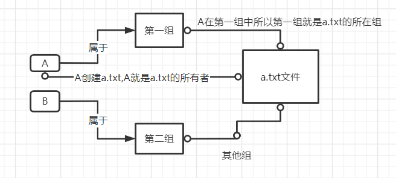<figcaption></figcaption></figure>

### 2. 所有者

一般文件的创建者就是文件的所有者

查看文件的所有者： 指令 ： ls -ahl

修改文件所有者： 指令： chown 用户名 文件名

### 3. 所在组

当某个用户创建一个文件后，这个文件的所在组就是该用户的所在组

查看文件的所在组： 基本指令： ls -ahl

修改文件所在组： 基本指令： chgrp 组名 文件名

### 4. 其他组

除文件的所有者和所在组的用户外，系统的其他用户都是文件的其他组

改变用户所在组： usermod -g 新组名 用户名 usermod -d 目录名 用户名 改变用户登陆的初始目录 特别说明：用户需要有新目录的访问权限

### 5. 权限的基本介绍

1.  ls -l中显示的内容如下： dr-xr-xr-x. 5 root root 4096 10月 5 08:30 boot 最前面十位数据含义：

    1. 第0位表示文件的数据类型：
       * d :表示为目录
       * l :表示为链接
       * c :表示为字符设备文件，如：鼠标、键盘
       * b :表示为块设备，比如：硬盘
       * \- :表示为普通文件
    2. 第1-3位表示确定**所有者**（该文件的所有者）拥有该文件的权限
    3. 第4-6位表示确定**所属组**（同用户组的）拥有该文件的权限
    4. 第7-9位表示确定**其他用户**拥有的该文件的权限

    > **rwx**权限详解： 对于文件：
    >
    > 1. r：表示可读：可以读取 查看
    > 2. w：表示可写：可以修改，但是不代表可以删除该文件，删除一个文件打的前提是对该**文件所在的目录**有写权限，才能删除该文件
    > 3. x：表示可执行
    >
    > 对于目录：
    >
    > 1. r： 表示可读，可以读取，ls查看目录内容
    > 2. w：表示可写，可以修改，对目录创建+删除+重命名目录
    > 3. x: 代表可执行，可以进入该目录

> 文件及目录权限实际案例：
>
> 1.  ls -l中显示的内容如下： drxxrw-r--. 5 root root 4096 10月 5 08:30 boot
>
>     10个字符确定不同的用户能对文件干什么 第一个字符表示文件类型：- l d c b 其余字符每3个一组（rwx）读（r） 写(w) 执行(x) 第一组rwx:文件拥有者的权限是 读 写 执行 第二组rw- : 文件拥有者同一组的用户的权限是读写但不能执行 第三组r--: 不与文件拥有者同组的其他用户的权限是读不能写和执行
>
> 可用数字表示为：r=4 w=2 x=1 因此rwx=4+2+1=7,数字可以进行组合

1. 其他内容： l 文件：硬链接数或 目录： 子目录数 root：用户 root： 组 4096 ： 文件大小（字节），如果是文件夹，显示4096字节 10月 5 08:30 ：最后修改日期 boot： 文件名

### 6. 修改权限 chmod

1. 基本说明：通过chmod指令，可以修改文件或目录的权限
2. 第一种方式： u: 所有者 g： 所有组 o：其他人 a ： 所有人
   * chmod u=rwx,g=rx,o=x 文件/目录名
   * chmod o+w 文件/目录名
   * chmod a-x 文件/目录名 eg: 给abc文件的所有者读写执行的权限，给所在组读执行权限，给其它组读执行权限 chmod u=rwx,g=rx,o=x abc
3. 第二种方式： chmod u-rwx,g=rx,o=x abc相当于 chmod 751 abc

### 7. 文件所有者 chown

基本指令： chown \[选项] newowner 文件/目录 （功能描述：改变所有者） chown \[选项] newowner:newgroup 文件/目录 （功能描述：改变所有者和所在组）

选项： -R: 如果是目录，则使其下所有子文件或目录递归生效

### 8. 修改文件/目录所在组 chgrp

基本指令：chgrp \[选项] newgroup 文件/目录 （功能描述：改变所在组）

### 9. 查看用户所在组

基本语法：groups 用户名

## 定时任务调度

### 1. crond任务调度

<figure>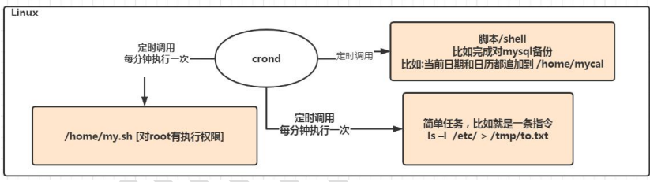<figcaption></figcaption></figure>

功能描述： crond进行定时任务的设置 基本指令：

| 基本指令                  | 功能描述          |
| --------------------- | ------------- |
| crontab -e            | 编辑crontab定时任务 |
| crontab -r            | 终止任务调度        |
| crontab -l            | 列出当前有哪些任务调度   |
| service crond restart | 重启任务调度        |

快速入门： 每小时每分钟执行 ls -l /etc/ >/tmp/to.txt命令： \*/1 \* \* \* \* ls -l /etc/ > /tmp/to.txt 参数说明：

*   5个占位符说明

    | 项目       | 含义         | 范围   |
    | -------- | ---------- | ---- |
    | 第一个 "\*" | 一小时当中的第几分钟 | 0-59 |
    | 第二个 "\*" | 一天当中的第几小时  | 0-23 |
    | 第三个 "\*" | 一个月当中的第几天  | 1-31 |
    | 第四个 "\*" | 一年当中的第几个月  | 1-12 |
    | 第五个 "\*" | 一周当中的星期几   | 0-7  |
*   特殊符号的说明

    | 特殊符号 | 含义                                                             |
    | ---- | -------------------------------------------------------------- |
    | \*   | 代表任何时间，比如第一个 \* 就代表一小时中的每分钟就执行一次                               |
    | ,    | 代表不连续的时间，比如"0 8,12,15 \* \* \*" ,就代表每天的8点0分 12点0分 15点0分就执行一次命令 |
    | -    | 代表连续的时间范围，比如"0 5 \* \* 1-6" ,代表在周一到周六的凌晨五点0分执行命令               |
    | \*/n | 代表**每隔多久**执行一次"\*/10 \* \* \* \*"，代表每隔十分钟就执行一遍命令               |
* 特殊时间执行案例&#x20;

<figure>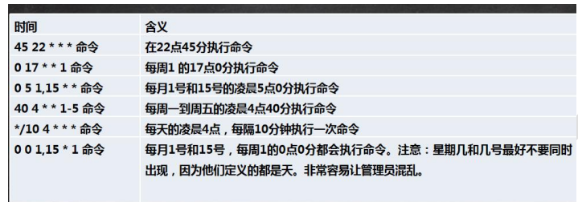<figcaption></figcaption></figure>

### 2. at 定时任务

1.  基本介绍

    * at命令是**一次性**定时计划任务，at的守护线程atd会以后台模式运行，检查作业队列进行运行
    * 默认情况下，atd守护线程每60秒检查作业队列，有作业时，会检查**作业运行时间**，如果时间与当前时间匹配就运行此作业
    * at命令是一次性定时计划任务，执行完一个任务后不在执行此任务
    * 在使用at命令时候，一定要保证atd线程的启动，可以使用相关指令来查看： ps -ef | grep atd
    * 示意图：&#x20;

    <figure>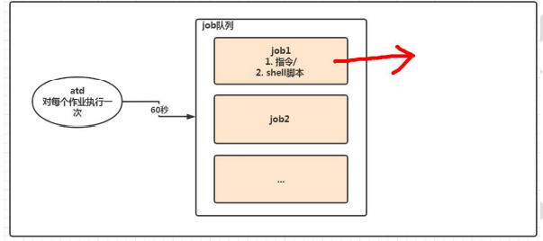<figcaption></figcaption></figure>
2. 指令格式： at \[选项] \[时间] \[执行命令] Ctrl + D 结束at命令的输入。要输入两次，在输入完时间后回车 atq 查看系统中执行的工作任务 strm 编号 删除已经设置的任务
3. 命令选项：
4.

    <figure>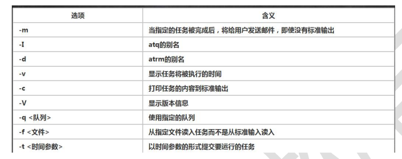<figcaption></figcaption></figure>
5. 时间定义：&#x20;

## Linux磁盘分区、挂载

### 1. Linux分区

1.  原理介绍

    1. Linux来说无论有几个分区，分给那一个目录使用，归根结底就只有一个根目录，一个独立且唯一的文件结构，Linux中每个分区都是用来组成整个文件系统的一部分
    2. Linux采用了一种叫**载入**的处理方法，它的整个文件系统包含了一整套的文件和目录，且将一个分区和一个目录联系起来，这时要载入一个分区将使他的存储空间在一个目录下获得
    3. 示意图：&#x20;

    <figure>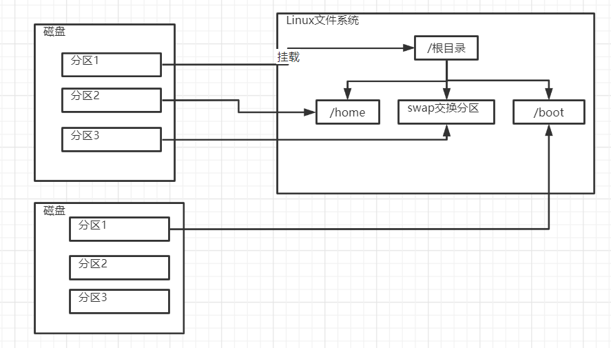<figcaption></figcaption></figure>

    &#x20;
2. 磁盘说明
   1. Linux硬盘分为IDE和SCSI（普遍）
   2. 对于IDE硬盘，驱动器标识符为**hdx\~**,其中hd表明分区所在设备的类型，这里指IDE硬盘了，x表示盘号(a为基本盘，b为基本从属盘,c为辅助主盘,d为辅助从属盘)，\~代表分区，前四个分区用数字1到4表示，它们是主分区或扩展分区，从5开始就是逻辑分区
   3.  对于SCSI硬盘，则标识为**sdx\~**，SCSI硬盘是用sd来表示分区所在设备的类型，其余与IDE相同

       查看设备挂载情况： 基本指令：lsblk 或lsblk -f

<figure>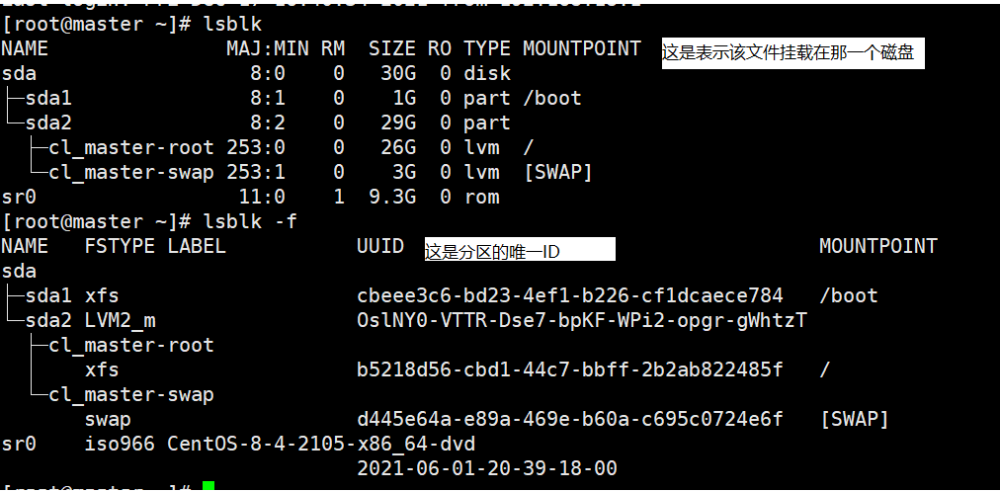<figcaption></figcaption></figure>

### 2.实用指令

1. 查询指定目录的磁盘占用情况
   1. 基本语法： du 选项
   2. 功能介绍：查询指定目录的磁盘占用情况，默认为当前目录
   3. 常用选项： -s 指定目录占用大小汇总 -h 带计量单位 -a 含文件 -max-depth=1 子目录深度 -c 列出明细的同时，增加汇总值
   4. eg: 查询/opt目录下磁盘占用情况，深度为1： du -hac --max-depth=1 /opt
2. 磁盘工作实用指令
   1. 统计/opt文件夹下文件的个数： ls -l /opt | grep "^-" | wc -l
   2. 统计/opt文件夹下目录的个数 ls -l /opt | grep "^d" |wc -l
   3. 统计/opt文件夹下文件的个数 ，包括子文件夹里的 ls -lR /opt | grep "^-" | wc -l
   4. 统计/opt文件夹下目录的个数，包括子文件夹里的 ls -lR /opt | grep "^d" | wc -l
   5. 以树状显示目录结构 tree 目录

## 网络配置

### 1. Linux网络配置原理图

<figure>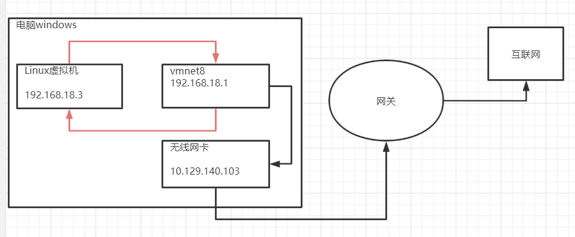<figcaption></figcaption></figure>

> 1. 查看windows环境下的网络配置：ipconfig指令 查看Linux的网络配置 ： ifconfig
> 2. 查看主机之间网络连通性： ping 目的主机ip 功能描述：测试当前服务器是否可以连接到目的主机

### 2. Linux网络环境配置

说明：直接修改配置文件来指定ip，并可以连接到外网

编辑： /etc/sysconfig/network-scriptes/ifcfg-电脑名称&#x20;

注意： 在调配完后要重启网络服务或系统

<figure>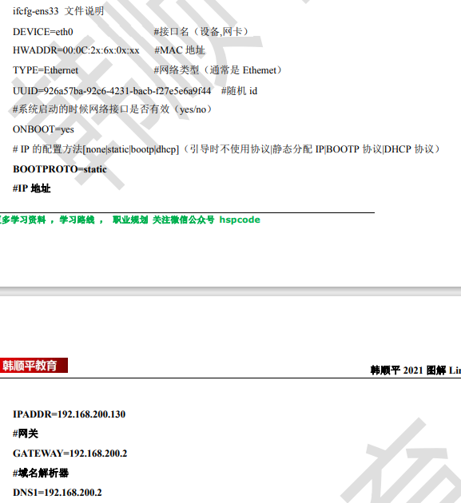<figcaption></figcaption></figure>

### 3. 设置hosts映射

思考：如何通过主机名就能够找到某个Linux系统

1. 在windows系统中， 在C:\Windows\System32\drivers\etc\hosts文件指定即可 eg: ip地址 主机名
2. 在Linux系统中， 在/etc/hosts文件中指定 eg: ip地址 主机名

### 4. 主机名解析过程分析

1. Hosts是什么： 一个文本文件，用来记录 IP和 主机名的映射关系
2. DNS DNS就是Domain Name System 的缩写，翻译过来就是域名系统，是互联网上作为一个域名和IP地址相互映射的一个**分布式数据库**
3.  应用实例：用户在浏览器输入 www.baidu.com

    1. 浏览器**先检查浏览器缓存**中有没有该域名解析IP地址，有就先调用该IP完成解析，如果没有，就检查DNS解析器缓存，如果有就直接返回IP完成解析。这两个缓存，可以理解为本地解析器缓存
    2. 一般来说，当电脑第一次成功访问某一个网站后，在一定时间呢，浏览器或操作系统会缓存它的IP地址（DNS解析记录），如在CMD输入： ipconfig /displaydns // DNS域名解析缓存 ipconfig /flushdns // 手动清理DNS缓存
    3. 如果本地解析器缓存没有找到对应的映射，检查系统中hosts文件中有没有配置对应的IP映射，如果有，则完成解析并返回
    4. 如果本地DNS解析器缓存和hosts文件总均没有找到对应的IP，则到域名服务DNS进行解析域名 示意图：&#x20;

    <figure>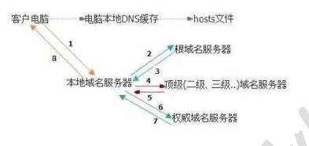<figcaption></figcaption></figure>

## 进程管理

### 1. 基本介绍

1. 在Linux中，每个执行的程序都称为一个进程，每一个进程都会分配一个ID号（pid ，进程号）
2. 每个进程的两种存在形式： 前台：用户目前屏幕上可以进行操作的 后台：实际在操作，但由于屏幕上无法看到进程，通常在后台执行
3. 一般系统的服务就是以后台进程的方式存在

### 2. 显示系统执行的进程

#### 1. 基本介绍

**ps**指令用来查看目前系统中，有哪些正在执行，以及执行的情况

<figure>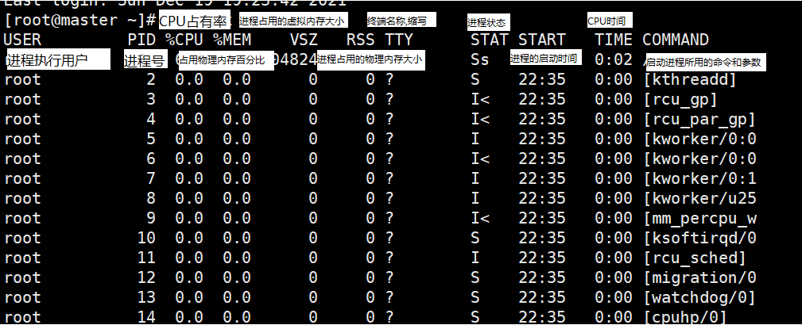<figcaption></figcaption></figure>

> ps -a: 显示当前终端的所有进程信息 ps -u: 以用户的格式显示进程信息 ps -x: 显示后台进程运行的参数 ps -ef: 是以去全格式显示当前所有的进程 -e： 显示所有进程 -f： 全格式

> STAT：进程状态，其中S-睡眠，s-表示该进程是会话的先导进程，N-表示进程拥有比普通优先级更低的优先级，R-正在运行，D-短期等待，Z-僵死进程，T-表示被跟踪或者停止等等

应用实例：

​ 以全格式显示当前所有进程，查看进程的父进程，查看sshd的父进程信息

<figure>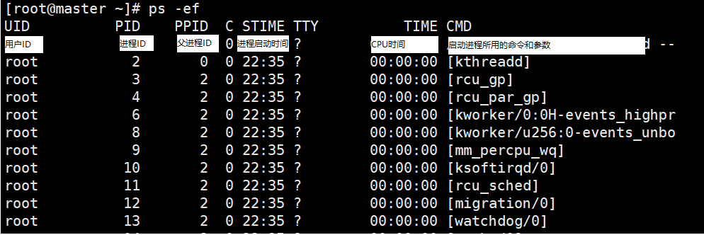<figcaption></figcaption></figure>

> C：CPU 用于计算执行优先级的因子。数值越大，表明进程是 CPU 密集型运算，执行优先级会降低；数值越小，表明进程是 I/O 密集型运算，执行优先级会提高

### 3. 终止进程

1.  基本语法： kill \[选项] 进程号 （功能描述： 通过进程号杀死/终止进程） killall 进程名称 （功能描述：通过进程名称杀死进程，杀死父进程时会杀死子进程）

    > 选项：
    >
    > \-9：表示强迫进程立即停止

### 4. 查看进程树

1.  基本语法： pstree \[选项] （功能描述： 可以更加直观的查看进程信息）

    > 常用选项：
    >
    > \-p : 显示进程的PID -u: 显示进程的所属用户

### 5. 服务管理

1.  介绍 服务本质就是进程，但是是运行在后台，通常会**监听某个端口**看，等待其他程序的请求，（比如mysqld,sshd,防火墙等），因此我们又称为守护进程


    <figure>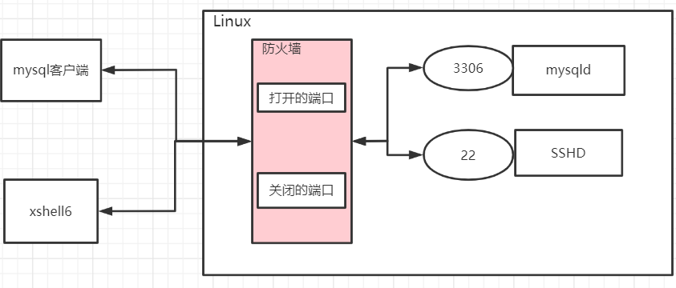<figcaption></figcaption></figure>
2.  service管理

    1. 基本介绍

    > ​ 启动 停止 重启 重载 状况
    >
    > 1. service 服务名 \[start| stop| restart | reioad | status]
    > 2. service 指令管理的服务在 /etc/init.d 查看
    > 3. 在Centos7.0以后，很多服务不在使用service,而是systemctl
3. 查看服务名
   1. 使用 setup就可以查看
   2. 在/etc/init.d看到
4.  服务运行级别&#x20;


    <figure><figcaption></figcaption></figure>
5. chkconfig指令
   1. 通过chkcongfig命令可以给服务的各个运行级别设置自 启动/关闭 chkconfig指令管理的服务在/etc/init.d查看
   2.  chkconfig基本语法

       > chkconfig --list \[|grep xxx] chkconfig 服务名 --list chkconfig --level 5 服务名 on/off

       案例演示 : 对 network 服务 进行各种操作, 把 network 在 3 运行级别,关闭自启动 chkconfig --level 3 network off chkconfig --level 3 network on 使用细节 : chkconfig 重新设置服务后自启动或关闭，需要重启机器 reboot 生效
6. systemctl管理指令
   1. 基本语法：systemctl \[start| stop| restart | status] 服务名 systemctl 指令管理的服务在/user/lib/systemed/system查看
   2.  设置服务的自启动状态：

       ```shell
       systemctl list-util-files [|grep 服务名]   # 查看服务开机自启动状态
       systemctl enable 服务名                    # 设置服务开机启动状态
       systemctl disable 服务名                   # 关闭服务开机启动状态
       systemctl is-enabled  服务名               # 查询某个服务是否是自启动的
       ```

       > 使用systemctl \[start| stop| restart | status] 服务名 该方法进行关闭启用服务，只是**暂时**的，当重启系统后会恢复，如果希望设置某个服务自启动或关闭永久生效，要使用systemctl enable|disable 服务名
   3.  打开或关闭指定端口


       <figure>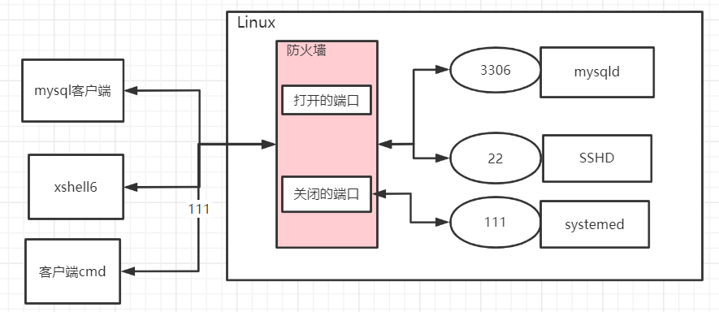<figcaption></figcaption></figure>

       1.  firewall指令

           ```shell
           # 协议通过netstat进行查看
           firewall -cmd --permanent --add-port = 端口号/协议     # 打开端口
           firewall -cmd --permanent --remove-port = 端口号/协议  # 关闭端口
           firewall -cmd --reload                                # 重新载入才能生效
           firewall -cmd --query-port = 端口号/协议               # 查询端口是否开放
           ```

### 6. 动态监控进程

<figure>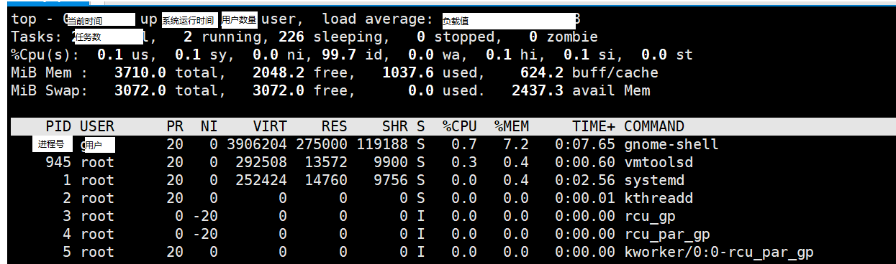<figcaption></figcaption></figure>

1. 基本介绍： top与ps命令很相似，他们都是用来显示正在执行的进程，**top与ps的最大不同之处在于top在执行一段时间后会更新正在运行的进程**
2. 基本指令： top \[选项]
3.  选项说明：

    | 选项    | 功能                    |
    | ----- | --------------------- |
    | -d 秒数 | 指定top命令每隔几秒刷新一次，默认是3秒 |
    | -i    | 是top不显示任何闲置或者僵死进程     |
    | -p    | 通过指定进程ID来仅仅监控某个进程的状态  |
4.  交互操作说明

    | 操作 | 功能               |
    | -- | ---------------- |
    | P  | 以CPU使用率排序，默认就是此项 |
    | M  | 以内存的使用率排序        |
    | N  | 以PID排序           |
    | q  | 退出top            |

### 7. 监控网络状态

1. 基本语法： nestat \[选项]
2.  选项说明：

    * \-an 按一定的顺序排列输出&#x20;
    * \-p 显示哪个进程在调用


    <figure>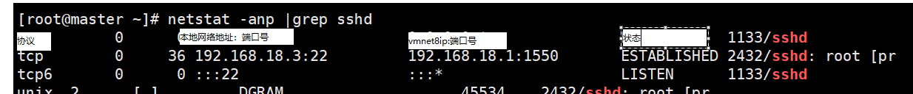<figcaption></figcaption></figure>

## RPM与YUM

### 1. rpm包管理

rpm 用于互联网下载包的打包及安装工具，它包含在某些 Linux 分发版

### 2. rpm包的简单查询指令

查询已安装的rpm列表： rpm --qa|grep xxx 查询已安装的所有rpm软件包：rpm -qa |morez 查询软件包信息：rpm -qi 软件包名 查询软件是否安装：rpm -q 软件包名 查询软件包中的文件：rpm -ql 软件包名 查询文件所属的软件包：rpm -qf 文件全路径名

卸载RPM包：rpm -e RPM包的名称

> 如果其它软件包依赖于您要卸载的软件包，卸载时则会产生错误信息。 如： $ rpm -e foo removing these packages would break dependencies:foo is needed by bar-1.0-1 2) 如果我们就是要删除 foo 这个 rpm 包，可以增加参数 --nodeps ,就可以强制删除，但是一般不推荐这样做，因为依 赖于该软件包的程序可能无法运行 如：$rpm -e --nodeps foo

### 3. 安装rpm包

基本语法： rpm -ivh RPM包的全路径名称

> 参数说明： i = install 安装 v = verbose 提示 h = hash 进度条

### 4. YUM

1.  介绍：

    Yum 是一个 Shell 前端软件包管理器。基于 RPM 包管理，能够从指定的服务器自动 下载 RPM 包并且安装，可以自动处理依赖性关系，并且一次安装所有依赖的软件包
2. yum的基本指令： 查询yum服务器是否有需要安装的软件: yum list|grep 软件名称· 安装指定的yum包： yum install 软件名称

## Shell编程

### 1. 介绍

shell是一个命令行解释器，它为用户提供了一个向Linux内核发送请求以便运行程序的界面系统程序，用户可以启动、挂起、停止甚至是编写一个程序

<figure>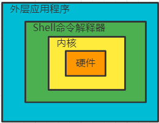<figcaption></figcaption></figure>

### 2. Shell脚本的执行模式

1. 脚本格式要求
   * 脚本以#!/bin/bash 开头
   * 脚本需要有可执行权限
   * 后缀为.sh
2.  脚本常用执行方式

    1. 要赋予脚本的执行的权限，在执行脚本

    ```shell
    ./脚本名称  # 在当前目录下执行相对应的脚本
    ```

    1. 使用命令运行

    ```shell
    sh 脚本名称
    ```

    1. 另一种执行方式

    ```shell
    source 脚本名称
    # 或者
    . 脚本名称   # . 代表 source 命令
    ```

### 3. Shell的变量

1.  shell变量的介绍

    1. Linux Shell中的变量分为： 系统变量 用户自定义变量
    2. 系统变量：$HOME $PWD $SHELL $USER
    3. 显示当前shell中所有变量： set
    4. ```shell
       ```

    \[root@master scripts]# my\_var="hello eorld" # 创建一个自定义变量 \[root@master scripts]# export my\_var=\_var # 将自定义变量提升为系统变量 \[root@master scripts]# vim hello.sh \[root@master scripts]# . hello.sh hello world \_var \[root@master scripts]# my\_var="hello eorld" \[root@master scripts]# . hello.sh hello world hello eorld \[root@master scripts]# new\_var="hello,linux" \[root@master scripts]# echo $new\_var hello,linux \[root@master scripts]# vim hello.sh \[root@master scripts]# . hello.sh hello world hello eorld hello,linux \[root@master scripts]# ./hello.sh hello world hello eorld

    \[root@master scripts]#

    ```


    ```
2.  Shell变量的定义

    1. 定义变量： 变量名=值 （**不能有空格**）
    2. 撤销变量：unset 变量
    3. 声明静态变量：readonly 变量， 注意不能使用unset

    ```
    #!/bin/bash
    # 案例1： 定义变量A
    A=100
    # 输出变量需要加上$
    echo A=$A
    # 撤销变量A
    unset A
    # 将指令返回的结果赋给变量
    C=`date`
    D=$(date)
    ```

    1. 声明变量的规则：
       * 变量名称是由字母 数字 下划线组成的，但是不能以数字开头
       * 等号两侧**不能有空格**
       * 在 Bash 中变量的默认类型都是字符串类型，无法直接进行数值运算
       * 变量的值如果有空格，需要使用双引号或者单引号括起来
    2. 将命令的返回值赋给变量：
       * A=\`date\` 反引号，运行里面的命令，并将结果返回给变量A
       * A=$(date) 等价于反引号
    3.  变量的修改

        | 变量设置方式            | 说明                     |
        | ----------------- | ---------------------- |
        | ${变量名#匹配字串}       | 从头向后开始匹配，删除符合匹配字串的最短数据 |
        | ${变量名##匹配字串}      | 从头向后开始匹配，删除符合匹配字串的最长数据 |
        | ${变量名%匹配字串}       | 从尾向前开始匹配，删除符合匹配字串的最短数据 |
        | ${变量名%%匹配字串}      | 从尾向前开始匹配，删除符合匹配字串的最长数据 |
        | ${变量名/旧的子串/新的子串}  | 将符合旧子字串的第一个字串替换为新的字串   |
        | ${变量名//旧的字串/新的字串} | 将符合旧字串的全部字串替换为新的字串     |

### 4. 设置环境变量

1. 基本语法：
   * export 变量名=变量值 （功能描述：将Shell变量输出为环境变量/全局变量）
   * source 配置文件 （功能描述：让修改后的配置文件立即生效）
   * echo $变量名 （功能描述：查询环境变量的值）
2.  案例：

    * 在/etc/profile 文件中定义 TOMCAT\_HOME 环境变量
    * 查看环境变量 TOMCAT\_HOME 的值
    * 在另外一个 shell 程序中使用 TOMCAT\_HOME

    注意：在输出 TOMCAT\_HOME 环境变量前，需要让其生效 source /etc/profil

### 5. 设置参数变量

1. 介绍： 在我们执行一个shell脚本是，如果希望获取到命令行参数信息，就可以使用到位置参数变量，比如 ： ./myshell.sh 100 200 ,这个就是一个执行shell的命令行，可以在myshell脚本汇总获取到参数信息
2. 基本语法： $n （功能描述： n 为数字，$0 代表命令本身 $1\~$9代表第一到九个参数，十以上的参数需要使用大括号包含： ${10}） $\* (功能描述：这个变量代表命令行中所有的参数，$\*把所有的参数**看成一个整体**) $@ (功能描述：这个变量也代表命令行中所有的参数，不过$@把**每个参数区分对待**) $# (功能描述：这个变量代表命令中所有的**参数的个数**)

### 6. 预定义变量

1. 基本介绍： 就是shell设计者事先已经定义好的变量，可以直接在shell脚本中使用
2.  基本语法：

    $$
    $! (功能描述：后台运行的**最后一个进程**的进程号) $? (功能描述：最后一个执行的命令的返回状态，如果这个变量的值为0，证明上一个命令正确执行；如果这个变量的为非0，则证明上一个命令执行不正确了）
    $$

### 7. 运算符

1.  基本语法

    1. $((运算式))或 $\[运算式] 或者 expr m + n
    2. 注意expr运算符之间**要有空格**，如果希望将expr的结果赋给某个变量要使用\`\`
    3. expr \\\* / % 乘 除 取余

    ```
    #!/bin/bash
    # 计算（2+3）*4的值
    RES1=$(((2+3)*4))
    RES2=$[(2+3)*4]
    TEMP=`expr 2 + 3`
    RES3=`expr $TEMP \* 4`
    ```

### 8. 条件判断

1. 判断语句
   1. 基本语法： \[ condition ] (注意condition前后要有空格) # 非空返回true。可以使用$?验证，0为true >1为false
2.  应用实例：

    ```
    [ xsbcd ]   返回true
    [ ]         返回false
    [ condition ] && echo OK || echo notok  条件满足执行后面的语句
    ```
3.  判断语句

    ```
    =    # 字符串比较
    -lt  # 小于
    -le  # 小于等于
    -eq  # 等于
    -gt  # 大于
    -ge  # 大于等于
    -ne  # 不等于

    # 按文件权限进行判断
    -r   # 有读的权限
    -w   # 有写的权限
    -x   # 有执行的权限

    # 按文件类型进行判断
    -f   # 文件存在并且是一个常规的文件
    -e   # 文件存在
    -d   # 文件存在并且是一个目录
    ```

### 9. 流程判断

1. if判断
   1.  基本语法：

       ```
       if [ 条件判断式 ]  # 中括号和条件判断式之间必须有空格
       then
       	# 代码
       fi


       # 或者，多分支
       if [ 条件判断式 ]
       then 
       	# 代码
       elif [ 条件判断式 ]
       then
       	# 代码
       fi
       ```
2. case语句
   1.  基本语法

       ```
       case $变量名 in
       "值1"）
       	# 如果$变量名等于值1，则执行程序
       ;;
       "值2"）
       	# 如果$变量名等于值2，则执行程序	
       ;;
       ....
       *)
            # 如果变量的值都不是以上的值，则执行此程序
       ;;
       esac
       ```
3. for循环
   1.  基本语法：

       ```
       for 变量 in 值1 值2 值3...
       do
       	# 程序/代码
       done

       # 第二种
       for(( 初始值; 循环控制条件;变量变化 ))
       do
       	# 程序/代码
       done
       ```
4. while循环
   1.  基本语法

       ```
       while [ 条件判断式 ]
       do
       	# 程序/代码
       done
       ```

### 10.read读取控制台输入

1.  基本语法：

    ```shell
    read(选项)(参数)
    ```
2.  选项： -p：指定读取值时的**提示符** -t ：指定读取时等待的时间秒数

    参数：指定读取值的变量名

### 11. 函数

1. 系统函数
   1.  basename 基本语法

       1. basename \[pathname] \[suffix] 功能描述： 返回完整路径**最后/的部分**常用于获取文件名
       2. basname \[string] \[suffix] 功能描述： basename命令会删掉所有的前缀包括最后一个/字符，然后将字符串显示出来
       3. dirname 文件绝对路径 （功能描述：从给定的包含绝对路径的文件名中去除文件名（非目录的部分），然后返回剩下的路径（目录的部分））

       选项：suffix 为后缀，如果suffix被指定了，basename会将pathname或string中的suffix去掉
   2. 应用实例：
      1. 返回/home/aaa/test.txt 的 "test.txt" 部分 basename /home/aaa/test.txt .txt
      2.  请返回 /home/aaa/test.txt 的 /home/aaa

          dirname /home/aaa/test.txt
2. 自定义函数
   1.  基本语法：

       ```
       [ function ] funname[()]
       {
       	Action;
       	[return int;]
       }
       ```

       调用直接写函数名：funname \[值]
