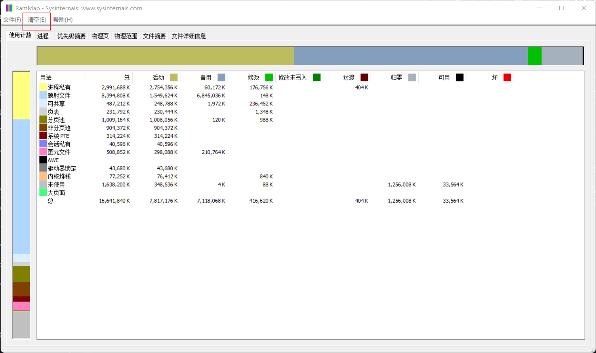

# RAMMap


RAMMap


有的时候电脑的内存可能会因为各种原因拉满，但是电脑管家等工具清理很有限，这时候使用这个工具就可以很快的清理

使用方法： 点击<mark style="color:red;">**清空**</mark>就可以看到大致的功能列表

<figure><figcaption></figcaption></figure>

> 注意：
>
> * 本文内容仅为技术科普，请勿用于非法用途
> * 本文内容未隐讳任何个人、群体、公司。非文学作品，请勿用于阅读理解的练习
> * 根据《计算机软件保护条例》第十七条，本博客所有软件请仅用于学习研究用途
> * 本博客一切资源不代表本站立场，并不代表本站赞同其观点和对其真实性负责
