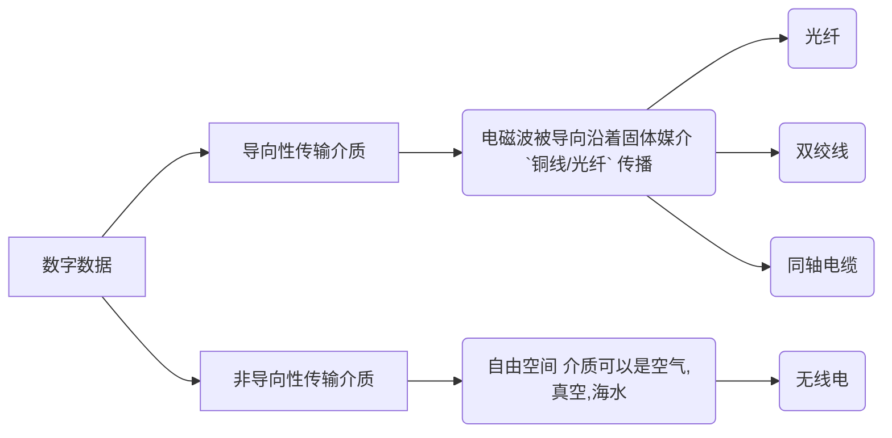

# 第二章--物理层

\[TOC]

## 1. 通信方式

1. 单工通信： 只有一个方向的通信而没有反方向的通信，仅需要一条信道，仅需要==一条==信道
2. 半双工通信： 通信的双发都可以发送或接收消息，但任何一方不能同时接收和发送，需要==两条==信道
3. 双工通信： 通信双方可以同时发送和接受信息，也需要==两条==信道

## 2. 数据传输方式

1. 串行传输：速度慢，费用低，适合远距离
2. 并行传输：速度快，费用高，适合==近距离==， 常用于计算机内部数据传输

## 3. 传输介质

## 4. 数据交换方式

### 1. 分组交换

1. 定义： 分组交换采用把一个个小的数据包存储转发传输来实现数据交换
2. 缺点：
   1. 不具有实时性
   2. 存在延时
   3. 会造成通信阻塞
   4. 存在无用的重复数据，(接收端收到两个完全相同的数据包)
   5. 会出现丢包的情况
3. 优点：
   1. 设计简单
   2. 资源利用率极高

### 2. 电路交换

1. 电路连接的阶段：
   1. 建立连接
   2. 数据传输
   3. 释放连接
2. 优点：
   1. 传输速度快、高效
   2. 实时
3. 缺点：
   1. 资源利用率极低
   2. 新建连接需要占据一定的时间

## 5. 物理设备

### 1. 中继器

1. 诞生原因： 由于存在损耗，在线路上传输的信号功率会逐渐衰减，衰减到一定程度时将造成信号失真，因此会导致接收错误
2. 中继器功能： 对信号进行==再生和还原==，对衰减的信号进行放大，保持与原数据相同，以增加信号传输的距离，延长网络的长度
3. 中继器的两端：
   * 两端的网络部分是`网段`，而不是子网适用于完全相同的`两类`网络的互连，且两个`网段速率要求相同`（原因是： 中继器不能存储），中继器只将任何电缆段上的数据发送到另一段电缆上，它仅用于信号的电气部分，并不管数据中是否有错误数据或不适合网段的数据。
   * 两端可连相同的媒体，也可连不同媒体
   * 中继器两端的网段一定要是==同一个协议==，(中继器只会转发)
4. 5-4-3 规则： 网络标准中对信号的延迟范围作了具体的规定，因而中继器只能咋规定的范围内进行，否则会网络故障： 

### 2. 集线器

1.  功能： 对信号进行再生放大转发，对衰减的信号进行放大，接着==转发到其他所有 (除输入端口之外)处于工作状态的端口上==，以增加信号传输的距离，延长网络长度。不具备信号的定向传送能力，是一个共享式设备

    
