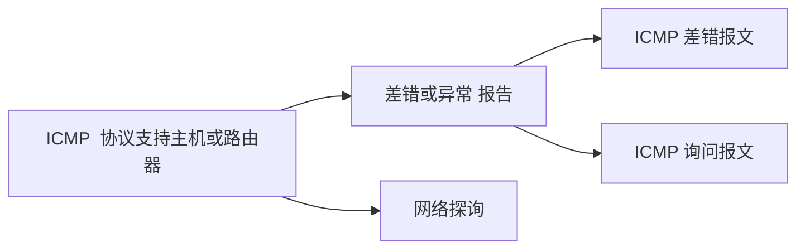

# 第四章--网络层

\[TOC]

## 引言

1. 网络层在数据链路层提供的两个相邻端点之间的数据帧的传送功能上，进一步管理网络中的数据通信，将数据设法从源端经过若干个中间节点传送到目的端，从而向运输层提供最基本的`端到端`的数据传送服务。 
2. 功能：
   1. 路由选择
   2. 分组转发
   3. 异构网络互连
   4. 拥塞控制

## 1. 路由算法和协议

> 这里的路由不是指路由器，而是指`指路`, 告诉 IP 数据报如何走可以到达目标位置

### 1. RIP 协议

1. 定义： RIP 是一种分布式的基于 `距离向量`的路由选择协议
2. RIP 协议要求网络中每一个路由器维护从 `自己到其他每一个目的网络的最佳距离`
3. 距离： 跳数--即从源端口到目的端口所经过的路由器个数，经过一个路由器跳数+1，==特殊的： 从一个路由器到直接连接的网络距离为1, RIP允许一条路由最多包含 15个路由器，因此距离为 16表示网络不可达== 

### 2. OSPF 协议

1. 开放最短路径优先 OSPF 协议。OSPF 的最主要的特征就是使用分布式的链路状态协议
2. 特点：
   1. 和谁交换： 使用`洪泛法`向自治系统内所有路由器发送信息，即路由器通过输出端看向所有相邻路由器发送信息，而每一个相邻路由器又再次将此信息发往其所有的相邻路由器广播
   2. 交换什么： 发送的信息就是与本路由器`相邻的所有路由器的链路状态`（本路由器和那些路由器相邻，以及该链路的度量/代价--费用、距离、时延、带宽等）
   3. 多久交换： 只有当链路状态发送变化时，路由器才向所有路由器洪泛发送此信息
   4. 最后所有的路由器都能建立一个链路状态数据库，即全网拓扑图
   5. 其他特点： 
3. 链路状态路由算法：
   1. 每个路由器发现它的邻居结点 \[HELLO 问候分组]，并了解邻居结点的网络地址 (每隔10秒)
   2. 设置它的每个邻居的成本变量 metric
   3. 构造 \[DD 数据库描述分组]，向邻站给出自己的链路状态数据库中的所有链路状态项目的摘要信息
   4. 如果 DD 分组中的摘要自己都有，则邻站不做处理，如果没有的或者是更新的，则发送 \[LSR 链路状态请求分组]，请求自己没有的和比自己更新的信息
   5. 收到邻站的 LSR 分组后，发送 \[LSU 链路状态更新分组] 进行更新
   6. 更新完毕后，邻站返回一个 \[LSAck 链路状态确认分组] 进行确认 只要一个路由器的链路状态发生变化
   7. 泛洪发送 \[LSU 链路状态更新分组] 进行更新
   8. 更新完毕后，其他站返回一个 \[LSAck 链路状态确认分组] 进行确认
   9. 使用 迪杰斯特拉算法 根据自己的链路状态数据库构造到其他结点的最短路径
4. OSPF 的区域： 为了使 OSPF 能够用于规模很大的网络， OSPF 将一个自治系统再划分为若干个更小的范围，叫做区域。每一个区域都有一个 32 位的区域标识符(用点分十进制表示)，区域不能太大，在一个区域内的路由器最好不超过 200 个

### 3. BGP 协议

1. 特点：
   1. 和谁交换： 与其他 AS 站点的邻站 BGP 发言人交换信息
   2. 交换什么： 交换的网络可达性信息，即要到达某个网络所要经过的一系列 AS
   3. 多久交换： 发生变化时更新有变化的部分
2. BGP 协议交换信息的过程： BGP 所交换的网络可达性的信息就是要到达某个网络所要经过的一系列 AS，当 BGP 发言人互相交换了网络可达性信息后，各 BGP 发言人就根据所采用的策略从收到的路由信息中找出到达 AS 的较好路由
3. BGP 协议交换的信息是一个完整的路径 
4. 特点：
   1. BGP 支持 [CIDR](https://blog.csdn.net/qq\_43141726/article/details/105520510?ops\_request\_misc=\&request\_id=\&biz\_id=102\&utm\_term=CIDR\&utm\_medium=distribute.pc\_search\_result.none-task-blog-2\~all\~sobaiduweb\~default-0-105520510.142^v40^pc\_rank\_34\_1,185^v2^control\&spm=1018.2226.3001.4187) ，因此 BGP 的路由表也就应当包括目的网络前缀、下一跳路由器，以及到达该目的网络所要经过的各个自治系统序列
   2. 在 BGP 刚刚运行的时候，BGP 的领站是交换整个 BGP 路由表，但是以后只需要在`发生变化的时候更新有变化的部分`,这样做对节省网络带宽和减少路由器的处理开销都有好处
5. BGP-4 的四种报文
6. | OPEN (打开) 报文         | 用来与相邻的另一个 BGP 发言人建立关系，并认证发送方         |
   | -------------------- | ------------------------------------ |
   | UPDATE (更新) 报文       | 通告新路径或撤销原路径                          |
   | KEEPALIVE (保活) 报文    | 在无 UPDATE 时，周期性证实领站的连通性；也作为 OPEN 的确认 |
   | NOTIFICATION (通知) 报文 | 报告先前报文的差错；也被用于关闭连接                   |

### 4. 总结

三种协议比较：

1. RIP 是一种分布式的基于距离向量的内部网关路由选择协议，通过广播`UDP`报文来交换路由信息
2. OSPF 是一个内部网关协议，要交换的信息量较大，应使报文的长度尽量短，所以不使用传输层协议，（如：UDP 或 TCP）而是直接采用 `IP`
3. BGP 是一个外部网关协议，在不同的自治系统之间交换路由信息，由于网络环境复杂，需要保证可靠传输，所以采用 `TCP`

| 协议   | RIP                   | OSPF               | BGP                                                                                                                 |
| ---- | --------------------- | ------------------ | ------------------------------------------------------------------------------------------------------------------- |
| 类型   | 内部                    | 内部                 | 外部                                                                                                                  |
| 路由算法 | 距离-向量                 | 链路状态               | 路径-向量                                                                                                               |
| 传递协议 | UDP                   | IP                 | TCP                                                                                                                 |
| 路径选择 | 跳数最少                  | 代价最低               | 较好、非最佳                                                                                                              |
| 交换结点 | 和本结点相邻路由器             | 网络中的所有路由器          | 和本结点相邻的路由器                                                                                                          |
| 交换内容 | 当前本路由器知道的全部信息，即自己的路由表 | 与本路由器相邻的所有路由器的链路状态 | <table><thead><tr><th>首次</th><th>整个路由表</th></tr></thead><tbody><tr><td>非首次</td><td>有变化的部分</td></tr></tbody></table> |
| 首次   | 整个路由表                 |                    |                                                                                                                     |
| 非首次  | 有变化的部分                |                    |                                                                                                                     |

## 2. IP

### 1. ARP 协议

> 每个主机和路由器都有一个 ARP 高速缓存(IP 地址和 MAC 地址的映射)

### 2. DHCP 协议

1. 动态主机配置协议 DHCP 是 `应用层`协议，使用`客户/服务器`方式，客户端和服务端通过`广播`方式进行交互，基于 `UDP`
2. DHCP 提供即插即用联网的机制，主机可以从服务器动态获取 IP 地址、子网掩码、默认网关、DNS 服务器名称与 IP 地址允许 `地址重用`，支持`移动用户加入网络，支持在用地址续租`

### 3. ICMP 协议

## 3. 设备

### 1. 路由器

