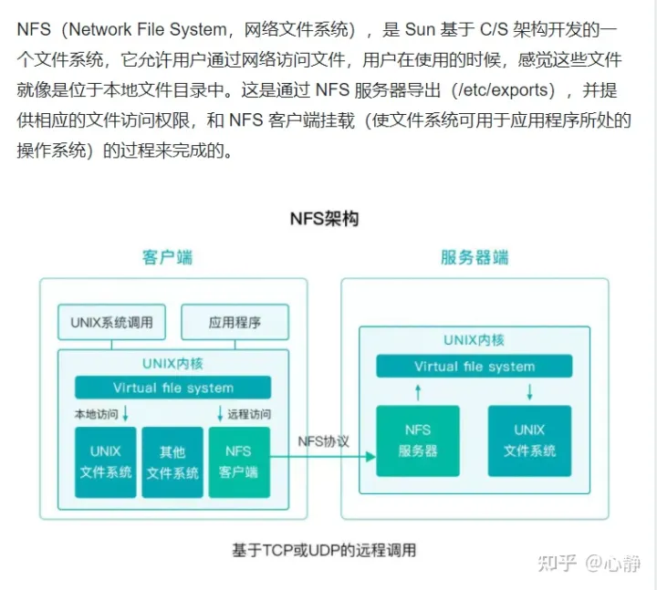
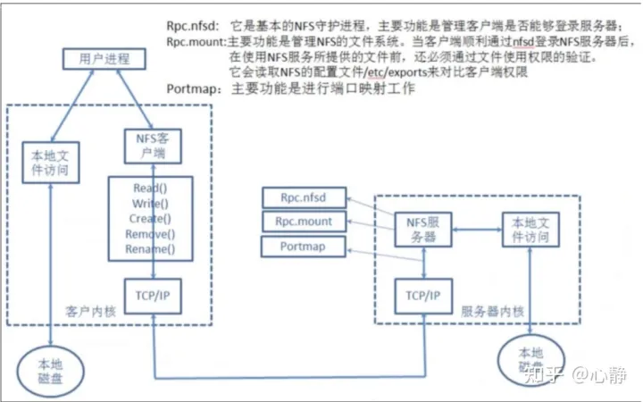

# NFS 介绍

## 简介

NFS 是 Network File System 缩写及网络文件系统。NFS主要功能是通过局域网络让不同的主机系统之间可以共享文件或目录。

NFS系统和Windows网络共享、网络驱动器类似, 只不过windows 网络共享用于局域网, NFS用于企业集群架构中, 如果是大型网站, 会用到更复杂的分布式文件系统FastDFS,glusterfs,HDFS,ceph

NFS 协议没有**身份验证和授权机制**。授权取自配置文件系统的可用信息，服务器负责将客户端提供的用户信息翻译成文件系统的用户信息，并尽可能正确的将相应的授权信息转换成 UNIX 要求的语法

| 版本    | 特征                                                                     |
| ----- | ---------------------------------------------------------------------- |
| NFSV2 | 比较旧但是受到许多系统支持，并且最初完全通过 UDP 运行                                          |
| NFSV3 | 具有更多的功能，包括可变文件大小和更好的错误报告，但是与 NFSV2 客户端不安全兼容                            |
| NFSV4 | 包括 Kerberos ，通过防火墙和 Internet 工作，不再需要端口映射器，支持 ACL， 应用基于状态的操作，并提高了性能和安全性 |

## NFS 架构

<figure><figcaption></figcaption></figure>

## NFS 应用

> 1. 用户访问NFS客户端，将请求转化为函数
> 2. NFS通过TCP/IP连接服务端
> 3. NFS服务端接收请求，会先调用portmap进程进行端口映射
> 4. Rpc.nfsd进程用于判断NFS客户端能否连接服务端；
> 5. Rpc.mount进程用于判断客户端对服务端的操作权限
> 6. 如果通过权限验证，可以对服务端进行操作，修改或读取

## NFS 运行原理

<figure><figcaption></figcaption></figure>

<figure><figcaption></figcaption></figure>

## NFS 实践

### 1. 部署 NFS 服务

**服务端**

1.  安装相关软件

    ```shell
    yum install nfs-utils rpcbind -y   # rpcbind是为nfs提供网络
    ```
2.  关闭防火墙和 selinux

    ```shell
    setenforce 0
    systemctl stop firewalld
    ```
3.  创建一个目录，用于存放共享文件或者目录

    ```shell
    mkdir /data
    ```
4.  创建一个系统用户，到时客户端也创建同样用户来统一用户

    ```shell
    groupadd www -g 666
    useradd www -u 666 -g 666 -M -r -s /sbin/nologin
    ```
5. 修改NFS的配置文件(作用：指定NFS的仓库及权限)

```shell
# NFS的配置文件：/etc/exports、/etc/lib/nfs/etab
# 格式：[挂载点] [可以访问的IP]([权限])

vi /etc/exports

内容：
    /data   172.16.1.0/20(rw,sync,all_squash,anonuid=666,anongid=666)
```

| NFS 共享参数           | 参数作用                                              |
| ------------------ | ------------------------------------------------- |
| rw                 | 读写权限 (常用)                                         |
| ro                 | 只读权限 (不常用)                                        |
| root\_squash       | 当 NFS 客户端以 root 管理员访问时，映射为 NFS 服务器的匿名用户(默认)       |
| no\_root\_squash   | 当 NFS 客户端以 root 管理员访问时，映射为 NFS 服务器的 root 管理员(不常用) |
| all\_squash        | 无论 NFS 客户端使用什么账号访问，都映射为 NFS 服务器的匿名用户(常用)          |
| no\_all\_squash    | 访客被映射为服务器上相同 uid 的用户(默认)                          |
| sync               | 同时将数据写入到内存和硬盘中，保证数据不丢失数据(常用)                      |
| async              | 优先将数据保存到内存中，然后再写入硬盘，这样效率高，但可能会丢失数据(不常用)           |
| secure             | 限制客户端只能从小于1024的tcp/ip端口连接服务器 （默认）                 |
| insecure           | 允许客户端从大于1024的tcp/ip端口连接服务器                        |
| anonuid            | 指定匿名访问的用户的本地用户 UID ，默认为 65534                     |
| anongid            | 指定匿名访问用户的本地用户组GID，默认为 65534                       |
| wdelay             | 检查是否有相关的写操作，如果有则将这些写操作一起执行，这样可以提高效率（默认）           |
| no\_wdelay         | 若有写操作则立即执行，应与sync配合使用                             |
| subtree\_check     | 若输出目录是一个子目录，则nfs服务器将检查其父目录的权限 （默认）                |
| no\_subtree\_check | 即使输出目录是一个子目录，nfs服务器也不检查其父目录的权限，这样可以提高效率           |

1.  启动NFS服务

    ```shell
    systemctl start nfs-server rpcbind
    ```
2.  查看NFS的挂载点是否设置成功

    ```shell
    # 查看指定服务器的挂载点
    showmount -e 172.16.1.31

    # 查看本机的挂载点
    showmount -e
    ```
3.  给挂载点授权(用于存放共享文件或者目录)

    ```shell
    chown -R www.www /data/
    ```

**客户端**

1.  挂载使用(客户端必须安装nfs-utils)

    ```shell
    yum install nfs-utils -y
    mount -t nfs 172.16.1.31:/data /opt
    ```

### 2. NFS -- 上传文件

**客户端**

1.  安装web服务软件及nfs-utils

    ```shell
    yum install httpd php -y
     
    yum install nfs-utils -y
    ```
2. 将代码上传到网站根目录（/var/www/html）
3.  给目录下的文件授权

    ```shell
    chown -R www.www /var/www/html
    ```
4.  修改web软件的用户

    ```shell
    vim /etc/httpd/conf/httpd.conf
    内容变为：
            User www
            Group www
    ```
5.  关闭selinux和防火墙

    ```shell
    setenforce 0
    systemctl disable --now firewalld
    ```
6.  启动web软件

    ```shell
    systemctl start httpd
    ```
7.  挂载

    ```shell
    cd /var/www/html/
    mkdir upload
    mount -t nfs 172.16.1.31:/data /var/www/html/upload
    ```
8. 测试： 上传、访问

### 3. NFS 实现文件共享

1.  安装web服务软件及nfs-utils

    ```shell
    yum install httpd php -y
     
    yum install nfs-utils -y
    ```
2.  将NFS挂载到web网站对应目录

    ```shell
    mkdir img
    mount -t nfs 172.16.1.31:/data /var/www/html/img/
    ```
3.  开启web服务

    ```shell
    systemctl start httpd
    ```
4. 测试

## 参考文章

* [NFS(局域网共享文件或目录)](https://zhuanlan.zhihu.com/p/451820450)
